# Bell Schedule Acquisition Pipeline

**Status:** Stage 1 (Queue) designed, built, validated, and CP-A-approved (`batch_00001.json` ready to advance). Stage 2 (Discovery) designed, built, and run live against all 12 districts in `batch_00001` (12/12 `found_all`); billing/auth failure handling hardened afterward. Stage 3 (Capture) designed, built, and run live against all 12 districts (150/150 URLs captured, 0 failures, all 12 `captured_all`) — Drive Tier 1, modal dismissal, unconditional `page.pdf()`, and emergent-candidate link-following all confirmed working on real data; Drive Tier 2 (OAuth) not yet built, deliberately deferred. Per-record hosting/CMS **fingerprinting** added + backfilled across all 12 (150/150) 2026-06-24 — raw signals only, surfaced SharpSchool/Apptegy/Educational Networks as the real platforms (none in the current `CMS_HOSTS`). Stage 4 (Local processing) designed, built, and run live 2026-06-23 — tool roster resolved by a real empirical spike against all 150 captured PDFs in `batch_00001` (keep `pdftotext`/`pdfplumber`-lines/`camelot`-stream/`camelot`-hybrid/`tesseract`; drop PyMuPDF, `pdfplumber`-text, `camelot`-network/lattice, `img2table`; heavy ML tools Docling/EasyOCR/PaddleOCR installed, timed, and deliberately rejected/uninstalled), waterfall design replaced by "run every kept tool against every applicable input, always." Production run against all 12 districts: 150/150 records processed, 0 crashes, 10 `processed_all` + 2 `processed_partial`. **Stage 5 (Local filtering): the CP-B review app, deterministic signals, the full 150-label pass, labeled topology + clustering, the funnel ingredients, the learning-loop infrastructure (config-as-data + measurement harness), and de-chrome are all BUILT; de-chrome MEASURED a strong win (category 0.43→0.60, topology 0.6→0.8). **The operational filter is now built too (REQ-094):** `release.py` emits one traceable **`filtered.json`** per district — an event-driven projection (no manual trigger; generated on the first scoring pass, refreshed on label/split + re-ingest events). Live on `batch_00001`: 12 files, **32 records to send** (the 32 canonical target-labeled records).** Stage 6 (routing/release — which representations → which OpenRouter model set) is REQ-101; Stages 7-9 design validated, per-school council rules still to build. **Console build underway (REQ-102): gate@1 fully built — backend + frontend — 2026-06-28.** The batch is a first-class governance-DB entity (the working store) with `batch_NNNNN.json` as the regenerated receipt; gate@1 is an in-band batch-level approval with soft, reversible, audited editing; the queue-review UI (first console stage view, on the MMM Design System via DesignSync) is live. **`batch_00002` was created → edited → approved entirely through the console** — the forcing-function milestone. **Stage 2 was then re-architected to a deterministic SERP cascade (Bright Data Wave 1 + Serper failover → Claude WebSearch residual; REQ-104, from a 5-provider bake-off) and the Stage 2 console view BUILT + RUN LIVE 2026-06-28** — `batch_00002` (Bright Data found 28/30 schools) and `batch_00003` (with add/reject edits) both ran end-to-end through the UI. **Stage 3 (Capture) console view BUILT 2026-06-28 (REQ-110)** — the ungated health/emergent readout + a per-district Node-Playwright capture run trigger. Its load-bearing infra change: the **cross-stage DB cache graduated to a live working store** — schema + per-district UPSERTs moved to `common/cache_ingest.py`, the four tables are `CREATE IF NOT EXISTS` + never dropped, and **each stage's finish hook (Stage 2/3/4) projects its slice in**, so the console reads fresh DB rows for an in-flight batch instead of parsing JSON off disk (Stage 2's console repointed too; Wave-2 `claude -p` timeout lowered 420→75s). **Hardened over live runs (batch_00002–00005):** no-link districts skip Playwright; failures/timeouts surface + are retriable; shared status labels + left-pane progress fractions (`static/outcomes.js`, honest "0/10 captured · 2 no-links"); **node-owns-shutdown** (a capture timeout writes a PARTIAL manifest → `captured_partial` instead of orphaning all work) + a **reconstruct-from-disk** recovery tool (also the interim manual-follow-up path — recovered Brookwood/Fairfield/LAS CRUCES + folded in a manually-downloaded handbook PDF). **Stage 4 (Process) console view BUILT + RUN LIVE 2026-06-29 (REQ-111)** — in-process (no node-owns-shutdown), per-district usable/not-usable doc counts + a usable-reps-by-tool readout, reading the `processed_doc` DB cache. **And the Stage 4→5 incremental handoff (REQ-111):** a process run that resolves a whole batch runs `build_signals.ingest_batch()` — a **batch-scoped** Stage-5 ingest (no full-corpus rebuild) + a per-district `furthest_stage→5` event — so the Stage-5 view loads with no lag. **This is where the batch dissolves and the district becomes the driving unit** — Stage 5 is district-driven on purpose (governance §12). **Stage 5 console REWORKED + BUILT 2026-06-29 (REQ-112)** — the district-driven, **attention-first** faceted console (the app's origin, finally on the current architecture): an `attention` score (the inverted-confidence "where my judgment moves us forward," NOT target-likelihood — a clean tier-A is LOW) drives the default sort; facet grouping (pipeline_state/state/topology, collapsible mini-dashboards) + record-facet filtering (label/tier/reason; district stays visible) + multi-key sort; a follow-up-flag action (top attention tier, precious); DB-backed saved views; re-fetch-on-show. Server-side faceting (`/api/stage5/*`) for ~5M-rep scale; SQLite vestige retired. **Stage 5 scoring + labeling V2 / v2.1 BUILT (REQ-113/114/115, 2026-07-01):** the V1 tier cascade — which drifted 85→69% tier-A precision and leaked 10 tier-D targets once scaled to 59 districts / 440 labels — became independent **labeling-function DETECTORS + a transparent combiner** yielding a `send`/`suppress`/`review` decision (tier-A precision→**0.79**, recall→**0.88**, **tier-D 0-target leak**, A+B recall→1.0); the labeling UI became a **three-axis object** (target SHAPE · confounder facets · location, incl. a print-dialog handbook page range), migrating all 440 labels (128 targets preserved); the detail pane went **text-first** with a per-rep unique-times readout; and Stage 3 gained iframe/embed capture + `cms_hint` promotion. Grounded in `docs/technical-notes/filtering-research/` (weak supervision; K-12 hours markup near-absent). Detail: `STAGE5_FILTER_DESIGN` (present-state rewrite). **Stage 6 (routing/release) BUILT to the Stage 6→7 seam (REQ-101, merged PR #2 2026-06-30)** — the `stage6_handoff/` package (per-rep routing data-driven off `input_kinds` + capture-fidelity gate; cost estimator on a bootstrap model; immutable dispatch with a price-independent hash; OpenRouter request assembly) + the **gate@6** console (preview routed/priced package → Approve & freeze) → immutable `handoff_<hash>_<ts>.json` + a precious `handoff` index row + a `dispatched` state_event, atomically; **stops before the paid call.** The 5/6 **send set is tier-gated** (`release.decide`): labeled targets + unlabeled tier-A → send, tier-B/C → **hold** (a third state, awaiting a gate@5 label), tier-D/non-target → reject; handbooks send the materialized **`harvest_slice`** (high-signal pages), not the whole PDF. The console shows **n_send / n_verified / n_hold** per district + gate@6 controls (filters · per-rep council override · click-to-inspect · remove-district · a **verified-only** mode that dispatches labeled targets only, frozen into the dispatch identity for training-grade data). Detail: `STAGE6_DISPATCH_DESIGN` §0. **Then: Stage 7 (the paid council + judge loop) + the council lab (`cost_benchmark`)** + REQ-100 (staleness), gate@6 auto mode.
**Last updated:** 2026-07-01 (council-template reconciliation + Key-files freshness pass; the 2026-06-26 architecture callout below still governs).
**Companions:** the **Flow diagram** is now inline below (moved here 2026-06-30 from the retired `docs/diagrams/acquisition_pipeline_flow.md`), `docs/EXTRACTION_BENCHMARK_FINDINGS.md` (model leaderboard + measured costs), `docs/technical-notes/EXTRACTION_AND_DISCOVERY_LEARNINGS_2026-06.md` (full learnings), `docs/INSTRUCTIONAL_TIME_HARVEST.md` (why SEA central data is a dead end), `docs/METHODOLOGY.md` (Rules 6 & 7 — CTC and grade-span-integrity exclusions referenced below). The strategy/options report that preceded this is `docs/INSTRUCTIONAL_MINUTES_ACQUISITION_STRATEGY.md` (now a pointer here).

> **⚑ Architecture update (2026-06-26) — governance app, state model & Postgres. Authority: `docs/technical-notes/PIPELINE_GOVERNANCE_AND_STATE_2026-06.md`.** Five decisions reshape how the back half of the pipeline is governed; where this doc's older prose conflicts, the governance note wins (it supersedes; this doc is being reconciled to it, not rewritten):
> 1. **The Stage-5 review app becomes the *Acquisition Pipeline Governance App*** — a stage-selectable console spanning the **5 stage-numbered gates (2026-06-27, governance §11): `gate@1` (queue) · `gate@5` (per-URL review) · `gate@6` (dispatch) · `gate@7` (council requests) · `gate@8` (results — the effective old CP-C; Stage 9 then auto-writes)**, with tuning + funnel dashboards. Stages 2/3/4 are ungated; each gate is manual/auto (Settings: global default + per-gate overrides, confidence-escalating). It moves to `infrastructure/acquisition/process_governance/`.
> 2. **DB: SQLite → Postgres**, an **isolated `governance` database** in the existing `lct_postgres` container (own user; drop+rebuild can't reach the production LCT tables). It becomes a **cross-stage cache** (ingests all stages' artifacts, not just Stage 5). *(**REQ-103 COMPLETE 2026-06-26** — governance DB + `common/db.py` + precious models; Stage-5 ingest + readers migrated SQLite→Postgres; cross-stage cache `discovery_school`/`candidate`/`capture`/`processed_doc` built. See `PIPELINE_GOVERNANCE_AND_STATE_2026-06.md` §1b.)*
> 3. **STATE vs DATA.** The cross-stage *registry* migrated from `district_status.json` into a Postgres **event log** (`state_event`; current-state a SQL view). The per-stage *JSON artifacts* (`discovery/candidates/captures/processed/batch`) **stay authoritative on disk** — their role shifts from data-carriers to **auditable receipts**. Precious state keeps the version-controlled JSON-backup pattern (like `labels.json`). *(**REQ-099 COMPLETE 2026-06-26** — see Stage 1 registry note + governance §3.)*
> 4. **The Stage 5→6 release:** `filtered.json` per district = a **regenerable export** of the DB's release decision (one best representation per qualifying canonical record); Stage 6 emits an **immutable `handoff_<hash>_<timestamp>.json`** naming which districts go to the council, freezing fingerprints so "what we sent" is always recoverable.
> 5. **Stage 2 discovery is a deterministic SERP cascade** (re-architected 2026-06-28 from a 5-provider bake-off): **Wave 1 = Bright Data SERP** (real Google, recurring-free) + **Serper failover** on API failure → **Wave 2 = Claude WebSearch** on the residual (different index, speculative). No agent in the Wave-1 loop; the pluggable-provider layer is what let Bright Data/Serper replace the original Claude/OpenRouter waves. **Index predicts recall** — raw Google wins, own-index providers crater. Run live on batch_00002/00003. See Stage 2 + design note §7.

> **What this replaces.** The Jan-2026 "production ready" design on this page — Crawlee *blind-maps* a district site → Ollama *ranks* URLs → Ollama *triages* PDFs — was superseded on 2026-06-13 after benchmarking. **Blind crawling does not find schedules; local Ollama extraction topped out ~37%; the Ollama models were deleted.** The validated design is **search-led discovery → tiered capture → local filtering → cheap-cloud council extraction → modal aggregation → fail-loud statutory fallback.** The salvageable implementation detail from the old design (modal dismissal, Google-Drive handling, edge-case/anti-bot rules, the Crawlee service itself re-cast as a *one-hop fetcher / school enumerator*) is retained below; the dead parts (blind mapping, Ollama rank/triage, the learning loop) are archived in git history.

---

## Goal

Per district, **daily instructional minutes per grade band (elementary / middle / high)** — the LCT numerator — for ~20,000 U.S. districts. We optimize for **school-level bell-schedule collection** (express per-band minute statements are rare), then aggregate to a district band value.

---

## The 9-stage pipeline

```
1 Queue    → 2 Discover (waves) → 3 Capture (tiered) → 4 Local process (OCR/text)
          → 5 Local filter (coarse) → 6 Hand to OpenRouter → 7 Extract (council, per-school)
          → 8 Aggregate (modal→mean) → 9 Incorporate (DB, or statutory fallback)
```

### Flow diagram

The full pipeline visual — all 9 stages, the 5 gates (`gate@1/5/6/7/8`), and the cyclic back-edges (dashed). Moved here 2026-06-30 from the retired `docs/diagrams/acquisition_pipeline_flow.md`; its decision log had already migrated into the per-stage `STAGE*_DESIGN_*.md` notes (§6) + `PROJECT_HISTORY.md`.

```mermaid
flowchart TD
    subgraph STAGE1 ["Stage 1 — Queue (gate@1 console BUILT — backend + frontend — 2026-06-28, REQ-102; batch_00002 created→edited→approved via the UI)"]
        direction TB
        Q_SRC["NCES LEA + school-level data (2024-25)<br/>+ DB enrollment/staff (multi-year)"]
        Q_EXCL1["Exclude: not operating<br/>LEA SY_STATUS != Open"]
        Q_EXCL2["Exclude: CTC / shared-service entity<br/>name pattern AND LEA_TYPE_TEXT not charter"]
        Q_EXCL3["Exclude (FIRST-RUN batches only): district reached Stage 3+ (Capture)<br/>any outcome — state_event log (was district_status.json, REQ-099)<br/>FOLLOW-UP batches re-include by design, targeting<br/>not-yet-satisfied BANDS (completion grain = district×band;<br/>schools are instrumental — raw material for queries/sampling)"]
        Q_EXCL4["Exclude + flag: grade-span gap<br/>LEA span claims a band, school union shows 0<br/>ERR_GRADE_SPAN_GAP (name TBD)"]
        Q_STRAT["build_batch (PURE): stratified batch of 12 districts<br/>priority: enrollment spread, then state diversity"]
        Q_SCHOOLS["Per district: select schools per band<br/>(elem/middle/high) up to 12 or full set;<br/>0 schools OK if band not claimed by LEA span"]
        Q_OUT["persist_batch: write the batch WORKING STORE in the governance DB<br/>(batch / batch_district / batch_school — normalized, PRECIOUS;<br/>included flag = soft-reject, source = stratified/manual_add)<br/>+ regenerate batch_NNNNN.json FROM the rows as the RECEIPT<br/>(structured params only, no prompts; + nces_school_counts {total, by_level})<br/>+ stage=1 'queued' state_events"]
        Q_SRC --> Q_EXCL1 --> Q_EXCL2 --> Q_EXCL3 --> Q_EXCL4 --> Q_STRAT --> Q_SCHOOLS --> Q_OUT
    end
    CPA{{"gate@1 — IN-BAND console approval (was Checkpoint A) — BUILT (UI + API)<br/>BATCH-level: batch.status draft -> approved + per-district gate@1 events<br/>soft + REVERSIBLE + audited edits: reject/restore district & school, add school<br/>(included flips / row inserts; locked once approved, reopen to edit)<br/>batch-of-record created + advanced ONLY via the console (CLI = dev/test)"}}

    subgraph STAGE2 ["Stage 2 — Discover (deterministic SERP cascade; re-architected + run live via console 2026-06-28, REQ-104)"]
        direction TB
        D_RECON["Reconciliation pass (BEFORE any searching)<br/>per district: does data/raw/lea-website-captures/&lt;id&gt;_&lt;slug&gt;/discovery.json exist?"]
        D_SKIP["Exists, registry behind -> reconcile registry UP, skip<br/>(already done, don't redo)"]
        D_HALT{{"Registry says done, disk doesn't have it -><br/>STOP ENTIRE RUN, fail loudly (control failure)"}}
        D_W1["Wave 1 - BRIGHT DATA SERP (real Google, site:-scoped, recurring-free, 98% recall)<br/>per school; deterministic HTTP, NO agent<br/>+ SERPER FAILOVER (banked credits, 100%) ONLY on Bright Data API failure<br/>(same Google index = uptime backup, not recall)"]
        D_GATE["Deterministic script: gate Wave-1 URLs<br/>(reject news/aggregator, off-domain)"]
        D_RESIDUAL{{"Any school with zero kept<br/>candidates after gating?"}}
        D_W2["Wave 2 - CLAUDE WEBSEARCH on residual schools<br/>(a DIFFERENT index than Google; speculative why-not-try)<br/>degrades to manual_flag, never halts<br/>[retired: Claude-as-Wave-1 66%, OpenRouter $27/1K, Perplexity 43%]"]
        D_FLATTEN["Flatten + dedup candidates across schools<br/>(by normalized URL - collapses hub pages for free)"]
        D_OUT["Write ONCE, atomically, per district (never by subagent):<br/>discovery.json (full audit trail, every school)<br/>candidates.json (capture-ready, deduped)<br/>-> data/raw/lea-website-captures/&lt;id&gt;_&lt;slug&gt;/<br/>(never overwrite - redo = new versioned file, manual only)"]
        D_REG["Registry write-back (orchestrating script ONLY)<br/>outcome: found_all / found_partial / manual_flag_all"]
        D_RECON -->|doesn't exist| D_W1 --> D_GATE --> D_RESIDUAL
        D_RESIDUAL -->|yes - residual exists| D_W2 --> D_FLATTEN
        D_RESIDUAL -->|no - Wave 1 satisfied everything| D_FLATTEN
        D_FLATTEN --> D_OUT --> D_REG
        D_RECON -->|exists, registry behind| D_SKIP
        D_RECON -->|registry ahead, disk empty| D_HALT
    end

    subgraph STAGE3 ["Stage 3 — Capture (built 2026-06-23; console + resilience BUILT/RUN LIVE 2026-06-28/29, REQ-110 — DB-cache readout, per-district run trigger, no-link skip, failure/timeout visibility, node-owns-shutdown partial manifest + reconstruct recovery)"]
        direction TB
        C_RECON["Reconciliation pass (BEFORE any fetching)<br/>per district: does .../captures.json exist?"]
        C_SKIP["Exists, registry behind -> reconcile UP, skip"]
        C_HALT{{"Registry says done, disk doesn't have it -><br/>STOP ENTIRE RUN, fail loudly (control failure)"}}
        C_BRANCH{{"Per candidate URL (incl. emergent):<br/>host is drive.google.com / docs.google.com?"}}
        C_DRIVE_PATTERN{{"Recognized single file/doc/sheet/slide<br/>pattern (file/d/, document/d/, etc.)?"}}
        C_DRIVE_T1["Tier 1: unauthenticated export URL<br/>Docs->PDF+Markdown, Slides->PDF,<br/>Sheets->CSV+PDF, generic file->direct download"]
        C_DRIVE_T1_OK{{"Tier 1 succeeded?"}}
        C_DRIVE_T2["Tier 2: OAuth Google Drive API<br/>files.list (folder enum, bounded recursion)<br/>files.get/export (content) -- ONLY path for folders<br/>NO Playwright-preview, NO Gemini tier (both dropped)"]
        C_DRIVE_T2_OK{{"Tier 2 succeeded?"}}
        C_OAUTH_FLAG["Flag this candidate: err=needs_oauth_reauth<br/>continue to next candidate -- does NOT halt the run<br/>(one stuck Drive item != every call failing, unlike billing)"]
        C_PDFIMG["Direct fetch (non-Google): content-type pdf/image?<br/>-> byte-for-byte copy, writeFileSync<br/>NEVER page.pdf() on an already-PDF target"]
        C_HTML["Render as HTML:<br/>goto(networkidle) -> waitForTimeout(2500)<br/>-> dismissModals() [ported from capturer.ts]<br/>-> innerText (all frames) -> .txt<br/>-> screenshot -> .png<br/>-> page.pdf() UNCONDITIONALLY -> .pdf<br/>-> fingerprint (host/headers/meta-gen/resource-hosts/<br/>js_dependent/cms_hint) from the goto Response + 1 DOM evaluate<br/>-> [BUILT] segment header/footer/nav vs main (de-chrome)<br/>-> page.main/header/footer/nav.txt (keep full page.txt)"]
        C_EMERGENT["Scan rendered DOM for anchor text/href matching<br/>SCHED_KW (same list as discover.py) -><br/>new candidate, source=emergent, found_on=this URL<br/>INTENDED to catch CDN-hosted files too (Finalsite,<br/>BoardDocs, S3, etc. - discover.py's CMS_HOSTS),<br/>not just Drive/Docs links"]
        C_OUT["Write captures/&lt;md5(url) hash&gt;/ (one subdirectory PER URL,<br/>not flat hash-prefixed files)<br/>+ captures.json (per-candidate: url, hash, source,<br/>found_on, ok, kind, files, err, fingerprint) -- NEVER mutates candidates.json"]
        C_REG["Registry write-back: captured_all / captured_partial /<br/>capture_failed_all, notes summarizes any flagged candidates<br/>(registry holds a STATUS, never a live array of open issues --<br/>triage list generated on demand from captures.json)"]

        C_RECON -->|doesn't exist| C_BRANCH
        C_RECON -->|exists, registry behind| C_SKIP
        C_RECON -->|registry ahead, disk empty| C_HALT

        C_BRANCH -->|yes - Google| C_DRIVE_PATTERN
        C_BRANCH -->|no| C_PDFIMG
        C_DRIVE_PATTERN -->|yes - single file| C_DRIVE_T1
        C_DRIVE_PATTERN -->|no - folder, or unrecognized| C_DRIVE_T2
        C_DRIVE_T1 --> C_DRIVE_T1_OK
        C_DRIVE_T1_OK -->|yes| C_OUT
        C_DRIVE_T1_OK -->|no| C_DRIVE_T2
        C_DRIVE_T2 --> C_DRIVE_T2_OK
        C_DRIVE_T2_OK -->|yes| C_OUT
        C_DRIVE_T2_OK -->|no| C_OAUTH_FLAG --> C_OUT
        C_PDFIMG -->|yes| C_OUT
        C_PDFIMG -->|no, render instead| C_HTML
        C_HTML --> C_EMERGENT
        C_EMERGENT -->|one hop only, no recursion| C_BRANCH
        C_HTML --> C_OUT
        C_OUT --> C_REG
    end

    subgraph STAGE4 ["Stage 4 — Local processing (built 2026-06-23; console view + Stage 4→5 handoff BUILT 2026-06-29, REQ-111 — in-process, no node-owns-shutdown)"]
        direction TB
        P_RECON["Reconciliation pass (BEFORE any per-district processing)<br/>per district: does .../processed.json exist?<br/>+ file-existence check: every files{} entry in captures.json<br/>actually exists in its captures/&lt;hash&gt;/ directory"]
        P_SKIP["Exists, registry behind -> reconcile UP, skip"]
        P_HALT{{"Registry says done but disk doesn't have it,<br/>OR captures.json references a missing file -> <br/>STOP ENTIRE RUN, fail loudly (control failure)"}}
        P_PDFTOOLS["Every PDF present (page.pdf / original.pdf / drive pdf.pdf):<br/>run ALL 4 KEPT tools unconditionally --<br/>pdftotext -layout, pdfplumber (lines), camelot (stream), camelot (hybrid).<br/>Rendered as real Markdown-table syntax, kept as plain .txt.<br/>No gating on whether another representation already worked."]
        P_IMGOCR["Tesseract OCR, unconditionally, on up to 3 SEPARATE inputs:<br/>tesseract_screenshot (existing page.png), tesseract_image<br/>(direct image download), tesseract_raster (fresh pdftoppm -r 200<br/>rasterization, PERSISTED as raster_p-&lt;N&gt;.png, not ephemeral)"]
        P_TXTEVAL["Existing .txt/.md/.csv (from Stage 3 / a Drive export)<br/>evaluated too, referenced never rewritten --<br/>no special priority over the other representations"]
        P_BAR{{"Per representation: usable-text bar --<br/>recognizable text, >=120 chars, not garbled binary --<br/>NOT a relevance/keyword check, that's Stage 5"}}
        P_NONE["No representation cleared the bar -> usable=false<br/>Stage 4 does NOT escalate to vision -- Stage 6/7's concern"]
        P_OUT["Write processed.json (bare array, like captures.json):<br/>per record, EVERY attempted representation -- success, below-bar,<br/>OR errored -- gets an entry {source, text_file, n_chars, n_times,<br/>usable, error?}. text_file is a REFERENCE only, null on error.<br/>usable = ANY representation usable. Versioned redo (rename-aside<br/>with UTC timestamp, matching discover_stage2.py). NEVER mutates captures.json"]
        P_REG["Registry write-back (orchestrator only, once per district):<br/>processed_all / processed_partial / no_usable_text_any"]

        P_RECON -->|doesn't exist, files consistent| P_PDFTOOLS
        P_RECON --> P_IMGOCR
        P_RECON --> P_TXTEVAL
        P_RECON -->|exists, registry behind| P_SKIP
        P_RECON -->|registry ahead, disk empty OR missing file| P_HALT
        P_PDFTOOLS --> P_BAR
        P_IMGOCR --> P_BAR
        P_TXTEVAL --> P_BAR
        P_BAR -->|none cleared| P_NONE --> P_OUT
        P_BAR -->|>=1 cleared| P_OUT
        P_OUT --> P_REG
    end

    S5["5. Local filter — DISTRICT-DRIVEN, ATTENTION-FIRST console (REQ-112)<br/>scoring V2: labeling-function detectors + combiner -> send/suppress/review (REQ-113)<br/>labeling v2.1: 3-axis (target SHAPE / confounder facets / location) (REQ-114)<br/>detail pane text-first + per-rep unique-times readout<br/> -> filtered.json (event-driven projection)"]
    CPB{{"gate@5 — per-URL review (was Checkpoint B)<br/>legible, relevant input; the critical gate before paid extraction"}}
    S6["6. Dispatch — BUILT to the seam (REQ-101)<br/>per-rep route -> council (data-driven off input_kinds<br/>+ capture-fidelity gate); price; freeze immutable<br/>handoff_&lt;hash&gt;_&lt;ts&gt;.json + dispatched event;<br/>assemble OpenRouter requests — STOP before the paid call"]
    G6{{"gate@6 — dispatch / dispatch approval — BUILT (manual)<br/>console: preview routed/priced package -> Approve &amp; freeze<br/>send set tier-gated (targets + tier-A; B/C held; handbook harvest_slice)<br/>+ verified-only mode (labeled targets only, training-grade)<br/>(auto mode + budget cost-gate deferred)"}}
    S7[7. Extract<br/>council reads reps; may request more evidence]
    G7{{"gate@7 — review council requests / recommendations"}}
    S8[8. Aggregate<br/>start/end -> daily instructional minutes by band;<br/>manual override requires a reason]
    G8{{"gate@8 — review results (the effective CP-C;<br/>Stage 9 DB write is mechanical, no gate)"}}
    S9[9. Incorporate -> LCT DB]

    Q_OUT --> CPA --> D_RECON
    D_REG --> C_RECON
    D_SKIP --> C_RECON
    C_REG --> P_RECON
    C_SKIP --> P_RECON
    P_REG -->|"batch FULLY resolved -> Stage 4→5 handoff (REQ-111):<br/>build_signals.ingest_batch() — batch-scoped Stage-5 ingest<br/>(no full-corpus rebuild) + filtered.json + furthest_stage→5 event.<br/>THE BATCH DISSOLVES HERE; the district becomes the unit"| S5
    P_SKIP --> S5
    S5 --> CPB --> S6 --> G6 --> S7 --> G7 --> S8 --> G8 --> S9

    %% feedback loops — the acquisition pipeline is CYCLIC, not a DAG (dashed = back-edge).
    %% Anything needing NEW capture/discovery routes back to Stage 1 as a reviewable follow-up batch
    %% (batch_*.json is created at the return to Stage 1, never directly by 7/8). Only re-routing
    %% EXISTING representations (re-extract / add-to-dispatch) bypasses Stage 1.
    S7 -.->|"re-extract existing reps via a different council config"| S6
    S7 -.->|"directions: re-discover / recapture -> follow-up batch (reviewable)"| Q_SRC
    S8 -.->|"band-coverage gap -> follow-up batch (district×band)"| Q_SRC
    S8 -.->|"add an existing-rep URL to a new dispatch"| S6
```



### 1 · Queue — built 2026-06-22 · gate@1 console (backend + frontend) built + validated 2026-06-28 (REQ-102) · deep design + decision log: `docs/technical-notes/STAGE1_QUEUE_DESIGN_2026-06.md`

**Purpose:** build a batch of districts + per-band school lists to target — the structured, `gate@1`-reviewed input Stage 2/3 consume. **In:** NCES `ccd_lea_029` / `ccd_sch_029` + DB enrollment/staffing/`is_shared_service_entity`. **Out:** the batch as a first-class entity in the **governance DB** (the working store — `batch`/`batch_district`/`batch_school`), with `data/acquisition/queue/batch_NNNNN.json` **regenerated from the rows as the receipt** (structured targeting only, no prompts; schema `batch.example.json`). Code: `stage1_queue/queue_batch.py` (`build_batch()` pure + `persist_batch()`), `stage1_queue/batch_store.py` + `models.py` (working store), `process_governance/server.py` (gate@1 API) (+ `common/school_sampling.py`, `common/district_status.py`).

- **Pre-queue exclusion filters** (all live, recomputed every run — never a persisted list): not-operating · CTC/shared-service (`METHODOLOGY.md` Rule 6) · grade-span integrity (Rule 7, exclude **and** flag) · already-attempted (reached Stage 3+, **first-run batches only**). Plus non-null `enrollment_k12`.
- **Stratified sampling:** 4 equal-count enrollment quartiles × 3 districts (= 12), state as a per-pick tiebreak, `seed = batch_id`.
- **Per-band school selection:** up to 12 schools/band (census if ≤ 12) from the **school-level** roster — **LEVEL-primary classification** + `recursive_band_groups()` for ambiguous spans; Regular-School-only (no preschool/virtual/CTC/SpEd); grade-13 in the high band; most-constrained-first cross-band overlap minimization; seeded random sample over the cap.
- **NCES denominator:** `nces_school_counts {total, by_level}` (our-criteria count by raw `LEVEL`) travels with the batch — provenance for Stage 5 topology + the funnel, never a selection input.
- **`gate@1` (was Checkpoint A) — an in-band console approval, fully built 2026-06-28:** approval is a **batch-level** transition (`batch.status: draft → approved`) + per-district `gate@1` events; editing is **soft, reversible, audited** (reject/restore district & school, add school — `included` flips / inserts, locked once approved, `reopen` to edit). The **batch-of-record is created + advanced only through the console** (hand-run `queue_batch.py` = dev/test). Backend + the queue-review **frontend** are live (`process_governance/static/`, on the MMM Design System via DesignSync); validated end-to-end by `batch_00002`. The create path is **CWD-independent** (NCES + `.env` anchored to the repo). (governance §11h; STAGE1 §6.)
- **Two batch types + completion grain = district × BAND** (governance §11d): **first-run** (excludes already-attempted) vs **follow-up** (re-includes, targeting unsatisfied bands); 12-district hard cap; schools are instrumental — a district is "satisfied" per *band*, not per school (Dunseith). Follow-ups are created at the return to Stage 1, reviewable at `gate@1`.
- **Cross-stage state** lives in the Postgres `state_event` log (REQ-099); `district_status.json` is its regenerable backup; `already_attempted` = furthest stage ≥ 3.

### 2 · Discovery — built 2026-06-23; **re-architected to a deterministic SERP cascade + run live via the console 2026-06-28** · deep design: `docs/technical-notes/STAGE2_DISCOVER_DESIGN_2026-06.md` §7

**Purpose:** find *a* bell-schedule page per targeted school (a **recall** problem — Capture/Extraction verify; **precision is Stage 5's learning loop**, not Stage 2's). **In:** Stage 1's `batch_NNNNN.json` — read directly, **never** re-deriving band membership from NCES CSV (that would discard every Stage 1 `gate@1` fix). **Out:** per district `discovery.json` (full per-school audit trail) + `candidates.json` (flattened, deduped, capture-ready URL list) under `data/raw/lea-website-captures/<id>_<slug>/`. Code: `common/discover.py` (`brightdata_search`/`serper_search`/`gate`) + `stage2_discover/discover_stage2.py` (`build_roster`, `run_wave1`/`run_wave2(search_fn)`, gate/residual/flatten/write) + `stage2_discover/headless.py` (the cascade + `run_batch`) + the console (`/api/discover/*`, `static/stage2.js`). The `stage2-discover` SKILL is **obsolete** (drove the retired agent Wave-1).

- **Architecture (DECIDED 2026-06-28 from a 5-provider bake-off — `data/acquisition/diagnostics/`):** fully **deterministic**, no agent in the Wave-1 loop. **Wave 1 = Bright Data SERP** (real Google, `site:`-scoped, recurring-free, 98% recall) with **Serper failover** (banked credits, 100%) **only on a Bright Data API failure** — same Google index, so Serper is uptime backup, not recall. **Wave 2 = Claude WebSearch** on the genuine residual (a *different* index, speculative "why-not-try"; degrades to `manual_flag`). **Index predicts recall** — raw Google wins; own-index providers (Perplexity 43%) crater on long-tail K-12. Retired: Claude-WebSearch-as-Wave-1 (66%), OpenRouter ($27/1K wraps Google), Perplexity.
- **Gate** (`common.discover.gate`): reject no-host/news/aggregator always; scoped (district has a domain) keeps **on-domain** or **CMS-slug** (approved `cms_hosts` suffix + slug in URL) only; unscoped keeps any non-news result.
- **Flatten/dedup** by normalized URL collapses a shared hub page into one capture target — which is *why* **topology classification was dropped** (not enough pre-content signal; the dedup keeps the efficiency, the per-school audit trail survives for later).
- **Reconcile = filesystem-authoritative:** `discovery.json` on disk IS "done"; registry-ahead-of-disk is a hard-stop CONTROL FAILURE. **Redo is versioned, never an overwrite, always manual.** One registry write per district at completion. `run_batch` is sequential (one registry writer).
- **Failure handling:** Wave 1/2 degrade per-school on a normal error, but **HTTP 401/402/429 (billing/auth) raises `SystemExit`** and halts the whole run; Bright Data billing-failure instead *fails over to Serper* (the only non-halting billing case).
- **Ungated** (no `gate@2`; Stages 2/3/4 are ungated) — the next human gate is `gate@5` (Filter). Outcomes: `found_all` / `found_partial` / `manual_flag_all`.
- **Run live:** batch_00002 (Bright Data Wave-1 found 28/30 schools; 2 residuals → Claude → recovered 0, genuine no-page cases) + batch_00003, both end-to-end through the console. **Cost reframe:** Stage 2 is cheap REAL cash now (~$0.001–0.0015/query, ~$17–21 / 17k pass), not subscription quota. Watch-items (design note §7d): is Claude-Wave-2 worth its latency; Serper-on-Bright-Data-misses; Claude timeout 420s→~60–90s.

### 3 · Capture — *tiered* (local Playwright) — built 2026-06-23 · deep design + decision log: `docs/technical-notes/STAGE3_CAPTURE_DESIGN_2026-06.md`

**Purpose:** fetch + persist every candidate page — capture everything available, trust downstream. **In:** each district's `candidates.json` (read, never modified). **Out:** `captures/<hash>/` (one dir per URL, `hash=md5(url).slice(0,10)`) + `captures.json` (per-candidate record). Code: Python orchestration `stage3_capture/capture_stage3.py` (reconcile/rollup/registry, mirrors Stage 2) + Node `infrastructure/scraper/capture_discovery.mjs` (browser work) + `capture_drive.mjs` (Drive Tier 1).

- **Per-candidate branch** (`stripFragment`-deduped): **Drive/Docs** Tier-1 export URLs (Docs→PDF+MD, Slides→PDF, Sheets→CSV+PDF) — Tier-2 OAuth designed-not-built, a Drive failure is a per-item `needs_oauth_reauth` flag (never a run halt); **direct PDF/image** byte-fetch (never `page.pdf()` an existing PDF); **generic HTML** `goto`+modal-dismissal+innerText/screenshot/**unconditional `page.pdf()`** + one-hop **emergent-candidate** link-following (`SCHED_KW`, CDN PDFs included).
- **Hosting/CMS fingerprint** (per record, raw signals only — `final_host`/`server`/`resource_hosts`/`cms_hint`/…), URL-level; `backfill-fingerprints` + `recompute-cms-hint` apply it to captured data with no re-capture.
- **De-chrome** (REQ-091, built+measured): `segmentChrome()` writes additive `page.main/header/footer/nav.txt` alongside the untouched `page.txt` — the fix must live here (render time) since only innerText is persisted. Measurement → Stage 5 note (category 0.43→0.60, topology 0.6→0.8).
- **Reconcile** filesystem-authoritative (registry-ahead-of-disk = CONTROL FAILURE); **redo versioned**, never overwritten. **Ungated.** Outcome: `captured_all`/`captured_partial`/`capture_failed_all`. **Superseded, don't revive:** `mapper.ts`'s `PlaywrightCrawler`, `google_drive_handler.py`'s Playwright/Gemini tiers.
- **Console + resilience (REQ-110, built + run live 2026-06-28/29):** ungated health/emergent readout (per-district outcome/counts, the `err` failure breakdown, CMS/host distribution — all from the **DB cross-stage cache**, the live working store maintained by each stage's finish hook in `common/cache_ingest.py`) + a per-district Node-capture run trigger (`stage3_capture/headless.py`; the Node `district` mode keeps a run batch-scoped). No-link districts skip Playwright; failures/timeouts surface + are retriable (`failed`/`timed_out`); shared labels + honest progress fractions (`static/outcomes.js`). **Node-owns-shutdown:** a capture timeout writes a PARTIAL manifest (`captured_partial`), never orphans completed work; Python's subprocess timeout is a backstop. **`capture_stage3 reconstruct`** rebuilds a manifest from on-disk folders for already-orphaned districts (+ the interim manual-follow-up path via `--manual-file`). Detail: `STAGE3_CAPTURE_DESIGN_2026-06.md` §7.

### 4 · Local processing — built + run live 2026-06-23 (150/150 records); **console view + Stage 4→5 handoff built 2026-06-29 (REQ-111)** · deep design + decision log: `docs/technical-notes/STAGE4_PROCESS_DESIGN_2026-06.md` §4a/§4b

**Purpose:** spend free local compute so Stage 7 (paid council) never pays to find a page has no text. Asks only *is there machine-readable text* — not relevance (Stage 5), not best-table (Stage 7). **In:** `captures.json` + `captures/<hash>/` files (read, never modified). **Out:** `processed.json` (per-record `texts[]`, `text_file` a filename reference never inline) + `extracted.txt`/`<tool>.txt`/`raster_p-<N>.png` per dir. Code: `stage4_process/process_stage4.py` (does the extraction itself — fast local tools, no browser/LLM).

- **Run every kept tool against every applicable input, always** (no waterfall — a real test showed short-circuiting discards signal): **PDF** → `pdftotext -layout` + `pdfplumber`-lines + `camelot` stream/hybrid (tables as Markdown); **image** → tesseract ×3 distinct reps (`screenshot`/`image`/`raster` via `pdftoppm`); **existing .txt/.md/.csv** referenced, never rewritten. Every attempted rep gets an entry (success/below-bar/errored).
- **Usable bar** (`is_usable`): ≥120 chars + ≥0.85 printable — deliberately weaker than & separate from Stage 5's relevance check.
- **Tool roster from an empirical spike** (all 150 PDFs): kept pdftotext/pdfplumber-lines/camelot-stream/camelot-hybrid/tesseract; **heavy ML (Docling/EasyOCR/PaddleOCR) timed, rejected, uninstalled** — that work goes to the paid council. A time-count is supporting evidence, not proof of quality.
- **Two fail-loud reconcile checks:** registry-ahead-of-disk **and** a manifest-claims-a-missing-file consistency check. **No vision escalation, no dup-PDF dedup** (deliberate non-goals). **Ungated.** Outcome: `processed_all`/`processed_partial`/`no_usable_text_any`.
- **Console view + Stage 4→5 handoff (REQ-111, built 2026-06-29):** ungated status (per-district usable/not-usable doc counts + a usable-reps-by-tool readout, from the `processed_doc` DB cache) + an **in-process** run trigger (`stage4_process/headless.py`; no node-owns-shutdown). When a run resolves the whole batch, the orchestration layer runs the **Stage 4→5 incremental handoff**: `build_signals.ingest_batch(district_ids)` — a **batch-scoped** Stage-5 ingest (`ingest_district` shared with the full `ingest()`; per-district DELETE+INSERT; `O(batch)` not `O(corpus)`; prior batches + precious labels untouched) + `filtered.json` regen + a per-district `furthest_stage→5` event. **This is the seam where the batch dissolves into Stage 5's district-driven world** (governance §12). Detail: `STAGE4_PROCESS_DESIGN` §4a/§4b.

### 5 · Local filtering (coarse)
Cheap `pdftotext`-density sniff: clock-time count + bell keywords; reject obvious non-schedules (board calendars, administrative pages). Deliberately cheap and high-recall — precision tightening (URL-keyword weighting, time-grid detection) is a later pass. Code: `infrastructure/acquisition/stage5_filter/relevance.py` (stale draft, predates the Stage 1-4 redesign — see Key files).

> **Stage 5 as actually built (2026-06; authority `docs/technical-notes/STAGE5_FILTER_DESIGN_2026-06.md`).** The coarse `relevance.py` sniff was superseded by the **CP-B review app** + deterministic signals (de-chromed), likelihood tiers, weak category hypothesis, near-duplicate clustering, labeled topology, handbook page-harvest, the funnel ingredients, and the **learning-loop infrastructure** (config-as-data + measurement harness + tuning ledger + frontier search). **The output, `filtered.json`, is the human-confirmed *release* of CP-B** (not the old "candidate list the human reviews" — the app *is* the review surface). Per the 2026-06-26 architecture: `filtered.json` per district is a **regenerable, traceable export** (built REQ-094, `release.py`) — **every canonical record with a `decision`+`reason`**, and for the sent ones **one best representation** (densest usable text; image when `visual_text_gap`/`target_image_only`; PDF + `harvest_pages` for handbooks), carrying tier/topology/`emergent`/`intended_schools`/cost-estimate + per-district `(config,labels,data)` fingerprints, honestly labeled `gross_bell_to_bell`. **It is EVENT-DRIVEN, not a manual button** (governance §6, revised): generated on the first scoring pass (`build_signals` ingest) and refreshed on label/split events + re-ingest. CP-B is the per-URL representation review; the *release/routing* (which package → which model set) is Stage 6 / REQ-100.

> **Stage 5 CONSOLE REWORKED — district-driven, attention-first (REQ-112, 2026-06-29; authority `STAGE5_FILTER_DESIGN` §A–D).** The standalone review app (the console's origin) came onto the current architecture: **attention** (`stage5_filter/attention.py` + `config/stage5_attention.json`) = the inverted-confidence "where my judgment moves us forward," **NOT target-likelihood** (clean tier-A = LOW; `image_only`/`signal_text_disagree`/`buried_long_doc`/`manual_flag` = HIGH). `{score, reasons[]}` per record → rolled up per district by `build_signals.recompute_attention()` (at ingest + every label/split save), stored on `record`/`district`. **Faceted server-side console** (`/api/stage5/districts` + `/facets` + `/followup` + `/views`; scales to ~5M reps): group by district facets, filter by record facets (district stays visible), sort incl. continuous, asc/desc; collapsible mini-dashboard groups; follow-up flag (precious `FollowupFlag`, the top attention tier); DB-backed saved views; re-fetch-on-show. Center/right labeling panes unchanged. SQLite vestige (`paths.REVIEW_DB`/`review.db`) retired; the signal tables are a never-dropped live working store on the incremental path. **No per-label state_event** (completion-only log); `recent`-sort reads `label.updated_at`. NCES **locale** facet descoped (not in our CCD data). **Open:** recency gate (REQ-044), a `state_event`-subscription projector, the harness attention-ordering metric, and a future "District Investigator" view.

> **Stage 5 SCORING + LABELING V2 / v2.1 (REQ-113/114/115, 2026-07-01; authority `STAGE5_FILTER_DESIGN`, present-state rewrite).** The V1 tier cascade (`tier_and_category`, one if/elif) validated at 85% tier-A precision on 12 districts but **drifted to 69% + leaked 10 tier-D targets at 59 districts / 440 labels** — a monolithic rule hides *which branch* drifted. **V2 (REQ-113):** independent **DETECTORS** (`stage5_filter/detectors.py`, labeling functions — Snorkel framing) combined by a transparent weighted vote (`combiner.py`) into a **`send` / `suppress` / `review`** decision (tier letters kept as a derived summary). Fixed three measured defects at zero recall cost — de-chrome time signal over the **max-evidence** source (recovers footer/OCR targets), a **proximity-pair** requirement, and a `no-in-window-times` **suppress floor**; added footer/heading/table-density signals + `cms_hint`. Result over 440 labels: tier-A precision **0.79** / recall **0.88** / **tier-D 0-target leak** / A+B recall **1.0**; per-detector harness diagnostics (coverage/accuracy/overlap/conflict) named the one tuning iteration. **v2.1 labeling (REQ-114):** the label became a **three-axis object** — Axis 1 target SHAPE (`school_start_end_list` / `school_bell_table` / `school_start_end_prose` / `district_hub_by_school` / `district_hub_by_band` / `explicit_instructional_time` / `target_other_shape` + `target_absent`/`unusable`); Axis 2 confounder facets (multi-select, the former non-targets); Axis 3 location (buried-handbook + a **print-dialog page range**, needs-vision, where). A fired detector *hints* but never auto-checks (facets stay clean ground truth). `migrate_label_v21` moved all 440 labels (128 targets preserved; git = restore point). The **detail pane reordered text-first** (footer/header first) with a per-rep "unique-times-vs-densest" readout. **REQ-115:** Stage 3 `capture_discovery.mjs` records categorized iframe/embed hosts + promotes `cms_hint` into the record signal. A **field-observations log** (`STAGE5_FILTER_DESIGN` §3a) accumulates gate@5 review insights for later, measured refinement. Stage 6 verified clean (everything reads `TARGET_LABELS` dynamically).

### 6 · Dispatch — routing + release (`gate@6`) — BUILT to the seam (REQ-101, merged 2026-06-30) · authority: `docs/technical-notes/STAGE6_DISPATCH_DESIGN_2026-06.md` §0
Extraction standardizes on **OpenRouter** (`google/gemini-2.5-flash` etc.). Stage 6 decides *which representation* goes to *which council* and performs the release/dispatch up to (not including) the paid call.

> **Stage 6 = routing + release — BUILT to the Stage 6→7 seam.** Stage 6 reads the Stage-5 release decision from the **DB** (`record`/`representation`/`label` + `release.decide`; `filtered.json` is the receipt, not the transport), **routes each representation per-rep to a council** (`stage6_handoff/routing.py`, data-driven off each council's `input_kinds` + the capture-fidelity gate: `visual_text_gap` → vision council, `fidelity_suspect`), **prices** it (`cost.py` over a config-as-data cost model with `provenance` — a labeled **bootstrap** today), **freezes** an immutable **`handoff_<hash>_<ts>.json`** (a **price-independent** content hash; `data/acquisition/handoffs/`), records a precious **`handoff`** index row + a per-district **`dispatched`** `state_event` (atomically), and **assembles the OpenRouter requests** (`prompts.py`/`requests.py` — the ported extraction prompt reads TIMES only, REQ-054) — **stopping before the paid POST.** The **gate@6 console** (`static/stage6.js` + `/api/handoff/*`) is: pick send-eligible districts (each showing **n_send / n_verified / n_hold**) → preview the routed/priced package → **Approve & freeze**; controls include left-pane filters, per-rep council override, click-to-inspect a representation, remove-district, and a **verified-only** mode. The **5/6 send set is tier-gated** (`release.decide`): labeled targets + unlabeled **tier-A** → send, **tier-B/C** → **hold** (a third state awaiting a gate@5 label — `n_hold`), tier-D/non-target → reject; handbooks send the materialized **`harvest_slice`** (high-signal `harvest_pages`), not the whole PDF. **Verified-only** narrows dispatch to **labeled targets only** (holding the speculative tier-A sends) for a training-grade corpus — frozen into the dispatch identity. Council template = **2 cross-family voters → a 3rd-family judge** on disagreement, enforced by `councils.validate()` (seeds: `low-cost-text`, `image`). **Deferred (own tracks):** the **council lab** (`cost_benchmark` — measured token rates + live OpenRouter pricing; composition re-benchmark on clean data); gate@6 **auto** mode + the budget-governor cost-gate (REQ-051); the cross-config cascade. **Stage 7** = the paid call + the judge loop + the "request more evidence" back-edges.

### 7 · Extraction — council, **per-school**
- Extract **each school page separately** (not a concatenated district dump — that's the over-stuffing failure mode), pulling the **first-bell START and last-bell END** time per band. **Target = GROSS daily instructional minutes (end − start), bell-to-bell.** We do **NOT** subtract lunch/passing/recess, and we do **NOT** apply assumed deductions — gross is the honest, simple target (it only needs two numbers nearly every schedule states plainly). Net minutes is a deferred future enhancement; "gross-with-assumptions" is dropped (assumed deductions add fake precision). **Ignore early-release/block days** — standard full day only. (Note: our existing GT was already gross — `instructional_minutes` = end − start — so this removes a spec/GT contradiction rather than lowering the bar.)
- **Council = the 6 non-reasoning candidates** (Update 4 of the benchmark doc): default **Gemini 2.5 Flash**; cross-family partners **DeepSeek V3.2 / Mistral Large 2512**; near-free members **Mistral Small 24B / Gemini 2.5 Flash-Lite / Qwen3-235B-2507**. Grok 4.3 and Qwen3.7-Max removed (reasoning-token cost 4–70×; not 100% on difficulty>0.70). **Exact membership + decision rule: open.**
- Accuracy context: top models hit **~95–100% on good inputs (difficulty>0.70)** but ~68% on the full 41 — **input quality is the ceiling, not the model.**

### 8 · Aggregation — modal, then mean
Across the sampled schools in a district, the band value is the **modal** (most common) gross minutes; if the mode is inconclusive/uncertain, fall back to the **arithmetic mean** for that band. **Models extract per-school start/end rows; deterministic code computes the mode** — never ask the model to pick the "typical" schedule (that hides the distribution and offloads statistics to the LLM). (`school_schedules` per-school rows → MODE-aggregate to `bell_schedules`; schema ready, migration 016, REQ-042.)

### 9 · Incorporation — fail loud
Write the district band values to the DB. A district where discovery finds nothing or the council can't agree lands as **`method=statutory_fallback`** — **labeled, never counted as enriched** (Rule #6, REQ-024). Coverage ≠ enrichment.

---

## Architecture distinction (carry this forward)

| Stage | Shape | Why |
|---|---|---|
| **Discovery (2)** | **Waves** (cost-ascending, stop when found) | Recall problem — any tool finding the page is success; capture verifies. Running all tools on every district is pure waste (26/37 found by all three). |
| **Extraction (7)** | **Council** (independent cross-check) | Correctness problem — agreement between decorrelated models buys confidence in the *answer*; disagreements route to human QC. |

**Crawlee is re-cast:** not a schedule-finder (blind crawling failed) but a **school enumerator** (off NCES, to drive the per-band sample) and **one-hop off-site fetcher** (CDN/Google-Drive-linked PDFs).

---

## Extraction failure modes → pipeline checkpoints (planning artifact, from the 2026-06 GT exercise)

The real value of the GT-curation exercise turned out to be a **systematic survey of how district schedules fail to extract** — each curated district surfaced a distinct, namable failure mode. A collection pipeline with checkpoints needs a gate for each. (Detail on each is in the per-finding sections below; this is the consolidated planning view.)

| # | Failure mode | Surfaced by | Required checkpoint / gate | Status |
|---|---|---|---|---|
| 1 | Image/canvas-rendered page, **OCR fails** (styled/low-contrast) | Mat-Su (whs/pjm) | capture screenshot → reader-route to **vision** when OCR returns nothing | reader-route spec'd; vision spiked ✓ |
| 2 | **Multi-column scan**, OCR scrambles columns → false consensus | New Haven CT | route to **vision**; **down-weight confidence** on garbled-capture sources | spec'd; vision validated ✓ |
| 3 | **Clean image flier** (works via OCR) | Cleveland .webp | **Tier 2.5 OCR** (cheap); no vision needed | handled ✓ |
| 4 | **Multi-page column-snake** drops tail bands (high) | Broward | use **band-from-school-name** signal; layout-aware/vision reading | FIX CANDIDATE — open |
| 5 | **Input-cap truncation** (`MAX_TEXT_LEN`) silently drops tail | Orange | **chunk + aggregate large inputs, never truncate** | FIX — open |
| 6 | **K-8 school assigned to only one band** (should cover elem+middle) | Cleveland K-8 | **queueing applies NCES `bands_for`** (grade-span → bands) before extraction | production queueing handles; GT-artifact limit |
| 7 | **Charter** schools present, untagged | Fairbanks | **tag** from NCES `CHARTER_TEXT` (never exclude) | handled ✓ (REQ-060) |
| 8 | **School-name matching** holds schools out as `unresolved` | Fairbanks, Orange | watch unresolved rate; **do NOT loosen matcher** until it demonstrably blocks | WATCH — open (Open-decision #6) |

**On #6 (Cleveland K-8) specifically — a GT-artifact limit, not a pipeline gap:** the GT proposer (`gt_propose`) reads a flier/PDF and guesses band from the school *name* on the page, so it has no grade-span and files a K-8 under `elementary` only. The **production pipeline starts from the NCES roster**, where queueing applies `school_sampling.bands_for(GSLO, GSHI)` → a K-8 deterministically maps to `{elementary, middle}` *before* extraction. So the production path already has the signal the GT exercise lacked. **Watch-item:** confirm the live wiring carries `bands_for` band-assignment through to per-school output. (Consequence in the GT: Cleveland's `middle` band is undercounted — its K-8 schools sit in `elementary` only; minor asterisk for review.)

---

## Extraction council design (stage 7) — candidate configs, to be selected empirically

Grounded in the council research (`docs/technical-notes/LLM_COUNCIL_RESEARCH_2026-06.md`) and the measured leaderboard/costs (`EXTRACTION_BENCHMARK_FINDINGS.md` Update 3–4). **Principles, fixed:**
- **INVARIANT — extractors read TIMES; deterministic code computes MINUTES and the MODE.** A council model only ever returns per-school `{start_time, end_time, grade_level, school_name}` *facts it read from the artifact*. It never computes instructional minutes, never subtracts anything, and never picks a "typical"/modal schedule. All arithmetic (`gross = end − start`) and all aggregation (the per-band mode over schools) are done in Python (`aggregate.py`). This keeps the distribution visible and auditable, and keeps the LLM doing the one thing it's good at (reading) and code doing the one thing it's reliable at (counting). *(Decided 2026-06-21; a prior design let models return pre-aggregated minutes and a triage prompt even asked the model to pick the typical schedule — both removed.)*
- **Consensus is on the per-school (start_time, end_time) PAIR**, evaluated per school within ±15 min, cross-family — NOT on the computed minutes or the band rollup. Two models "agreeing on 380 minutes" via *different* start/end pairs is a false agreement; agreeing on `08:00–14:20` for *this school* is a real one.
- **Consensus must be cross-family.** Agreement only counts between different model families — same-family agreement (two Gemini, two Mistral) is weak evidence (correlated blind spots). Family buckets: **Google** (Flash, Flash-Lite) · **Mistral** (Small 24B, Large 2512) · **DeepSeek** (V3.2) · **Qwen** (235B-2507).
- **The band value is the deterministic MODE** (exact most-common gross over consensus schools; genuine tie between distinct values → arithmetic mean). The mode is the *exact* most-common value, not a tolerance-cluster mean (a cluster-mean bug once turned {380×26, 390×2, 345×1} into 381 instead of 380).
- **Disagreements go to a JUDGE that re-reads the captured page** + applies a plausibility gate (school day ~240–**510** min — the upper bound raised from 480 because real full days run to ~8.5h, e.g. LA at 500; start ~6:30–9:30), not to more voters — a judge can catch a *shared* trio error that voting cannot. Judge is a distinct family from the voters.
- **~3 diverse voters + 1 judge** is the sweet spot; do not call all 6. **Log which models formed the consensus** for each school (DB change — see below) to audit for monoculture.
- **Run the council per *school*, not per district** (concatenating schools is the over-stuffing failure); cheap path per school, escalate only on disagreement; aggregate across schools in stage 8.

> **⚑ SUPERSEDED (2026-06-30, Stage 6 build — authority `STAGE6_DISPATCH_DESIGN_2026-06.md` §2/§3A).**
> The Path-1/Path-2 question below **collapsed into the decided council TEMPLATE**: **2 cross-family
> voters → a 3rd-family judge on disagreement** (pair+judge cascade), enforced by `councils.validate()`
> (seed configs: `low-cost-text`, `image`). A 3-voter first pass "doesn't add value, just cost at
> scale." What remains open is **membership** (which models fill the slots), deferred to the council
> lab (`cost_benchmark`) on clean data — never guessed. The table is retained as the reasoning record.

**The two candidate configs (A/B — historical; the decision was superseded by the template above):**

| | **Path 1 — cheap trio** | **Path 2 — accuracy pair** |
|---|---|---|
| Voters | Mistral Small 24B + Gemini 2.5 Flash-Lite + Qwen3-235B-2507 | Mistral Large 2512 + Gemini 2.5 Flash |
| Families in accept-path | 3 | 2 |
| Judge (if needed) | DeepSeek V3.2 (4th family) | **DeepSeek V3.2** (3rd family; preferred over Qwen — higher accuracy 66.2% vs 58.1%) |
| Base cost / school | ~$0.0013 | ~$0.0043 (~3×) |
| Voter accuracy (full-41) | 63.5 / 60.8 / 58.1% | 67.6 / 68.9% |
| Expected escalation | higher (weaker voters disagree more on hard inputs) | lower (best models agree-and-right more often) |
| Judge role | tiebreak on a split (1–1–1 or 2–1 cross-family) | **decider on every disagreement** (a 2-voter pair has no internal majority → judge breaks every 1–1 tie) |

**Accept rule (both paths):** accept when the required cross-family voters agree within ±15 min; otherwise invoke the judge; if the judge's value fails the plausibility gate or no defensible value emerges → **statutory fallback** (small/single-school districts where no alternate school exists get flagged for human review instead).

**Resolution (2026-06-30):** the template question was decided without the escalation-rate measurement (a 2-voter pair has no internal majority, so the judge fires on every disagreement — the cascade shape the research prefers); the **escalation rate** is still worth measuring, but now it informs the *cost model* (`STAGE6_DISPATCH_DESIGN` §3C) and *membership*, not the template.

---

## Edge cases / anti-bot (salvaged, still in force)

| Scenario | Detection | Action |
|---|---|---|
| Google Drive URL | `drive.google.com` / `docs.google.com` | 3-tier: direct download → Playwright preview → manual flag |
| Direct PDF link | URL ends `.pdf` | HTTP download → Crawlee fallback |
| Auth/login wall | login form or 401/403 | mark `blocked`, flag manual |
| Cloudflare/WAF | challenge page | mark `blocked`, **ONE-attempt rule** (Rule #3), flag manual |
| Site unreachable | timeout/error | mark `unreachable`, flag manual |

A managed-scraping fallback (Zyte/Firecrawl, budget-bounded) is available for JS-heavy/blocked sites if yield demands it; not yet wired.

---

## Cost (measured, 2026-06-20)

Per extraction call (one captured document), from OpenRouter activity logs — see `EXTRACTION_BENCHMARK_FINDINGS.md` Update 4:

| Model | $ / call | | Model | $ / call |
|---|---:|---|---|---:|
| Mistral Small 24B | $0.00022 | | Gemini 2.5 Flash | ~$0.00168 |
| Gemini 2.5 Flash-Lite | $0.00050 | | Mistral Large 2512 | $0.00265 |
| Qwen3-235B-2507 | $0.00060 | | *(removed)* Grok 4.3 | $0.00680 |
| DeepSeek V3.2 | $0.00102 | | *(removed)* Qwen3.7-Max | $0.01571 |

District cost = (schools sampled) × (per-call) × (council size). A 3-model non-reasoning council ≈ $0.0029/call → **~$0.15 for a 50-school district, ~$1 for a 340-school Broward.** **Money is not the constraint** — input quality and downstream human-QC time are. Discovery/search/capture are local or fractions of a cent.

---

## Open decisions (not yet built or pinned)

1. **Per-school sampling policy — queue-time half resolved 2026-06-22; extraction-time half still open.** Queue-time (cap=12/band, seeded sample, most-constrained-first overlap minimization) is built and validated — see `METHODOLOGY.md` "Bell Schedule Sampling Policy" (the *why*) + `STAGE1_QUEUE_DESIGN_2026-06.md` §3 (the Stage-1 implementation). Still open: the *extraction-time* mode-stability early-exit (does Stage 7/8 need to process all 12 queued schools, or can it stop once the modal value stabilizes?) — blocked on Open decision #2 (per-school extract→aggregate not yet built).
2. **Per-school extract → modal-aggregate** — **not yet built or tested.** The end-to-end test to date used naive *concatenated* district pages and scored ~50% vs ~100% on clean curated files; the fix is per-school extraction then aggregation. This is the #1 build item.
3. **Council membership + decision rule** — which 2–3 of the 6, agreement tolerance (±15 min), tiebreak, what routes to human QC.
4. **Discovery precision filter** — URL-keyword weighting / time-grid detection to close the 71%↔90% gap (deferred until we see scaled yield).
5. **The 4 discovery misses** (Orange FL, Baldwin AL, Springdale AR, Champlain Valley VT) — deferred.
6. **School-name matching in per-school consensus** — `aggregate.consensus_school_facts` groups a school across models by normalized name; when spellings/OCR differ ("West Valley HS" vs "W. Valley", garbled letters), a school fails to reach cross-family agreement and is held out as `unresolved` (correctly excluded from the band mode, not wrong-counted). Observed on Fairbanks (West Valley) and as the bulk of Orange FL's 102 unresolved. **WATCH-ITEM, do NOT loosen yet** — a looser matcher risks *merging genuinely different schools* (a worse error than holding one out). Only revisit if unresolved rates are demonstrably blocking GT/coverage; first confirm the pattern (are the held-out times actually fine under different names?) before touching the matcher.
7. **Wave-cascade vs. always-run-both, and which/how-many search providers.** Stage 2's first live run on `batch_00001` (2026-06-23) split exactly 6/12 districts Wave-1-only vs. 6/12 needing Wave 2 for every school, with zero mixed cases — see the diagram decision log. Open question raised by the user: once Capture/Extraction exist and we can judge candidate-page *quality* (not just presence), does it make sense to run both providers unconditionally for every district rather than stopping at the first wave that returns anything? **RESOLVED 2026-06-28 by a measured 5-provider bake-off** (53-school known-positive set, `data/acquisition/diagnostics/`). The pluggable layer paid off: **Wave 1 = Bright Data SERP** (real Google, recurring-free, 98%) + **Serper failover** (banked credits, 100%) on API failure; **Wave 2 = Claude WebSearch** (different index) on the residual. Retired: Claude-WebSearch-as-Wave-1 (66%, slow), OpenRouter ($27/1K wraps Google), **Perplexity (43% — own index, zero coverage on long-tail K-12: the load-bearing finding that *the index predicts recall*)**. **Gemini grounding confirmed unusable** — no `site:` parameter (generates its own queries) + ToS requires displaying Search Suggestions. SerpApi avoided (active Google DMCA suit). Bake-off + two Perplexity Deep Research reports: `docs/technical-notes/SERP API Provider Comparison*.md`. Still-open *sub*-questions (design note §7d): whether to keep the slow Claude-Wave-2 tier (recovered 0/2 on batch_00002), and whether Serper should also recover Bright Data *misses* (not just failover) — both deferred until real-batch miss data accumulates.

8. **`CMS_HOSTS` list scope — RESOLVED 2026-06-24 (option a, with a governance rule).** Stage 3 fingerprinting's `resource_hosts` data revealed the dominant K-12 platforms in the first 12 districts are **SharpSchool** (51 records), **Apptegy/Thrillshare** (~24), and **Educational Networks** (25) — none in the original 8-entry `CMS_HOSTS`, so `cms_hint` was `null` across all 150. **Decision: grow `CMS_HOSTS`** (chosen over giving fingerprinting its own separate list), adding `sharpschool.com` / `apptegy.net` / `thrillshare.com` / `educationalnetworks.net` to both `discover.py` and `capture_discovery.mjs` (hand-synced). This is the load-bearing path — it also makes Stage 2's `gate()` *keep* slug-matched URLs on those hosts that it previously rejected as off-district, closing a possible discovery-recall gap. **Governance rule, going forward (the user's standing instruction): every `CMS_HOSTS` addition is a human-in-the-loop decision, never automated** — each entry must be a vendor that *specifically serves school districts*, never a general hosting/CDN provider. Concretely excluded for exactly this reason: `amazonaws.com`, despite `core-docs.s3.amazonaws.com` appearing in the real data (S3 hosts everything; whitelisting it would invite pollution). Regression test added (`TestDiscoveryGate`). **This was also the first instance of the fingerprint-driven refinement loop the user wants to run continuously — and an explicit topic to carry into Stage 5 design.** The existing 12 districts' `cms_hint` was then re-derived in place via `capture_discovery.mjs recompute-cms-hint` — a **pure recompute over the already-stored `resource_hosts`, no browser, no re-capture** (the "refine retroactively over raw facts" design paying off concretely): 107/150 records updated, now **SharpSchool 59 / Educational Networks 25 / Apptegy 19 / Thrillshare 4 / null 43**. That `recompute-cms-hint` mode is the standing mechanism for applying any future human-approved `CMS_HOSTS` change to already-captured data cheaply.

### Reader-modality head-to-head (2026-06-21) — THREE input classes, format-route the reader
Two tests. **CORRECTION:** an initial test wrongly concluded "`page.pdf()` is useless" — but that test was **biased by construction** (it sampled only pages with innerText≈0, i.e. already-image-based pages, so of course PDF inherited the emptiness). A corrected test on **text-RICH** pages overturns it. Net finding: there are **three input classes**, each with a different best reader:

1. **Clean single-column text** (e.g. Pueblo HS) — `innerText` and `pdftotext -layout` tie; cheap text reader is fine.
2. **CSS multi-column schedules** (e.g. Washoe McQueen — three schedule variants side-by-side) — **`innerText` FLATTENS the columns into a vertical list (loses which column a row belongs to), but Playwright `page.pdf()` + `pdftotext -layout` PRESERVES the column alignment.** This is a real, cheap (no-vision) win — validates the "Save as PDF keeps structure" intuition. *(NB: the right PDF reader here is `pdftotext -layout`, NOT `pdfplumber` — these are CSS-laid-out pages with no ruling-line `<table>` borders, so pdfplumber pulls nav chrome, not the schedule. Caveat: print-CSS can reflow/clip on some hub pages and HURT — so route, don't blanket-apply.)*
3. **Image/canvas-rendered schedules** (e.g. Mat-Su whs/pjm — innerText, pdftotext, pdfplumber, AND screenshot-OCR all 0) — **only VISION reads these** (Gemini Flash got `Wasilla HS 08:45–14:15`, `Palmer Jr 08:00–14:30`). 107 zero-innerText candidates exist in the discovery set; vision isn't competing with text here, it's the only reader that works.

**Implications:** (a) **DO capture `page.pdf()`** (Chromium print path ≈ Chrome "Save as PDF") in addition to innerText + screenshot — it cheaply rescues CSS-multi-column structure that innerText destroys, keeping those pages on the *cheap text council* instead of escalating to vision. (b) **Vision is a first-class reader for the image class** (escalate when text/pdftotext return empty/garbled — cost-gated per the user's logic). (c) The "vision underperformed" bake-off was on clean-text inputs and does NOT apply to the image class. (d) This is **format-routing** (cheap text → pdftotext-layout-on-PDF → vision), not a blanket switch. *(All from 2-3 page spikes — directional; confirm at scale against the new GT before wiring.)*

#### Reader-routing spec (formalized 2026-06-21) — try the cheapest reader that works, escalate only on failure
The router is **outcome-based**, not format-based: it runs the cheap reader, checks whether the output is *usable*, and escalates only when it isn't. (Format only *hints* the starting tier; the success check decides escalation. Tiers are fallbacks, not parallel — vision is never paid for if text already worked.)

```
TIER 1 — plain TEXT (cheapest):  send TEXT to the cheap council
  WHEN innerText OR pdftotext yields usable schedule content
       (≥1 plausible start/end time, or an explicit "starts at hh:mm … ends at hh:mm" phrase)
  COVERS single-column period schedules; paragraph prose

TIER 2 — PDF with structure (still cheap, no vision):  send the PDF (read via `pdftotext -layout`) to the cheap council
  WHEN text is present but its STRUCTURE was lost (multi-column flattened) AND
       page.pdf()/source-PDF + `pdftotext -layout` recovers the column alignment
  COVERS CSS multi-column tables; side-by-side schedule variants
  (reader = pdftotext -layout, NOT pdfplumber, for CSS-laid-out pages)

TIER 2.5 — OCR an image (cheap, between text and vision):  OCR the image, send recovered TEXT to the cheap council
  WHEN the source is a raster image (.png/.jpg/.webp/.gif — NO text layer) but OCR recovers usable content
  COVERS clean image fliers (e.g. Cleveland .webp: tesseract got 176 times, 93 schools cleanly)

TIER 3 — VISION (most expensive, last resort):  send the SCREENSHOT/image to the vision council
  WHEN OCR also fails or scrambles (styled/low-contrast text, e.g. Mat-Su; or multi-column scans, e.g. New Haven CT)
  COVERS styled-graphic text OCR can't read; multi-column scans OCR scrambles
```
*(Note: a raster image — `.png`/`.jpg`/`.webp`/`.gif` — has **no text layer** (unlike a PDF), so it always needs OCR or vision. But "image" is NOT monolithic: a **clean image flier OCRs fine and cheaply** (Cleveland .webp), while **styled/low-contrast** images (Mat-Su) or **multi-column scans** (New Haven CT) defeat OCR → vision. So the Tier-3 trigger is "**did OCR recover usable content**," not "is it an image.")

**Escalation gates:**
- **Tier 2→3 (well-defined):** "no usable content" = count plausible times in all text outputs; below threshold → vision.
- **Tier 1→2 (OPEN — not yet a buildable trigger):** detecting *"text present but structure lost"* is the hard, unsolved part. Washoe's page had 122 innerText times yet the columns were flattened/ambiguous — so the trigger is **not** "few times." Candidate signals (undecided): low band-coverage despite many times; inability to bind times→bands; or the council itself returning low confidence. **Left open deliberately — define before wiring Tier 2.**

#### Broward (2026-06-21) — multi-PAGE column-snake is a SEPARATE failure axis from multi-column
Broward (1200180, a `hub` district) captured **elementary (111 schools, gross 360) and middle (10, 400) accurately — but ZERO high schools** (proposal has no high band). Diagnosis (user-observed): the schedule is a **multi-page, multi-column continuous flow** — Page1 cols1&2 → cols3&4 → Page2 cols1&2 → … — with the elem/middle/high section breaks living *inside* that snaking stream, not as clean per-band blocks. When `pdftotext -layout` / innerText linearizes a multi-*page* multi-*column* doc, reading order tangles across page boundaries, and the **tail of the stream (high schools) degrades most** → high dropped while elementary (front of stream) came through clean. **CONFIRMED in source:** the 3-page PDF has 132 "elementary", 37 "middle", 28 "high" mentions with clean times — high schools ARE present (`Anderson Boyd H. High 7:40–2:40`, `Coconut Creek High 6:50–1:35`), so they were **dropped from a present, readable signal**, not absent. The layout puts **two schools side-by-side per row** (e.g. `Tropical Elementary 8:25–2:25 │ Anderson Boyd H. High 7:40–2:40`) — elementary and high interleaved across column-pairs; extraction captured the left pair (elementary) and lost most of the right pair (middle/high).
- **Two distinct axes:** PDF capture **solved multi-COLUMN** (the captured schools were accurate — strong evidence for `page.pdf()`). Multi-**PAGE continuous flow** is a *separate, unsolved* axis; PDF/pdftotext handles columns-on-one-page but not columns-snaking-across-pages.
- **Strong unused signal — band is encoded in the school NAME** (Broward names schools "… High School" / "… Middle"). Extraction relied on positional grouping and missed this. **FIX CANDIDATE: use band-from-school-name as a disambiguation/recovery signal** in extraction+aggregation (we already have `school_sampling.bands_for` for NCES rosters; the *council extraction* should also lean on the name signal, not just page structure).
- **Topology routing implication (reinforces REQ-057):** per-school queueing **sidesteps** this for `per_school` districts (each HS discovered/captured individually). But Broward is `hub` — per-school queueing can't save it; the hub path needs the **name signal and/or layout-aware reading** (vision handles multi-page layout natively). So hub-vs-per_school routing sends these down different solution paths.

#### Orange (2026-06-21) — INPUT TRUNCATION (`MAX_TEXT_LEN`), a different bug than Broward
Orange (1201440, `hub`) lost the second half of its middle schools (all → unresolved) and **all page-4 high schools**. Root cause is **our own input cap, not the models and not an API/context limit**: `gt_propose`/`extractors` truncate the document to `MAX_TEXT_LEN = 12000` chars (`txt[:MAX_TEXT_LEN]`). Orange's source is **16,618 chars**; the consensus "fell apart at Howard Middle" because **"Howard" sits at char 11,890 — right at the 12,000 cutoff.** Everything after (rest of middle + all high) was **never sent to the models** — not mis-read, *unsent*.
- **Distinct from Broward:** Broward's high schools were *inside* the 12K window but lost to column-snaking; Orange's were *cut off entirely* by the char cap. Different fixes.
- **FIX (deterministic, cheap): chunk large inputs, don't truncate.** Since we aggregate per-school anyway, feed a multi-page hub in page/section chunks and union the per-school facts — loses nothing, removes the silent tail-drop. (Raising `MAX_TEXT_LEN` is a stopgap; chunking is the real fix and also helps Broward by keeping per-page column structure local.) **`MAX_TEXT_LEN` truncation must not silently drop schedule content — any source exceeding the cap must be chunked + aggregated, never sliced.**

### Deferred hard input cases (come back to — expensive, low priority for now)
These source formats are *known to contain schedules* but are costly to extract reliably; explicitly out of scope for the current build, recorded so they aren't forgotten:
- **Bell schedules buried in Parent/Student Handbooks** — long multi-topic PDFs where the schedule is a few lines among dozens of pages. Needs locating the right page/section before extraction (a retrieval step our current "the captured page IS the schedule" assumption skips). Several manually-collected sources turned out to be this.
- **Expanding/accordion hub pages** (e.g. Anchorage `School Start List` — collapsible sections that only render fully on interaction). The tiered capture's screenshot misses collapsed content; would need scripted expansion before capture. Excluded from the curated GT for this reason.
- **Image-only schedules requiring layout reasoning** (rotated tables, multi-column posters) beyond what OCR linearizes cleanly.
General principle: these are **retrieval/rendering** problems upstream of extraction, not model-quality problems — defer until the core per-school path is proven on clean inputs.

- **Multi-column layouts that OCR linearizes wrong (NOTE — confidence signal, not solved).** A page with side-by-side school|times column *pairs* (e.g. New Haven CT 0902790: cols 1&2 = school/time, cols 3&4 = school/time) is read by `tesseract` as separated *runs* — all names lumped together, times elsewhere — destroying the row→school binding. Models then *guess* the school↔time pairing from the scrambled stream and **make the SAME mis-pairing** (Col-3 names paired with Col-2 times; Col-1 names dropped entirely). Critically, this produces a **FALSE consensus**: the council agrees not because each model independently read it right, but because the shared bad input misled them identically — and "confirmed" values can be right only by coincidence (e.g. Col-2 times happening to equal Col-4 times where the district uses uniform hours). **Implication: cross-model agreement on a known multi-column/garbled-OCR source is weak evidence — it must DOWN-weight confidence, not auto-accept** (when reading OCR *text*).
**RESOLVED by vision (spike 2026-06-21):** sending the *rendered page PNG* (not OCR text) to **Gemini 2.5 Flash + Mistral Large 2512 in vision mode** read New Haven CT's 4-column layout **spatially correct** — recovered the Column-1 names OCR-text dropped, paired each school with its own times, and the two cross-family models *agreed on the correct reads* (real consensus, since the input was no longer scrambled). Flash 59 / Mistral 56 schedules vs the broken OCR-text result. **Takeaway: for multi-column / scanned sources, vision-read the rendered PNG — it's a working fix we already have (the harness `extract(images=[...])` + OpenRouter `image_url` path), not deferred research.** Vision defeats the shared-bad-input false-consensus because a legible image is no longer a shared *bad* input. (Caveat: vision underperformed in the earlier text-vs-vision bake-off on *clean* inputs — so use vision as a **format-routed reader for image/scan/multi-column sources**, not a blanket replacement for clean digital text.)

**Now handled (2026-06-21): scanned / image-only PDFs (no text layer).** A PDF that is a printed-then-scanned page (JBIG2/CCITT raster, empty `pdffonts`, `pdftotext`→~0 chars) cannot be read by `pdftotext` *or* by `tesseract` directly (tesseract needs a raster image, not a PDF). Fix: the OCR fallback **rasterizes each PDF page to PNG via `pdftoppm -r 200` first, then OCRs** (`gt_propose._ocr_pdf`). Recovered New Haven CT (0902790) from `no_readable_times` to a full 3-band per-school list (125 time patterns). Note: OCR of scans is noisier → more `unresolved` schools from garbled school names (matching misses), but resolved schools still drive solid band values. The same rasterize-then-OCR step must exist anywhere the pipeline OCRs PDFs.

---

## Human-QC strategy (the binding constraint)

Two independent extractors disagree on a large share of districts; at <1 hr/week, human review can't drain a 20K queue. Resolution: **decouple coverage from verification** — auto-accept on council agreement, statutory-fallback the uncertain tail (labeled), and **spend human QC enrollment-weighted** (the top few hundred districts dominate every published LCT number; ~500 × 2 min ≈ feasible). See `INSTRUCTIONAL_MINUTES_ACQUISITION_STRATEGY.md` for the full constraint analysis.

---

## Key files

| Concern | File |
|---|---|
| **Queue (Stage 1): exclusion filters, stratified sampling, batch writer** | `infrastructure/acquisition/stage1_queue/queue_batch.py` |
| **NCES classification: per-school bands, LEA claimed span, charter lookup** | `infrastructure/acquisition/common/school_sampling.py` |
| **Cross-stage district status registry (all 9 stages)** — *migrating to a Postgres event log (governance DB), 2026-06-26* | `infrastructure/acquisition/common/district_status.py` |
| **Stage 1 output / status registry schema references** | `data/acquisition/queue/batch.example.json`, `data/acquisition/status/district_status.example.json` |
| **CTC/shared-service classification backfill (Rule 6)** | `infrastructure/database/migrations/apply_ctc_classification.py` |
| Archived: pre-redesign stratified batch picker (superseded by `queue_batch.py`) | `data/archive/training_batch_py-superseded-20260622/training_batch.py` |
| **Discovery (Stage 2): deterministic half, built + tested 2026-06-23** | `infrastructure/acquisition/stage2_discover/discover_stage2.py` |
| OBSOLETE (drove the retired agent Wave-1; the SERP cascade replaced it, REQ-104) | `.claude/skills/stage2-discover/SKILL.md` |
| Discovery utility functions only (manifest-reading/roster parts superseded) | `infrastructure/acquisition/common/discover.py` |
| Archived 2026-06-24: GT-manifest-era per-school discovery (bypassed Stage 1's batch) | `data/archive/gt-benchmark-era-tools-superseded-20260624/per_school_run.py` |
| Superseded skills (built on the above, pre-Stage-1 design) | `.claude/skills/per-school-acquire/`, `.claude/skills/per-school-acquire-training/` |
| **Capture (Stage 3): built + run live 2026-06-23, 150/150 captured** | `infrastructure/scraper/capture_discovery.mjs` (active) |
| **Capture (Stage 3): orchestration (reconcile/outcome-rollup/registry + cache hook)** | `infrastructure/acquisition/stage3_capture/capture_stage3.py` |
| **Capture (Stage 3): console batch runner (per-district Node subprocess, DB-cache status) — REQ-110** | `infrastructure/acquisition/stage3_capture/headless.py` |
| **Console: Stage 3 capture view + API (REQ-110)** | `infrastructure/acquisition/process_governance/static/stage3.js`, `server.py` (`/api/capture/*`) |
| **Console: shared status labels + left-pane progress badges (Stage 2/3/4) — REQ-110** | `infrastructure/acquisition/process_governance/static/outcomes.js` |
| **Capture (Stage 3): manifest recovery + manual-add (`reconstruct`) — REQ-110** | `infrastructure/acquisition/stage3_capture/capture_stage3.py`, `tests/test_capture_reconstruct.py` |
| **Capture (Stage 3): node-owns-shutdown (partial manifest on deadline) — REQ-110** | `infrastructure/scraper/capture_discovery.mjs` (`runCapture` deadline), `stage3_capture/headless.py` |
| **Cross-stage DB cache (live working store): schema + per-district UPSERTs + per-stage hooks — REQ-103c/REQ-110** | `infrastructure/acquisition/common/cache_ingest.py` |
| Drive Tier 1 export-URL handling (built, tested) | `infrastructure/scraper/capture_drive.mjs` |
| Hosting/CMS fingerprint helpers + backfill mode (built, tested, run live 2026-06-24) | `infrastructure/scraper/capture_discovery.mjs`, `capture_fingerprint.test.mjs` |
| Drive Tier 2 (OAuth) — deliberately deferred, not built | REQ-078 |
| **Local processing (Stage 4): built + run live 2026-06-23, 150/150 records processed** | `infrastructure/acquisition/stage4_process/process_stage4.py` |
| **Console: Stage 4 process view + run trigger (in-process) — REQ-111** | `infrastructure/acquisition/stage4_process/headless.py`, `process_governance/static/stage4.js`, `server.py` (`/api/process/*`), `tests/test_stage4_headless.py`, `tests/test_process_api.py` |
| **Stage 4→5 incremental handoff: batch-scoped Stage-5 ingest + trigger — REQ-111** | `infrastructure/acquisition/stage5_filter/build_signals.py` (`ingest_batch`/`ingest_district`/`delete_district_signal_rows`), `process_governance/server.py` (`_ingest_stage5_if_complete`), `tests/test_stage5_incremental_ingest.py` |
| **Stage 4 PDF-tool spike (real data, 150 PDFs) — kept/dropped tool decision evidence** | `data/benchmark_results/stage4_pdf_tool_spike/run_spike.py`, `summary.jsonl` |
| Existing pdftotext→OCR fallback pattern Stage 4 ports from (`_ocr_pdf`, `PDF_MIN_TEXT_CHARS`) — archived 2026-06-24, no live code imports either | `data/archive/gt-benchmark-era-tools-superseded-20260624/reading.py`, `.../gt_propose.py` |
| Modal dismissal + page.pdf() options ported in (verified pure-Playwright, no dead-architecture coupling) | `infrastructure/scraper/src/capturer.ts` |
| Superseded: abandoned Jan-2026 blind-site-mapping (do not revive) | `infrastructure/scraper/src/mapper.ts` |
| Stale: coarse relevance filter — pre-Stage-1-3-redesign, reads the old `data/acquisition/discovery/` layout and old tool names (perplexity/openrouter/claude); not yet ported to the new `captures.json` shape | `infrastructure/acquisition/stage5_filter/relevance.py` |
| **Stage 5: CP-B review app + deterministic signals/tier/topology/clustering/harvest/de-chrome ingest** — *app → `process_governance/` (governance app); `build_signals.py` → `stage5_filter/`; DB → Postgres governance DB (2026-06-26)* | `infrastructure/acquisition/stage5_filter/build_signals.py`, `server.py` |
| **Stage 5: measurement harness + tuning ledger + frontier search (config-vs-labels scorecard, fingerprinted)** | `infrastructure/acquisition/stage5_filter/{harness,tuning_ledger,frontier}.py` |
| **Stage 5: ATTENTION engine (inverted-confidence score + reasons; config-as-data) — REQ-112** | `infrastructure/acquisition/stage5_filter/attention.py`, `common/config/stage5_attention.json`, `build_signals.recompute_attention`, `tests/test_stage5_attention.py` |
| **Stage 5: faceted console API + precious follow-up-flag/saved-view models — REQ-112** | `process_governance/server.py` (`/api/stage5/*`, `/followup`, `/views`), `stage5_filter/models.py` (`FollowupFlag`/`SavedView`), `tests/test_stage5_facets_api.py` |
| **Stage 5: district-driven attention-first left pane (faceted/grouped/sorted/filtered, chips, flags, saved views, re-fetch-on-show) — REQ-112** | `process_governance/static/{app.js, app.css}`, `gate1.js` (`window.loadStage5`) |
| **Learning-loop: config-as-data layer (per-entry provenance) + loader + paths/DATA_ROOT** | `infrastructure/acquisition/common/{config_loader,paths}.py`, `infrastructure/acquisition/common/config/*.json` |
| **Stage 3 de-chrome: segmentChrome + backfill-segments (REQ-091, built+measured)** | `infrastructure/scraper/capture_discovery.mjs`, `config/de_chrome_landmarks.json` |
| **Governance app, state model & Postgres (architecture authority, 2026-06-26)** | `docs/technical-notes/PIPELINE_GOVERNANCE_AND_STATE_2026-06.md` |
| **Stage 5 operational filter → `filtered.json` (event-driven release export — BUILT, REQ-094)** | `infrastructure/acquisition/stage5_filter/release.py`; design: `STAGE5_FILTER_DESIGN_2026-06.md` |
| **Stage 5 scoring V2: detectors + combiner → send/suppress/review (REQ-113)** | `infrastructure/acquisition/stage5_filter/{detectors,combiner}.py` |
| **Stage 6 dispatch: routing/cost/immutable handoff/request assembly + gate@6 (REQ-101)** | `infrastructure/acquisition/stage6_handoff/`, `process_governance/stage6_dispatch.py`; design: `STAGE6_DISPATCH_DESIGN_2026-06.md` §0 |
| Discovery→extraction loop test (archived) | `data/archive/gt-benchmark-*/dead_benchmark_scripts/extract_test.py` |
| Extraction harness + providers — archived 2026-06-24 (GT-benchmark era, no live code imports either) | `data/archive/gt-benchmark-era-tools-superseded-20260624/{extractors,reading,score_minutes,council_extract}.py` |
| Google Drive handler | `infrastructure/scripts/enrich/google_drive_handler.py` |
| **Aggregation (Stage 8): mode-then-mean logic, pure logic/no I/O** | `infrastructure/acquisition/stage8_aggregate/aggregate.py` |
| Per-school schema + MODE aggregation | `school_schedules` / `bell_schedules` (migration 016), REQ-042 |
| LCT precedence (bell → statutory → 360) | `infrastructure/scripts/analyze/calculate_lct_variants.py::get_instructional_minutes` |
| Requirements | REQ-024, 032, 042, 043–053 |
