# Acquisition Pipeline — Working Flow Diagram

> Built incrementally during stage-walkthrough sessions, not transcribed from `ACQUISITION_PIPELINE.md`. Reflects what we've actually decided/confirmed in conversation. May confirm, refine, or diverge from the written doc — if it diverges, that's signal to reconcile the doc afterward, not a mistake here. As of 2026-06-23 the two docs are reconciled: everything below matches `ACQUISITION_PIPELINE.md`'s Stage 1 through Stage 4 sections.

**Status:** Stage 1 (Queue) designed, built, tested, and CP-A-approved. Stage 2 (Discover) designed, built, and run live against all 12 `batch_00001` districts (12/12 `found_all`). Stage 3 (Capture) designed, built, and run live against all 12 districts (150/150 URLs captured, 0 failures, all `captured_all`). Drive Tier 2 (OAuth) deliberately deferred, not built. Stage 4 (Local processing) designed, built, and run live 2026-06-23 — tool roster resolved via a real spike against all 150 captured PDFs (keep pdftotext/pdfplumber-lines/camelot-stream/camelot-hybrid/tesseract; heavy ML tools Docling/EasyOCR/PaddleOCR installed, timed, and deliberately rejected/uninstalled); production run against all 12 districts: 150/150 records processed, 0 crashes, 10 `processed_all` + 2 `processed_partial`. Stage 5 (Filter) built (review app + signals + de-chrome + `filtered.json`). **Console: gate@1 (REQ-102) + Stage 2 (REQ-104) + Stage 3 (REQ-110) + Stage 4 (REQ-111) views all BUILT + run live (2026-06-28/29).** Stage 3's view turned on the load-bearing infra change: the **cross-stage DB cache graduated to a live working store** maintained by each stage's finish hook (`common/cache_ingest.py`), so the console reads fresh DB rows for an in-flight batch (Stage 2 repointed too). Stage 3 hardened over live runs (batch_00002–00005): no-link skip, failure/timeout visibility + retry, shared labels + honest progress fractions, **node-owns-shutdown** (timeout → partial manifest, never orphans) + a reconstruct-from-disk recovery tool. **Stage 4 (Process) console view + the Stage 4→5 incremental handoff BUILT 2026-06-29 (REQ-111):** a process run that resolves a whole batch runs `build_signals.ingest_batch()` (batch-scoped Stage-5 ingest, no full-corpus rebuild) so the Stage-5 view loads with no lag — **the seam where the batch dissolves and Stage 5's district-driven world begins** (the console was *born* as a Stage-5 tool; governance §12). **Stage 5 console REWORKED + BUILT 2026-06-29 (REQ-112):** the district-driven, **attention-first** faceted console — an inverted-confidence `attention` score (NOT target-likelihood; clean tier-A = LOW) drives the default sort; facet grouping + record-facet filtering + multi-key sort, collapsible mini-dashboards, a follow-up-flag action (top attention tier), DB-backed saved views, re-fetch-on-show; server-side (`/api/stage5/*`) for scale; SQLite vestige retired. Detail: `STAGE5_FILTER_DESIGN` §A–D. **Next: Stage 6 + gate@6 routing** (REQ-101) + REQ-100 (staleness). Stages 6-9 still skeleton boxes.
**Last updated:** 2026-06-29 (Stage 5 console rework — district-driven, attention-first, REQ-112 — see `STAGE5_FILTER_DESIGN_2026-06.md` §A–D / `PIPELINE_GOVERNANCE_AND_STATE_2026-06.md` §12c)

```mermaid
flowchart TD
    subgraph STAGE1 ["Stage 1 — Queue (gate@1 console BUILT — backend + frontend — 2026-06-28, REQ-102; batch_00002 created→edited→approved via the UI)"]
        direction TB
        Q_SRC["NCES LEA + school-level data (2024-25)<br/>+ DB enrollment/staff (multi-year)"]
        Q_EXCL1["Exclude: not operating<br/>LEA SY_STATUS != Open"]
        Q_EXCL2["Exclude: CTC / shared-service entity<br/>name pattern AND LEA_TYPE_TEXT not charter"]
        Q_EXCL3["Exclude (FIRST-RUN batches only): district reached Stage 3+ (Capture)<br/>any outcome — state_event log (was district_status.json, REQ-099)<br/>FOLLOW-UP batches re-include by design, targeting<br/>not-yet-satisfied BANDS (completion grain = district×band;<br/>schools are instrumental — raw material for queries/sampling)"]
        Q_EXCL4["Exclude + flag: grade-span gap<br/>LEA span claims a band, school union shows 0<br/>ERR_GRADE_SPAN_GAP (name TBD)"]
        Q_STRAT["build_batch (PURE): stratified batch of 12 districts<br/>priority: enrollment spread, then state diversity"]
        Q_SCHOOLS["Per district: select schools per band<br/>(elem/middle/high) up to 12 or full set;<br/>0 schools OK if band not claimed by LEA span"]
        Q_OUT["persist_batch: write the batch WORKING STORE in the governance DB<br/>(batch / batch_district / batch_school — normalized, PRECIOUS;<br/>included flag = soft-reject, source = stratified/manual_add)<br/>+ regenerate batch_NNNNN.json FROM the rows as the RECEIPT<br/>(structured params only, no prompts; + nces_school_counts {total, by_level})<br/>+ stage=1 'queued' state_events"]
        Q_SRC --> Q_EXCL1 --> Q_EXCL2 --> Q_EXCL3 --> Q_EXCL4 --> Q_STRAT --> Q_SCHOOLS --> Q_OUT
    end
    CPA{{"gate@1 — IN-BAND console approval (was Checkpoint A) — BUILT (UI + API)<br/>BATCH-level: batch.status draft -> approved + per-district gate@1 events<br/>soft + REVERSIBLE + audited edits: reject/restore district & school, add school<br/>(included flips / row inserts; locked once approved, reopen to edit)<br/>batch-of-record created + advanced ONLY via the console (CLI = dev/test)"}}

    subgraph STAGE2 ["Stage 2 — Discover (deterministic SERP cascade; re-architected + run live via console 2026-06-28, REQ-104)"]
        direction TB
        D_RECON["Reconciliation pass (BEFORE any searching)<br/>per district: does data/raw/lea-website-captures/&lt;id&gt;_&lt;slug&gt;/discovery.json exist?"]
        D_SKIP["Exists, registry behind -> reconcile registry UP, skip<br/>(already done, don't redo)"]
        D_HALT{{"Registry says done, disk doesn't have it -><br/>STOP ENTIRE RUN, fail loudly (control failure)"}}
        D_W1["Wave 1 - BRIGHT DATA SERP (real Google, site:-scoped, recurring-free, 98% recall)<br/>per school; deterministic HTTP, NO agent<br/>+ SERPER FAILOVER (banked credits, 100%) ONLY on Bright Data API failure<br/>(same Google index = uptime backup, not recall)"]
        D_GATE["Deterministic script: gate Wave-1 URLs<br/>(reject news/aggregator, off-domain)"]
        D_RESIDUAL{{"Any school with zero kept<br/>candidates after gating?"}}
        D_W2["Wave 2 - CLAUDE WEBSEARCH on residual schools<br/>(a DIFFERENT index than Google; speculative why-not-try)<br/>degrades to manual_flag, never halts<br/>[retired: Claude-as-Wave-1 66%, OpenRouter $27/1K, Perplexity 43%]"]
        D_FLATTEN["Flatten + dedup candidates across schools<br/>(by normalized URL - collapses hub pages for free)"]
        D_OUT["Write ONCE, atomically, per district (never by subagent):<br/>discovery.json (full audit trail, every school)<br/>candidates.json (capture-ready, deduped)<br/>-> data/raw/lea-website-captures/&lt;id&gt;_&lt;slug&gt;/<br/>(never overwrite - redo = new versioned file, manual only)"]
        D_REG["Registry write-back (orchestrating script ONLY)<br/>outcome: found_all / found_partial / manual_flag_all"]
        D_RECON -->|doesn't exist| D_W1 --> D_GATE --> D_RESIDUAL
        D_RESIDUAL -->|yes - residual exists| D_W2 --> D_FLATTEN
        D_RESIDUAL -->|no - Wave 1 satisfied everything| D_FLATTEN
        D_FLATTEN --> D_OUT --> D_REG
        D_RECON -->|exists, registry behind| D_SKIP
        D_RECON -->|registry ahead, disk empty| D_HALT
    end

    subgraph STAGE3 ["Stage 3 — Capture (built 2026-06-23; console + resilience BUILT/RUN LIVE 2026-06-28/29, REQ-110 — DB-cache readout, per-district run trigger, no-link skip, failure/timeout visibility, node-owns-shutdown partial manifest + reconstruct recovery)"]
        direction TB
        C_RECON["Reconciliation pass (BEFORE any fetching)<br/>per district: does .../captures.json exist?"]
        C_SKIP["Exists, registry behind -> reconcile UP, skip"]
        C_HALT{{"Registry says done, disk doesn't have it -><br/>STOP ENTIRE RUN, fail loudly (control failure)"}}
        C_BRANCH{{"Per candidate URL (incl. emergent):<br/>host is drive.google.com / docs.google.com?"}}
        C_DRIVE_PATTERN{{"Recognized single file/doc/sheet/slide<br/>pattern (file/d/, document/d/, etc.)?"}}
        C_DRIVE_T1["Tier 1: unauthenticated export URL<br/>Docs->PDF+Markdown, Slides->PDF,<br/>Sheets->CSV+PDF, generic file->direct download"]
        C_DRIVE_T1_OK{{"Tier 1 succeeded?"}}
        C_DRIVE_T2["Tier 2: OAuth Google Drive API<br/>files.list (folder enum, bounded recursion)<br/>files.get/export (content) -- ONLY path for folders<br/>NO Playwright-preview, NO Gemini tier (both dropped)"]
        C_DRIVE_T2_OK{{"Tier 2 succeeded?"}}
        C_OAUTH_FLAG["Flag this candidate: err=needs_oauth_reauth<br/>continue to next candidate -- does NOT halt the run<br/>(one stuck Drive item != every call failing, unlike billing)"]
        C_PDFIMG["Direct fetch (non-Google): content-type pdf/image?<br/>-> byte-for-byte copy, writeFileSync<br/>NEVER page.pdf() on an already-PDF target"]
        C_HTML["Render as HTML:<br/>goto(networkidle) -> waitForTimeout(2500)<br/>-> dismissModals() [ported from capturer.ts]<br/>-> innerText (all frames) -> .txt<br/>-> screenshot -> .png<br/>-> page.pdf() UNCONDITIONALLY -> .pdf<br/>-> fingerprint (host/headers/meta-gen/resource-hosts/<br/>js_dependent/cms_hint) from the goto Response + 1 DOM evaluate<br/>-> [BUILT] segment header/footer/nav vs main (de-chrome)<br/>-> page.main/header/footer/nav.txt (keep full page.txt)"]
        C_EMERGENT["Scan rendered DOM for anchor text/href matching<br/>SCHED_KW (same list as discover.py) -><br/>new candidate, source=emergent, found_on=this URL<br/>INTENDED to catch CDN-hosted files too (Finalsite,<br/>BoardDocs, S3, etc. - discover.py's CMS_HOSTS),<br/>not just Drive/Docs links"]
        C_OUT["Write captures/&lt;md5(url) hash&gt;/ (one subdirectory PER URL,<br/>not flat hash-prefixed files)<br/>+ captures.json (per-candidate: url, hash, source,<br/>found_on, ok, kind, files, err, fingerprint) -- NEVER mutates candidates.json"]
        C_REG["Registry write-back: captured_all / captured_partial /<br/>capture_failed_all, notes summarizes any flagged candidates<br/>(registry holds a STATUS, never a live array of open issues --<br/>triage list generated on demand from captures.json)"]

        C_RECON -->|doesn't exist| C_BRANCH
        C_RECON -->|exists, registry behind| C_SKIP
        C_RECON -->|registry ahead, disk empty| C_HALT

        C_BRANCH -->|yes - Google| C_DRIVE_PATTERN
        C_BRANCH -->|no| C_PDFIMG
        C_DRIVE_PATTERN -->|yes - single file| C_DRIVE_T1
        C_DRIVE_PATTERN -->|no - folder, or unrecognized| C_DRIVE_T2
        C_DRIVE_T1 --> C_DRIVE_T1_OK
        C_DRIVE_T1_OK -->|yes| C_OUT
        C_DRIVE_T1_OK -->|no| C_DRIVE_T2
        C_DRIVE_T2 --> C_DRIVE_T2_OK
        C_DRIVE_T2_OK -->|yes| C_OUT
        C_DRIVE_T2_OK -->|no| C_OAUTH_FLAG --> C_OUT
        C_PDFIMG -->|yes| C_OUT
        C_PDFIMG -->|no, render instead| C_HTML
        C_HTML --> C_EMERGENT
        C_EMERGENT -->|one hop only, no recursion| C_BRANCH
        C_HTML --> C_OUT
        C_OUT --> C_REG
    end

    subgraph STAGE4 ["Stage 4 — Local processing (built 2026-06-23; console view + Stage 4→5 handoff BUILT 2026-06-29, REQ-111 — in-process, no node-owns-shutdown)"]
        direction TB
        P_RECON["Reconciliation pass (BEFORE any per-district processing)<br/>per district: does .../processed.json exist?<br/>+ file-existence check: every files{} entry in captures.json<br/>actually exists in its captures/&lt;hash&gt;/ directory"]
        P_SKIP["Exists, registry behind -> reconcile UP, skip"]
        P_HALT{{"Registry says done but disk doesn't have it,<br/>OR captures.json references a missing file -> <br/>STOP ENTIRE RUN, fail loudly (control failure)"}}
        P_PDFTOOLS["Every PDF present (page.pdf / original.pdf / drive pdf.pdf):<br/>run ALL 4 KEPT tools unconditionally --<br/>pdftotext -layout, pdfplumber (lines), camelot (stream), camelot (hybrid).<br/>Rendered as real Markdown-table syntax, kept as plain .txt.<br/>No gating on whether another representation already worked."]
        P_IMGOCR["Tesseract OCR, unconditionally, on up to 3 SEPARATE inputs:<br/>tesseract_screenshot (existing page.png), tesseract_image<br/>(direct image download), tesseract_raster (fresh pdftoppm -r 200<br/>rasterization, PERSISTED as raster_p-&lt;N&gt;.png, not ephemeral)"]
        P_TXTEVAL["Existing .txt/.md/.csv (from Stage 3 / a Drive export)<br/>evaluated too, referenced never rewritten --<br/>no special priority over the other representations"]
        P_BAR{{"Per representation: usable-text bar --<br/>recognizable text, >=120 chars, not garbled binary --<br/>NOT a relevance/keyword check, that's Stage 5"}}
        P_NONE["No representation cleared the bar -> usable=false<br/>Stage 4 does NOT escalate to vision -- Stage 6/7's concern"]
        P_OUT["Write processed.json (bare array, like captures.json):<br/>per record, EVERY attempted representation -- success, below-bar,<br/>OR errored -- gets an entry {source, text_file, n_chars, n_times,<br/>usable, error?}. text_file is a REFERENCE only, null on error.<br/>usable = ANY representation usable. Versioned redo (rename-aside<br/>with UTC timestamp, matching discover_stage2.py). NEVER mutates captures.json"]
        P_REG["Registry write-back (orchestrator only, once per district):<br/>processed_all / processed_partial / no_usable_text_any"]

        P_RECON -->|doesn't exist, files consistent| P_PDFTOOLS
        P_RECON --> P_IMGOCR
        P_RECON --> P_TXTEVAL
        P_RECON -->|exists, registry behind| P_SKIP
        P_RECON -->|registry ahead, disk empty OR missing file| P_HALT
        P_PDFTOOLS --> P_BAR
        P_IMGOCR --> P_BAR
        P_TXTEVAL --> P_BAR
        P_BAR -->|none cleared| P_NONE --> P_OUT
        P_BAR -->|>=1 cleared| P_OUT
        P_OUT --> P_REG
    end

    S5["5. Local filter — DISTRICT-DRIVEN, ATTENTION-FIRST console (REWORKED REQ-112)<br/>attention = inverted-confidence 'needs my judgment' (NOT target-likelihood)<br/>facet group / record filter / sort; flags; saved views; per-URL labeling<br/> -> filtered.json (event-driven projection)"]
    CPB{{"gate@5 — per-URL review (was Checkpoint B)<br/>legible, relevant input; the critical gate before paid extraction"}}
    S6[6. Handoff<br/>route representations -> council config;<br/>immutable handoff_&lt;hash&gt;_&lt;ts&gt;.json freeze]
    G6{{"gate@6 — handoff / dispatch approval<br/>which package -> which council config (cost-gated in auto mode)"}}
    S7[7. Extract<br/>council reads reps; may request more evidence]
    G7{{"gate@7 — review council requests / recommendations"}}
    S8[8. Aggregate<br/>start/end -> daily instructional minutes by band;<br/>manual override requires a reason]
    G8{{"gate@8 — review results (the effective CP-C;<br/>Stage 9 DB write is mechanical, no gate)"}}
    S9[9. Incorporate -> LCT DB]

    Q_OUT --> CPA --> D_RECON
    D_REG --> C_RECON
    D_SKIP --> C_RECON
    C_REG --> P_RECON
    C_SKIP --> P_RECON
    P_REG -->|"batch FULLY resolved -> Stage 4→5 handoff (REQ-111):<br/>build_signals.ingest_batch() — batch-scoped Stage-5 ingest<br/>(no full-corpus rebuild) + filtered.json + furthest_stage→5 event.<br/>THE BATCH DISSOLVES HERE; the district becomes the unit"| S5
    P_SKIP --> S5
    S5 --> CPB --> S6 --> G6 --> S7 --> G7 --> S8 --> G8 --> S9

    %% feedback loops — the acquisition pipeline is CYCLIC, not a DAG (dashed = back-edge).
    %% Anything needing NEW capture/discovery routes back to Stage 1 as a reviewable follow-up batch
    %% (batch_*.json is created at the return to Stage 1, never directly by 7/8). Only re-routing
    %% EXISTING representations (re-extract / add-to-handoff) bypasses Stage 1.
    S7 -.->|"re-extract existing reps via a different council config"| S6
    S7 -.->|"directions: re-discover / recapture -> follow-up batch (reviewable)"| Q_SRC
    S8 -.->|"band-coverage gap -> follow-up batch (district×band)"| Q_SRC
    S8 -.->|"add an existing-rep URL to a new handoff"| S6
```

## Decision log

_(running notes on what each diagram change reflects, added as we go)_

**2026-06-22 — Stage 1 (Queue) design + hardening → moved to `docs/technical-notes/STAGE1_QUEUE_DESIGN_2026-06.md` §6.** Per-stage design notes are now the home for each stage's decision log (the flow diagram keeps the visual). Stage 1 was designed, built, and hardened across that session: pre-queue filters (CTC Rule 6, grade-span Rule 7, virtual/preschool/`SCH_TYPE` exclusions), LEVEL-primary + `recursive_band_groups()` classification (rewritten twice from CP-A findings — Bridge Academy, Sequoia Union, grade-13, Stroudsburg JHS), stratified sampling, the `already_attempted` Stage-3 threshold fix, and the NCES denominator. See the note.

**2026-06-23 — Stage 2 (Discovery) design + build + first-live-run + billing/auth hardening → moved to `docs/technical-notes/STAGE2_DISCOVER_DESIGN_2026-06.md` §6.** Per-stage design notes are the home for each stage's decision log (the flow diagram keeps the visual). Stage 2 was designed in full, built (deterministic half + the `stage2-discover` orchestration skill), reviewed before first use, and run live against all 12 `batch_00001` districts (12/12 `found_all`) across that session: read-the-batch-never-recompute, topology-dropped, filesystem-authoritative reconcile, conditional Wave 2 on a residual, the subagent strict-JSON handoff + `district_id`/`domain` echo validation, the hard-2 concurrency cap, the Pittsylvania under-reporting finding, and the HTTP 401/402/429 billing/auth halt. The 2026-06-26 headless + pluggable-provider reframe (REQ-104, designed not built) is captured in §3 of the note. See the note.

**2026-06-23 — Stage 3 (Capture) design + build + first-live-run, plus the 2026-06-24 hosting/CMS fingerprinting, the 2026-06-24 `CMS_HOSTS` growth, and the 2026-06-25 de-chrome segmentation → moved to `docs/technical-notes/STAGE3_CAPTURE_DESIGN_2026-06.md` §6.** Per-stage design notes are the home for each stage's decision log (the flow diagram keeps the visual). Stage 3 was designed (grounded against the live code), built (`capture_stage3.py` orchestration + `capture_drive.mjs` Tier-1 + `capture_discovery.mjs` extended with modal dismissal / unconditional `page.pdf()` / one-hop emergent candidates / Drive Tier 1), and run live against all 12 `batch_00001` districts (150/150 captured, 0 failures) across that session — the per-URL-directory structure bug + the `stripFragment` dup-inflation bug both caught on real output; Drive Tier 2 (OAuth) deliberately deferred. Then per-record raw-signal fingerprinting was added + backfilled (150/150), `CMS_HOSTS` grown by human approval under the school-district-vendors-only governance rule, and DOM de-chrome segmentation built + measured (REQ-091; category 0.43→0.60, topology 0.6→0.8 — full measurement in `STAGE5_FILTER_DESIGN_2026-06.md`). See the note.

**2026-06-23 — Stage 4 (Local processing) design + tool-roster spike + build + run live → moved to `docs/technical-notes/STAGE4_PROCESS_DESIGN_2026-06.md` §6.** Stage 4 was designed against a real captured district, the PDF/OCR tool roster resolved by an empirical spike against all 150 captured PDFs (keep pdftotext/pdfplumber-lines/camelot-stream/camelot-hybrid/tesseract; heavy ML Docling/EasyOCR/PaddleOCR timed, rejected, uninstalled), the "stop at first usable representation" waterfall abandoned mid-spike for "run every kept tool always", and the whole thing built + run live (150/150 records, 0 crashes, 10 `processed_all` + 2 `processed_partial`) — including the two fail-loud reconcile checks, the weaker-than-Stage-5 usable bar, the three-way tesseract split, and the no-vision / no-dup-dedup non-goals. See the note.

**2026-06-23 — `REQUIREMENTS.yaml` moved to `docs/REQUIREMENTS.yaml`; `requirements.txt` stays at the root.** The two files sitting side-by-side at the repo root, sharing the same stem word, was flagged as a real source of confusion. Checked actual blast radius before deciding rather than assuming: `requirements.txt` is load-bearing in `.github/workflows/test.yml` (`pip install -r requirements.txt`) and is the single strongest naming+location convention in the Python ecosystem (pip, PaaS buildpacks, GitHub's dependency-graph scanner all assume root) — moving it would break CI for zero benefit, since it was never the actual source of confusion. `REQUIREMENTS.yaml` had no code that opened it by path (only prose/comment mentions across ~9 files, all updated) — cheap and safe to move, and keeping the exact stem (not inventing a new name) matches this project's own convention of ALL-CAPS reference docs already living in `docs/`.

**2026-06-25 — Stage 1 now stamps an NCES school-count denominator into the batch (driven by Stage 5's topology + funnel work).** Building Stage 5's `labeled_topology` (single_school / per_school / district_hub / mixed / incomplete_coverage / none_found) surfaced the need for a trustworthy *school count* per district — and the binding rule that it must come from NCES, never from "how many pages discovery happened to yield" (the 12/band cap means "we have data for k schools" must never be read as "the district *has* k schools"). Decisions, each grounded in the concrete batch_00001 data:
- **Denominator = our-criteria count, by raw `ccd_sch` `LEVEL` — explicitly NOT `ccd_lea`'s self-reported figure.** The user's call: count the schools that actually pass our eligibility (open · regular · non-virtual · non-preschool — the same filter selection already uses), grouped by the raw NCES `LEVEL` string (Elementary/Middle/High/Secondary/Other/Not reported/…), not the derived 3-band assignment. New `school_sampling.school_level_counts(year)`; the eligibility test was factored into a **shared `_eligible()` predicate** now used by both it and `school_index()`, so the LEVEL denominator and the band index can never disagree (`total` == `school_index()`'s distinct count — verified across all 12). Stroudsburg's `Secondary`-LEVEL junior-high (the 08-09 school from the 2026-06-22 investigation) shows up here as `Secondary: 1`, detail the 3-band view collapses.
- **Captured at Stage 1, stamped with `nces_year`, carried in `batch_*.json`** (`queue_batch.py` emits `nces_school_counts:{total,by_level}` per district + a top-level `nces_year`; `batch.example.json` documents it; `batch_00001.json` patched in place — selections untouched). Provenance over recomputation: a re-ingest after a new NCES release won't silently flip a historical `single_school`/`incomplete_coverage` call.
- **Stage 5 prefers the batch value over a live CSV read** (retires the hardcoded-`NCES_YEAR` read the first topology build used); live `school_level_counts()` stays as the fallback for districts with no batch entry. Same conversation, Stage 5 also began ingesting `candidates.json` (the Stage 2 D_FLATTEN capture plan — the only artifact with the URL→school map) so each record carries `intended_schools`/`is_emergent` — the "targeted vs got" funnel ingredients (38/150 emergent, 23 in Stroudsburg). The funnel/yield analysis itself is deferred; only the ingredients are now in the DB. See `docs/technical-notes/STAGE5_FILTER_DESIGN_2026-06.md`.

**2026-06-25 — Stage 5 implementation wave: config-as-data + a measurement harness + de-chrome, the learning loop closed end-to-end (REQ-087…093).** After the 150-label pass, built the infrastructure to *learn from* the labels rather than guess. **Foundation:** `paths.py`/`DATA_ROOT` (relocatable runtime state), a **config-as-data layer** (`infrastructure/acquisition/common/config/*.json`, per-entry provenance, read by both Python and Node) with **`CMS_HOSTS` migrated as the first knob** — killing the discover.py↔capture_discovery.mjs hand-sync. **Keystone:** a **measurement harness** (`stage5_filter/harness.py`) that scores a config state against the labels and emits a **fingerprinted scorecard** (config × label-set × data → metrics), turning every change into a before/after number. Baseline it quantified: tier A = 40/41 targets (0.85 prec / 0.98 rec); **category-guess 0.43** ("the guess doesn't work").
- **The loop earned its keep on its first real use.** REQ-093 tried Tier-0 keyword/regex fixes; the harness measured the hours-regex broadening **net-NEGATIVE** (category 0.43→0.42, a false-positive rescue) — DUNSEITH's real "7.5 hrs/day" is in a visual calendar grid extraction mangles, while broad hours phrasings false-positived on marketing copy. **Reverted**, and the finding *redirected* the effort: the category ceiling is a **vision/de-chrome problem, not a keyword one.** (Kept: keywords→config, "class schedule", the instr→B rescue, all metric-neutral.)
- **Handbook harvest (REQ-092):** `is_handbook` + `harvest_pages` (the per-page time-count standouts) — Pittsylvania's 15-page handbooks → harvest [4,9]/[3]/[2] (drhs p2 = 112 times). Stage 6/7 sends the page, not the doc.
- **De-chrome (REQ-091) — BUILT + MEASURED, the wave's payoff.** Landmark config knob (strict semantic+ARIA) + `capture_discovery.mjs` `segmentChrome()` + `backfill-segments` mode + Stage-5 consumption (`compute_signals(main_text=…)` tiers over `page.main.txt`, graceful fallback). A **live `backfill-segments` run** on batch_00001 (140/140 html, 123/150 de-chromed), harness before→after: **category 0.43→0.60 (+17pts), topology 0.6→0.8** (Marion `hub→per_school`, now matching label), **tier A unchanged**. Side-effect the harness surfaced: footer-negative stripping floats 24 non-targets C→B (A+B precision 0.75→0.53) — the tier-C `neg_dominant` was partly leaning on chrome negatives, the next Tier-0 retune. Two bugs caught by validating on **Marion first**: `textContent`-on-detached-clone (98KB hidden cruft → live-DOM `innerText`); `goto` missing the capture path's `.catch(()=>null)` (networkidle timeouts aborted segmentation).
- **NEXT (resume here):** the operational Stage 5 **filter → `filtered.json`** for Stage 6 — see `STAGE5_FILTER_DESIGN_2026-06.md` → "Path to filtered.json (RESUME HERE)".

**2026-06-26 — architecture decisions: governance app, STATE-vs-DATA, Postgres, headless Stage 2 (authority: `docs/technical-notes/PIPELINE_GOVERNANCE_AND_STATE_2026-06.md`).** A design-first session (no code yet) that reshapes the back half of the pipeline. Each decision below was reached by weighing trade-offs in conversation; recording so a cold start doesn't re-litigate:
- **Tuning foundations BUILT first (REQ-095/096), committed:** a **tuning-episode ledger** (durable `before→after` scorecard transitions, the future recommender's training history) and an advisory **frontier/grid search** (re-scores labeled records under candidate tier-thresholds — `tier_and_category` refactored to `DEFAULT_TIER_PARAMS`, 0/150-mismatch behavior-preserving — emits the recall-constrained precision frontier + LOGO-by-district guard). First run *proved the `neg_dominant` knob inert* for precision and that the recall floor must be policy (baseline 0.9688), not a round 0.97. Research (two Perplexity passes + WebSearch, saved to `docs/scratch-paper/`) set the methods: Bernoulli-CUSUM+Wilson two-gate drift detector, exact sorted-breakpoint frontier → constrained Optuna at scale, LOGO-by-district + bootstrap-stability. `scikit-learn`+`scikit-optimize` added.
- **The CP-B app → Acquisition Pipeline Governance App.** A stage-selectable console (the "Stage 5 — Capture Review" title becomes a stage selector) spanning **CP-A (Stage 1 queue) · CP-B (Stage 5 release) · CP-C (Stage 9 write)** + tuning/funnel dashboards. Six surfaces: overview/lifecycle · per-stage views · checkpoint actions · tuning console · funnel dashboards · orchestration triggers. Moves to `infrastructure/acquisition/process_governance/`; `build_signals.py` → `stage5_filter/`.
- **DB: SQLite → Postgres** (genuine SQLite steelman weighed and lost once the app became central). An **isolated `governance` database** in the existing `lct_postgres` container (own user; the drop+rebuild ingest can't reach production LCT tables), riding the project's SQLAlchemy/migrations stack, cloud-ready via the existing `DATABASE_URL` path. Becomes a **cross-stage cache** (ingests all stages' artifacts).
- **STATE vs DATA.** Cross-stage *registry* → a Postgres **event log** (Option B; current-state a projection; `actor` holds identity for the multi-user future). Per-stage *JSON artifacts stay authoritative on disk* — role shifts from data-carriers to **auditable receipts**. Precious state keeps the version-controlled JSON-backup pattern.
- **Stage 5→6 release.** `filtered.json` per district = **regenerable export** of the DB release decision (one best representation per qualifying canonical record). Stage 6 emits an **immutable `handoff_<hash>_<timestamp>.json`** freezing fingerprints so "what we sent" is always recoverable; the council (OpenRouter, out-of-process) is the consumer.
- **Stage 2 headless + pluggable providers.** Discovery shells out to **`claude -p`** per district (full headless agent, subscription-billed) — no chat, schedulable overnight; the "subagent requires an agent-in-the-loop" framing is retired. Search providers are an **extensible layer** (Claude CLI WebSearch / OpenRouter `gpt-4o-mini-search` / future Bright Data, Brave, new OR models) behind a common candidate-URL contract.
- **Build sequence (§9):** code move → Postgres+cross-stage cache → state event-log → release generator/`filtered.json` → Generate-trigger UI → Stage-6 handoff → CP-A/stage-selector → Stage 2 headless conversion. Open `event_type` vocabulary to finalize during the state-schema build.

**2026-06-27 — pipeline is CYCLIC, gates are stage-numbered, batches have two types (console design session; authority once formalized: `PIPELINE_GOVERNANCE_AND_STATE_2026-06.md`).** From the APGA console user-stories review (stories since migrated into the per-stage `STAGE*_DESIGN_*.md` + `OVERVIEW_AND_SETTINGS_DESIGN_2026-06.md`; source doc retired 2026-06-27):
- **Gates renamed CP-A/B/C → stage-numbered `gate@N`,** and the set grows from 3 to **5: gate@1 (queue), gate@5 (per-URL review), gate@6 (handoff/dispatch), gate@7 (council requests), gate@8 (results review)**. The deterministic stages (2/3/4) and the mechanical Stage-9 DB write get no gate; **gate@8 is the effective CP-C** (results approval), Stage 9 auto-writes. Settings exposes a per-gate manual/auto toggle (a global default + overrides). Reflected on the diagram tail; supersedes the "3 checkpoints" language in CLAUDE.md/§3 once formalized.
- **The pipeline is cyclic (a DAG + feedback loops), not a pure DAG** — four back-edges drawn (dashed). **Directions route back to Stage 1:** anything needing NEW capture/discovery (re-discover / recapture / band-gap) returns to Stage 1, where the follow-up `batch_*.json` is created and stays **reviewable at gate@1** — 7/8 never create a batch straight to discovery. Only re-routing EXISTING representations bypasses Stage 1: **7→6** (re-extract existing reps via a different council config) and **8→6** (add an existing-rep URL to a new handoff). The other two (**7→1** re-discover/recapture, **8→1** band-coverage gap) land at Stage 1.
- **Completion grain = district×BAND, not district×school** (user correction 2026-06-27). The goal is daily instructional minutes per district per band (elem/middle/high); **schools are instrumental** — raw material for search queries + expected sampling units — but once a captured page states the band-level answer (e.g. Dunseith: "elementary 435 min / high 450 min"), the schools are irrelevant. A district is "satisfied" when every claimed band has confident minutes; re-queue targets unsatisfied **bands**.
- **Two batch types:** **first-run** (cold-start stratified draw; excludes already-attempted districts — the original `already_attempted` intent) and **follow-up** (re-discovery/gap-fill; deliberately re-includes attempted districts, targeting unsatisfied bands). A district can recur across batches. **12-district hard cap on BOTH types** — a blast-radius control for stages 1-4 (representations don't exist yet at queue time; a break shouldn't spiral) and a natural ceiling that stops automated follow-up creation running away; spillover starts the next batch. (The *cost/representation* ceiling is a separate, later control at Stage 6 dispatch, where representations exist.) `Q_EXCL3` scoped to first-run batches.
- **Pipeline Overview = a visualization of the event log** ("what just happened / needs attention," a durable projection) **plus a thin ephemeral run-status layer** ("what's processing right now") — kept separate, since the durable `state_event` log is deliberately completion-only (no interim markers). **Start control** kicks off full-auto advance; **safe-stop** lets in-flight work complete (with a progress bar); pause dropped as not worth the complexity. Auto-advance through the paid stages (6/7) is **cost-gated** (budget governor, REQ-051).
- **filtered.json will carry alternate target-flagged representations** (not just the winner) so gate@6 can offer representation-override — un-defers the §4 "representation override deferred" lean. A small REQ-094 follow-up.

**2026-06-27 — gate@1 console backend built + the batch becomes a first-class DB entity (REQ-102) → detail in `STAGE1_QUEUE_DESIGN_2026-06.md` §6 + `PIPELINE_GOVERNANCE_AND_STATE_2026-06.md` §11h; Stage-1 subgraph updated below.** (Per-stage build logs live in the stage note, not here.)

**2026-06-28 — Stage 2 re-architected to a deterministic SERP cascade + Stage-2 console view built + run live (REQ-104) → detail in `STAGE2_DISCOVER_DESIGN_2026-06.md` §7; STAGE2 subgraph (D_W1/D_W2) updated above.** The headless `claude -p` Wave-1 runner was built, then a smoke test exposed Claude's `--json-schema` structured-output flake (fixed by no-schema free-text parsing), which prompted a **five-provider bake-off** on a 53-school known-positive set (`data/acquisition/diagnostics/`). Result — **the underlying INDEX predicts recall:** raw-Google providers (Bright Data 98%, Serper 100%, OpenRouter 100% but $27/1K) win; own-index Perplexity craters at 43% (all misses = zero coverage on long-tail K-12). New architecture: **Wave 1 = Bright Data SERP** (recurring-free) + **Serper failover** (banked credits) on API failure only — same Google index, uptime backup not recall (user insight); **Wave 2 = Claude WebSearch** on the residual (a *different* index, speculative). Stage 2 is now fully deterministic (no agent in the Wave-1 loop); `stage2-discover` SKILL obsolete. The **Stage-2 console view** (`static/stage2.js` + `/api/discover/*`, ungated status + Run-Discovery background job) ran `batch_00002` (Bright Data found 28/30 schools; 2 residuals → Claude → recovered 0, genuine no-page cases) and `batch_00003` end-to-end through the UI. Cost reframe: cheap REAL cash (~$0.001–0.0015/query), not subscription quota. Watch-items (§7d): Claude-Wave-2 worth-it (0/2 + latency); Serper-on-misses; Claude timeout 420s→~60–90s.
