# Acquisition Pipeline — Working Flow Diagram

> Built incrementally during stage-walkthrough sessions, not transcribed from `ACQUISITION_PIPELINE.md`. Reflects what we've actually decided/confirmed in conversation. May confirm, refine, or diverge from the written doc — if it diverges, that's signal to reconcile the doc afterward, not a mistake here. As of 2026-06-23 the two docs are reconciled: everything below matches `ACQUISITION_PIPELINE.md`'s Stage 1 and Stage 2 sections.

**Status:** Stage 1 (Queue) designed, built, tested, and CP-A-approved. Stage 2 (Discover) designed and built — deterministic half unit-tested, orchestration skill written — not yet run against real districts. Stages 3-9 still skeleton boxes — not yet walked.
**Last updated:** 2026-06-23

```mermaid
flowchart TD
    subgraph STAGE1 ["Stage 1 — Queue"]
        direction TB
        Q_SRC["NCES LEA + school-level data (2024-25)<br/>+ DB enrollment/staff (multi-year)"]
        Q_EXCL1["Exclude: not operating<br/>LEA SY_STATUS != Open"]
        Q_EXCL2["Exclude: CTC / shared-service entity<br/>name pattern AND LEA_TYPE_TEXT not charter"]
        Q_EXCL3["Exclude: reached Stage 3+ (Capture)<br/>any outcome — district_status.json registry<br/>Stage 1/2-only districts stay eligible for redraw"]
        Q_EXCL4["Exclude + flag: grade-span gap<br/>LEA span claims a band, school union shows 0<br/>ERR_GRADE_SPAN_GAP (name TBD)"]
        Q_STRAT["Stratified batch of 12 districts<br/>priority: enrollment spread, then state diversity"]
        Q_SCHOOLS["Per district: select schools per band<br/>(elem/middle/high) up to 12 or full set;<br/>0 schools OK if band not claimed by LEA span"]
        Q_OUT["Write batch JSON<br/>data/acquisition/queue/ (structured params only —<br/>no prompts; prompt construction is Stage 2's job)"]
        Q_SRC --> Q_EXCL1 --> Q_EXCL2 --> Q_EXCL3 --> Q_EXCL4 --> Q_STRAT --> Q_SCHOOLS --> Q_OUT
    end
    CPA{{"Checkpoint A — human review<br/>(right schools/bands targeted)"}}

    subgraph STAGE2 ["Stage 2 — Discover (designed 2026-06-23, not yet built)"]
        direction TB
        D_RECON["Reconciliation pass (BEFORE any searching)<br/>per district: does data/raw/lea-website-captures/&lt;id&gt;_&lt;slug&gt;/discovery.json exist?"]
        D_SKIP["Exists, registry behind -> reconcile registry UP, skip<br/>(already done, don't redo)"]
        D_HALT{{"Registry says done, disk doesn't have it -><br/>STOP ENTIRE RUN, fail loudly (control failure)"}}
        D_W1["Wave 1 - Claude WebSearch, ONE Haiku subagent PER DISTRICT<br/>(never multiple districts/subagent), loops over its schools<br/>domain-scoped via batch's domain field<br/>subagent returns STRICT machine-parseable JSON only"]
        D_GATE["Deterministic script: gate Wave-1 URLs<br/>(reject news/aggregator, off-domain)"]
        D_RESIDUAL{{"Any school with zero kept<br/>candidates after gating?"}}
        D_W2["Wave 2 - OpenRouter gpt-4o-mini-search<br/>(script-driven, NOT subagent)<br/>scoped ONLY to the residual schools"]
        D_FLATTEN["Flatten + dedup candidates across schools<br/>(by normalized URL - collapses hub pages for free)"]
        D_OUT["Write ONCE, atomically, per district (never by subagent):<br/>discovery.json (full audit trail, every school)<br/>candidates.json (capture-ready, deduped)<br/>-> data/raw/lea-website-captures/&lt;id&gt;_&lt;slug&gt;/<br/>(never overwrite - redo = new versioned file, manual only)"]
        D_REG["Registry write-back (orchestrating script ONLY)<br/>outcome: found_all / found_partial / manual_flag_all"]
        D_RECON -->|doesn't exist| D_W1 --> D_GATE --> D_RESIDUAL
        D_RESIDUAL -->|yes - residual exists| D_W2 --> D_FLATTEN
        D_RESIDUAL -->|no - Wave 1 satisfied everything| D_FLATTEN
        D_FLATTEN --> D_OUT --> D_REG
        D_RECON -->|exists, registry behind| D_SKIP
        D_RECON -->|registry ahead, disk empty| D_HALT
    end

    S3[3. Capture]
    S4[4. Local process]
    S5[5. Local filter]
    S6[6. Hand to OpenRouter]
    S7[7. Extract]
    S8[8. Aggregate]
    S9[9. Incorporate]

    Q_OUT --> CPA --> D_RECON
    D_REG --> S3
    D_SKIP --> S3
    S3 --> S4 --> S5 --> S6 --> S7 --> S8 --> S9
```

## Decision log

_(running notes on what each diagram change reflects, added as we go)_

**2026-06-22 — Stage 1 design session:**
- Band/school selection must come from **school-level** NCES data (`ccd_sch_029`, via `school_sampling.bands_for()`), not LEA-level — LEA-level `GSLO`/`GSHI` only gives the district's overall claimed span, no per-school granularity.
- Grade-span gap (LEA-level span claims a band, school-level union shows zero coverage) is a data-integrity **flag + exclude**, not just a note — documented as Rule 7 in `METHODOLOGY.md`. General rule (any claimed-but-uncovered band, edge or middle), not scoped to "middle gap" only. Scoped to the acquisition queue, not the core LCT enrollment/staff calculation (which doesn't consume per-school grade-span data).
- Stratification axes: **enrollment (priority) + state**. Staff count and school count dropped as separate axes — too collinear with enrollment to buy independent coverage. **Algorithm confirmed 2026-06-22:** enrollment quartiles computed fresh from the current eligible pool each run, 3 districts/quartile target (mirrors `training_batch.py`'s fixed-mix-per-stratum pattern), seeded shuffle within each quartile preferring an unused state as tiebreak, top up from adjacent quartiles if one runs short.
- School selection when a band exceeds the 12-per-band cap (e.g. Fairbanks: 23 elementary / 15 middle candidates): **seeded random sample** (seed = `f'{batch_id}:{district_id}:{band}'`) — no signal yet at queue-time for "better" schools, so an unbiased subsample is the most defensible default (same logic as the project's 95/5 sampling theory).
- **Cross-band overlap minimization (confirmed 2026-06-22):** multi-band schools (K-8, K-12, alternative schools) can satisfy more than one band's `bands_for()` classification, so independent per-band sampling can pick the *same* school into multiple bands' selections even when enough distinct single-band schools exist. Fixed by processing bands **most-constrained-first** (ascending by candidate-pool size) per district, each band excluding schools already claimed by an earlier-processed band before sampling, only falling back to reuse if the unclaimed pool can't fill the cap. Validated on real Fairbanks data: went from 3 overlapping schools (elementary↔middle) under independent sampling to 1 unavoidable overlap (high↔middle, forced because high's full 9-school census left middle only 11 unclaimed against its cap of 12) — confirms the heuristic minimizes overlap where avoidable and accepts it only where the roster genuinely forces it.
- CP-A review is **out-of-band** — no `approved`/`reviewed_by` fields in the queue JSON for now; matches the project's current high-touch ramp-up posture. Revisit if/when we want a machine-checkable gate.
- Drafted the actual Stage-1 queue output schema (`data/acquisition/queue/batch.example.json`) — array-of-districts (human-scannable, unlike the dict-keyed status registry, since this is the CP-A review artifact), with `n_candidates`/`n_selected` per band so a reviewer can see at a glance when the cap kicked in.
- "Through Stage 3" exclusion = **attempted, regardless of outcome** — don't resample districts that failed; triage failures separately. *(Corrected 2026-06-22 — see the dedicated entry below: this was implemented as "any presence in the registry," not "reached Stage 3+," and the literal name "Through Stage 3" was the intended threshold all along, just not what the code did.)*
- **Status registry drafted** (`data/acquisition/status/district_status.example.json`): a single JSON dict keyed by `district_id` (structure prioritized over human-scan convenience for this one — it's process input, not just a record), updated at **every** stage (1-9, not just through capture) as a district progresses, with a per-district `history[]` trail. Lives under `data/acquisition/status/` — "acquisition" is the umbrella term for the whole 9-stage process per `ACQUISITION_PIPELINE.md`, so a cross-cutting, all-stages-write-to-it registry belongs there, not nested under a single stage's folder. Replaces the directory-presence heuristic in `training_batch.py`. **Pre-queue exclusions (CTC, not-operating, grade-span gap) are deliberately NOT recorded in this registry** — they're live filters recomputed every run from `is_shared_service_entity`/`LEA_TYPE_TEXT`/grade-span, never a frozen list, so a future policy change lets a district back in for free with no cleanup needed.
- CTC/shared-service exclusion applied **at queue time**, using NCES `LEA_TYPE_TEXT` to disambiguate from charter LEAs with career/tech branding (39 of 191 raw name matches were charters, wrongly caught by name pattern alone — see `METHODOLOGY.md` Rule 6/7). Backfilled DB flags for 152 real CTCs via `apply_ctc_classification.py`; LCT recalculated.
- Stage-1 JSON output holds structured targeting params only (district, schools-per-band) — **no prompt text**. Prompt construction belongs to Stage 2, since Python can't spawn the Haiku WebSearch subagent anyway (agent-in-the-loop).
- `data/acquisition_queue/` (old Crawlee-era FastAPI job queue, confirmed dormant) cleared out. `data/acquisition/` doesn't exist yet on disk despite being referenced in docs/code — nothing has actually been queued under the new design yet.
- Reusable logic from `training_batch.py` (seeded-shuffle reproducibility, band-counting via `school_sampling.py`) to be harvested into the real Stage 1 implementation; `training_batch.py` itself then archived per the project's existing convention (cf. `gt-exercise-complete` git tag).

**2026-06-22 — Stage 1 implementation session (docs → scripts):**
- Built `district_status.py` (registry module), extended `school_sampling.py` (`lea_info()`, `school_index()` — refactored `load()` to derive from `school_index()` rather than duplicating the CSV read), and `queue_batch.py` (the real Stage 1 orchestrator) exactly per the design above. `training_batch.py` harvested then archived to `data/archive/training_batch_py-superseded-20260622/`.
- **Found and fixed a real CTC-exclusion gap while testing for real:** the first dry run queued Pima County JTED (Joint Technical Education District, AZ) — the name-pattern filter missed it because "JTED" doesn't literally spell "technical." Investigating turned up a cluster of similarly-named AZ JTEDs/CTEDs and led to checking NCES `LEA_TYPE_TEXT` more broadly. Expanded the exclusion to also blanket-catch `LEA_TYPE_TEXT` in `{Specialized public school district, Service agency, State operated agency}` — accepting the known trade-off that this also sweeps in some legitimate full-time special-purpose state schools (deaf/blind institutes, fine-arts academies) that aren't really CTCs. 152 → 600 districts excluded; documented in full in `METHODOLOGY.md` Rule 6. Re-ran the LCT calculation after the fix — pass rate improved 99.47% → 99.63%, `ERR_IMPOSSIBLE_SSR` dropped 828 → 314.
- **Validated the grade-span-gap filter (Rule 7) isn't a bug** — spot-checked sample exclusions against the raw NCES files; confirmed e.g. "Alabama Youth Services" claims KG-12 at LEA level but has *zero* schools listed anywhere in `ccd_sch_029` (not even closed ones) — a real data-integrity gap, not a logic error. ~3% of the eligible-pool candidates excluded this way on the first real run.
- **Generated and validated a real `batch_00001.json`** (12 districts, 12 distinct states, zero unforced cross-band school overlaps — the few overlaps present are all genuinely forced by small total school counts, e.g. a single school covering all three bands in a tiny district). Confirms the full Stage 1 pipeline — exclusion filters, stratified sampling, per-band selection, registry write — works end to end on real data, not just the Fairbanks spot-check used during design.
- **Batch file naming: 5-digit zero-padded (`batch_00001.json`, not `batch_01.json`)** — covers the unlikely-but-possible case of needing one batch per individual US school district (~19K LEAs).
- Added a stale-pointer note to the `per-school-acquire-training` skill (still references the archived `training_batch.py` path/schema) since CLAUDE.md already flags that skill as reference-only, not the active runbook, and not in scope to rewrite today.

**2026-06-22 — CP-A human review of `batch_00001` caught three real bugs, none of which automated checks (Rule 7) would have found:**
- **Olympic Peninsula HomeConnection** (a homeschool-umbrella program) and **Jackson County Vocational Center** (a school-level CTC inside an otherwise-normal district) both got selected as band representatives. Fix: `school_index()` now only admits NCES `SCH_TYPE_TEXT = "Regular School"` (excludes Alternative / Career and Technical / Special Education — the latter accepted as a deferred gap, not a clean fit for this filter's rationale). Deliberately a structural-field filter, not name-matching — "Mountain Home Elementary"-style names would collide with a naive keyword approach.
- **Lake Preschool** (`GSLO=GSHI=PK`) got selected for the elementary band. Fix: exclude standalone preschools (`GSHI == "PK"`) — narrower than excluding all PK-serving schools, so a normal K-5 school that also offers PK still counts normally.
- **The real bug, found by tracing *why* the Vocational Center was the sole high-band candidate:** `bands_for()` had no entry for NCES grade code "13" (a real, sanctioned code some states use for an extra-year high school program), so any school coded e.g. `09-13` silently mapped to zero bands. Jackson County's three real high schools all use this coding and were completely invisible to band selection — not a name/type issue at all, a parser gap. 222 open schools nationally use `GSHI=13`. Fixed by adding grade 13 to `GRADE_ORD` as part of the high band.
- Rule 7 (grade-span-gap) exclusions roughly doubled (485 → 985) after these fixes — expected and correct: districts whose only "covering" school in a claimed band was one of the now-excluded types correctly show that band as uncovered instead of falsely covered.
- Regenerated `batch_00001.json` with all three fixes applied; confirmed none of the three flagged schools appear anywhere in the new batch.

**2026-06-22 — second CP-A finding on the same batch: pervasive elementary/high duplication into middle.** Eyeballing `batch_00001` further (still the same review pass) showed real elementary and high schools showing up in middle's candidate list throughout — not isolated, present in nearly every multi-school district. Root cause: band membership was pure grade-range overlap (`bands_for()`), and our hardcoded K-5/6-8/9-12 split doesn't match how many real districts organize grades (K-6/7-8, K-4/5-8, 6-12 combined secondaries, etc.) — a real "Elementary" school extending to grade 6 got counted toward middle even when a genuine, correctly-labeled middle school existed for that district, diluting the sample (confirmed concretely: Fayette County IN's middle pool was 6 schools, 5 of which were K-6 elementaries and only 1 — `Connersville Middle School` — was the real thing).
- **Fix: LEVEL-primary classification with a per-band rescue fallback**, not a literal "LEVEL primary, fall back only when LEVEL=Other" rule as first proposed — that literal version would have traded the dilution bug for a false-gap bug. Confirmed two real districts (Calhan CO, Breathitt County KY) have **no school labeled "Middle" at all** — just a K-5/K-6 Elementary and a 6-12/7-12 combined High secondary — so a strict LEVEL-only rule would show zero middle candidates and wrongly trip Rule 7. The rescue pass (grade-range fallback, but only for bands left empty by the LEVEL-primary pass, not for every school) preserves these legitimate cases while still fixing the dilution.
- Validated against all 7 concrete real-data examples surfaced during the investigation (Calhan, Breathitt County, Fayette County, Hammarskjold Upper Elementary [named "Elementary" but NCES LEVEL is actually "Middle" — grades 5-6], Quitman County, Universal Academy, Jackson County) — every one resolved correctly. Re-ran the full batch afterward: 12 remaining cross-band overlaps, all individually traced and confirmed genuinely forced (e.g. Chama Valley NM and Northern Tioga PA both have zero schools labeled "Middle," same pattern as Breathitt County).
- Reinforces the same lesson as the first finding: Rule 7 (an automated check) would not have caught dilution at all — a diluted-but-nonzero candidate pool looks identical to a healthy one from the gap-checker's point of view. Only a human looking at actual school names found it.

**2026-06-22 — third and fourth CP-A findings, same review pass: GSLO/GSHI added to the JSON for inspection, which immediately surfaced two more real cases.**
- **Exactly-2-school rescue tie-break:** Jasper Co. MO and Jefferson-Morgan PA each have exactly 2 schools (a KG-06/PK-06 elementary, a 07-12 secondary — Jefferson-Morgan's literally named "MS/HS"). Both overlap middle under the rescue pass, so both got included — diluting middle with the elementary even though the secondary (2 middle-grades covered) is clearly the dominant representative vs. the elementary (1 middle-grade). Fix: when exactly 2 schools exist and both would rescue into the same band, keep only the larger-overlap one. **Deliberately scoped narrowly** — when offered the more general "largest overlap wins everywhere" version (which would also have changed Breathitt County/Chama Valley/Northern Tioga's already-validated 3+-school rescue results), the call was to keep those three as-is and only fix the literal 2-school pattern described. Martins Mill ISD's earlier "this one's fine" status turned out to be incidental, not by design — its elementary happens to stop at grade 5, so it never even reaches the ambiguous-overlap situation in the first place.
- **Early-childhood exclusion extended:** Clinton County Early Childhood Center (`GSLO=PK, GSHI=KG`) was missed by the `GSHI=="PK"`-only preschool filter. Extended to `GSHI in ("PK","KG")`.
- Both fixes landed alongside adding `level`/`gslo`/`gshi` to the school JSON for human inspection — exactly the visibility that surfaced them. Also fixed a smaller inconsistency: `row.get("GSLO")`/`row.get("GSHI")` were missing the `""` default every other field in the dict uses.
- 4 new tests added (27 total now passing); `REQUIREMENTS.yaml` REQ-065/REQ-066 updated in place to cover both extensions rather than adding new requirement IDs, since they're refinements of the same capability, not new capabilities.

**2026-06-22 — the exactly-2-school tie-break replaced entirely with a general recursive rule, after profiling the full corpus.** The narrow 2-school scoping above didn't sit right (raised directly: "I don't want a case where the two districts we named are handled by specific exception" / "I don't like the rule of largest grade overlap wins... it seems better off for us to specify more explicit rules than an overly general one"). Resolution: build a markdown reference table of recognized grade-band shapes by hand (`docs/scratch-paper/Recognized Grade Bands for Fallback Scenarios.md`), then profile it against the full 2024-25 NCES corpus (17,265 eligible districts) instead of theorizing.
- **Corrected the N=2 threshold**: "does the lower segment's top grade reach 7?" (not 8, my earlier guess) — verified against every row of the reference table.
- **Found the real general rule, no enumeration needed**: consecutive leading segments with top ≤6 collapse into elementary (1, 2, or 3+ sub-segments); what remains is middle alone, middle+high merged, or middle followed by one-or-more high segments (lower/upper-high splits). Validated against 1,114 real N=4 districts (1,053 matched cleanly), plus real N=5/N=6 examples (elementary split into 3 tiers — Albertville City AL; high split into two campuses — Aledo ISD TX, a 9th-grade campus + main high school).
- **The "exactly 2 schools" scoping was itself the wrong dividing line**, confirmed by this profiling: Northern Tioga PA's 3 elementaries share an *identical* span and its 2 secondaries share an *identical* span — collapsed to distinct spans, structurally identical to Jasper Co.'s 2-school case. It should have gotten the same fix and previously did not; this was a real correction, not a refinement. Breathitt County/Chama Valley remain correctly different (genuinely non-identical, overlapping/redundant elementary spans — not a clean partition).
- **Implementation, stress-tested against a non-production single-user system** (the user's framing): two real bugs surfaced and were fixed during implementation, not just design — (1) a lone segment spanning the full range with nothing following (e.g. Universal Academy MI, a K-12 "Other"-LEVEL school) was wrongly losing its "high" membership; (2) an ambiguous-LEVEL school (Aledo's 9th-grade campus, LEVEL="Secondary") was being dropped from a band that already had LEVEL-clean coverage, when it should join as an additional candidate. Both fixed; full re-validation against all 15+ previously-confirmed cases plus the new ones passed cleanly afterward.
- `_band_overlap_size` (the old tie-break) removed entirely, superseded by `recursive_band_groups()`. 10 tests now cover this requirement (REQ-066, updated in place); 31 total passing.

**2026-06-22 — `recursive_band_groups()` rewritten a second time: position-based middle/high assignment replaced by a per-segment overlap check, after a CP-A reviewer spotted The Bridge Academy (CT) wrongly in `batch_00001`'s elementary band.** The first rewrite (above) fixed elementary's *prefix* correctly but still assigned middle/high to whatever segments were left by **position** ("first remaining = middle, rest = high"; for the `elem_end == -1` single/no-leading-run case, segment 0 was *unconditionally* put in elementary too). Real-data trace found two genuine bugs from that positional assumption, plus one case confirmed already correct:
  - **The Bridge Academy CT (0900015)** — a single LEVEL=High, 07-12 school, the district's only segment. `elem_end == -1` (no leading run), so the old rule's `if not remaining: return {"elementary": [0], ...}` fired and put the 07-12 high school in elementary purely because it was segment 0 — confirmed live in `batch_00001.json` before the fix (`schools_by_band.elementary` listed "The Bridge Academy" despite `lea_claimed_bands` correctly excluding elementary). **Real bug, now fixed.**
  - **Sequoia Union Elementary CA (0636360)** — LEVEL=Elementary KG-07 school + LEVEL=Middle 08-08 school (confusingly named "...Elementary" despite its LEVEL). Old rule: `elem_end == -1`, `remaining = [1]`, unconditionally `"high": remaining` — pulled the 08-08 middle school into the **high** candidate pool just for coming last, even though its own span never reaches grade 9. **Real bug, now fixed** — traced by hand against the old code's literal branches, not just observed in output.
  - **Quitman County GA (1304290)** — LEVEL=Elementary PK-08 + LEVEL=High 09-12, the case motivating "does a PK-08 elementary's middle-coverage also pull in the trailing high school?" Traced the old code's `elem_end == -1` branch by hand: `remaining = [1]`, `"high": remaining` — already gave `high=[1]` only, never added segment 1 to middle. **Already correct under the old rule**; kept as a validation/regression case for the new rule, not a bug fix.
- **Fix:** elementary stays a *positional* prefix-collapse (unchanged), but middle/high are now resolved by checking **each segment's own grade span**, independent of position: a segment joins middle if it starts at grade <=8, joins high if it ends at grade >=9 (can join both, or just one). A segment never joins elementary just because it's first — only if its own span actually starts within elementary's range.
- 3 new tests added (`test_lone_secondary_segment_does_not_join_elementary`, `test_trailing_segment_stays_middle_not_high_by_position`, `test_pk08_elementary_does_not_over_claim_into_trailing_high`); REQ-066 acceptance criteria updated in place to describe the per-segment rule. 34 total passing (2 pre-existing skips unrelated).

**2026-06-22 — `already_attempted()` threshold bug found while trying to re-queue `batch_00001` with the `recursive_band_groups()` fix applied.** Attempting to regenerate `batch_00001.json` to confirm the Bridge Academy fix landed in place revealed all 12 of its districts were silently excluded — `district_status.already_attempted()` was implemented as "any presence in the registry" (any stage), even though Stage 1's own design intent, stated plainly in this doc's decision log above ("'Through Stage 3' exclusion = attempted, regardless of outcome"), was always **Stage 3 (Capture) or beyond**. None of `batch_00001`'s districts had progressed past Stage 1 (`furthest_stage: 1`, never captured) — excluding them was masking the bug fix, not protecting against a real re-attempt.
- **Fix:** added `ATTEMPTED_THRESHOLD_STAGE = 3` to `district_status.py`; `already_attempted()` now returns `True` only when `furthest_stage >= 3`. A district that only reached Stage 1 (queue) or Stage 2 (discover) stays eligible for redraw.
- Updated `TestDistrictStatusRegistry::test_record_and_check_attempted` (previously asserted `already_attempted` True right after a Stage-1 record — now asserts it stays False through Stage 1 and only flips True at Stage 3); added `TestPreQueueExclusion::test_stage1_only_district_stays_eligible_for_redraw` and `test_captured_district_is_excluded_from_redraw`. REQ-062/REQ-067 updated in place. 36 tests passing (2 pre-existing skips unrelated).
- `batch_00001.json` regenerated with both fixes (per-segment `recursive_band_groups()` + the corrected threshold). **Turned out NOT to reproduce the same 12 districts** — the per-segment fix changes `school_index()` output nationally (not just for Bridge Academy's own district), which shifts which districts pass Rule 7 (grade-span integrity): the gap-exclusion count rose from the previously-recorded ~985 to **1,439**. The old bug had been *masking* real Rule-7 gaps elsewhere in the corpus (a district whose only "elementary" coverage came from a wrongly-reclassified non-elementary segment now correctly shows that band as uncovered) — so the eligible pool itself changed shape, and the same `seed=batch_id` draws a different 12 from a different pool. A fresh batch (Dayton Athletic Vocational Academy OH, North Country Charter Academy NH, Colfax Township MI, Bemus Point NY, Jefferson County North KS, Jenkins Independent KY, Caswell County NC, West Bonner County ID, Manteno CUSD 5 IL, Greenfield Union CA, Scott County VA, Dover Area SD PA) was reviewed in its place: all cross-band overlaps traced and confirmed genuinely forced (single-school districts, explicit Jr/Sr-combined or Elem/Middle-combined school names, West Bonner's 3 elementary spans genuinely overlapping/redundant like Breathitt County, and Virginia Connections Academy — LEVEL=Secondary, grades 06-11 — correctly joining both middle and high as an ambiguous multi-band school). No Bridge-Academy-style false positive found. Batch judged ready to advance to Stage 2.

**2026-06-22 — CP-A review of that batch caught two more real bugs: a virtual school and a grade-6 dilution case the any-overlap fallback had never been fixed for.**
- **Virtual school not excluded:** Virginia Connections Academy (Scott County VA) — confirmed via NCES `ccd_sch_129` `VIRTUAL_TEXT = "Exclusively virtual"` (a Pearson-operated full-virtual school) — has no real in-person bell-to-bell day, yet was being rescued into both middle and high via the ambiguous-LEVEL=Secondary path. **Fix:** new `school_sampling._virtual_ids()` excludes `VIRTUAL_TEXT` in `{"Exclusively virtual", "Primarily virtual"}`; `"Supplemental Virtual"` (a normal school that also offers a virtual option) and `"Missing"`/`"Not reported"` are left alone (no positive evidence to exclude on).
- **West Bonner County ID (any-overlap fallback dilution):** IDAHO HILL and PRIEST RIVER ELEMENTARY (both PK-06) were wrongly rescued into middle, while PRIEST LAKE ELEMENTARY (PK-07) and PRIEST RIVER LAMANNA HIGH (07-12) correctly belong there. Root cause: the any-overlap fallback (for districts whose spans don't form a clean partition) still used plain `bands_for()`, which treats grade 6 as inherently part of middle's nominal 6-8 range — the exact dilution shape the LEVEL-primary/per-segment fixes already solved for the *clean-partition* path, just never carried over to this fallback. **Fix:** new `bands_for_rescue()` requires a school to actually reach grade 7 to count as touching middle; used only in the any-overlap fallback (`bands_for()` itself is unchanged for other callers, e.g. Rule 7's LEA-level claimed-band check). Re-running this against Breathitt County KY (an existing test fixture using this same fallback) surfaced the identical latent bug there — Sebastian and Highland-Turner Elementary (both top out at grade 6) no longer dilute middle; the test assertion was corrected to match.
- 5 new tests; REQ-065/REQ-066 updated in place. 39 tests passing (2 pre-existing skips unrelated); full suite 864 passing.
- `batch_00001.json` regenerated again: Blue Water Middle College MI, HOPE LEADERSHIP ACADEMY MO, ROY NM, Hoboken Dual Language Charter School NJ, Sojourner Truth Academy MN, DUNSEITH 1 ND, Marion ISD IA, Mt. Abraham USD #61 VT, Fort Scott KS, Stroudsburg Area SD PA, Urbana SD 116 IL, Pittsylvania County VA. Reviewed in full: every overlap is a single named school genuinely covering two bands (e.g. Stroudsburg JHS, LEVEL=Secondary 08-09, correctly joins both middle and high alongside the LEVEL-clean MS and HS) — no dilution, no virtual/CTC/alternative/preschool leaks found.

**2026-06-22 — investigated Stroudsburg JHS (LEVEL=Secondary, 08-09) joining both middle and high, before deciding whether it needed special-casing.** Scanned the full 2024-25 NCES corpus for the exact shape (a `...-07` middle segment + an `08-09` junior-high segment + a `10-12` high segment). Found **39 distinct districts** nationally with an exact `08-09`-span school (46 schools total) — **33** in the full clean 3-tier shape (uniformly flanked by a `10-12` high; the "before" segment almost always starts at grade 6), 6 in messier shapes. **Every one of the 46 is NCES `LEVEL="Secondary"`** — NCES has no dedicated junior-high category, so this always falls to the ambiguous/per-segment path, never the LEVEL-clean one. **Decision: leave it alone.** At 39/~17,000 districts, and since a grade-8-9 school genuinely has students in both bands with one real bell schedule covering both, dual-band membership is correct behavior, not a bug — not worth a special case.

**2026-06-23 — Stage 2 (Discovery) designed in full, via extended back-and-forth before any code was written.** Superseded both pre-existing discovery scripts: `discover.py` (district-level, Perplexity+OpenRouter, reads the old `ground_truth_manifest.json`) and `per_school_run.py` (per-school, but rebuilds its own roster from raw NCES CSV via plain `bands_for()`, bypassing Stage 1's batch entirely and re-introducing the exact dilution/CTC/virtual bugs Stage 1 just fixed). Both `.claude/skills/per-school-acquire*` skills built on top of them are likewise obsolete (confirmed by the user explicitly, not inferred). Key decisions, each arrived at by tracing a concrete failure mode rather than asserting a default:
- **Input is `batch_NNNNN.json`, read directly — never recomputed.** `schools_by_band` already carries everything Stage 2 needs (domain, school_id/name/level/gslo/gshi); re-deriving it from CSV would throw away every Stage 1 CP-A fix.
- **Topology classification (hub/per_school/none) dropped.** Not enough signal to classify reliably from search results alone, before any page content has been read. Cost is small: URL-dedup-by-normalized-URL already collapses a hub page into one shared capture target regardless of topology label, so the practical efficiency isn't lost — only the *future* possibility (CP-B results informing better Stage 2 queries, eventually a hypothesis for the Step 7 council) is deferred, not lost, since the raw per-school audit trail survives for that later analysis.
- **Output relocated from `data/acquisition/discovery/` (the original instinct, matching old `discover.py`'s precedent) to `data/raw/lea-website-captures/<district_id>_<slug>/`.** Reasoning surfaced mid-discussion: `data/acquisition/` is our own pipeline's process state (queue, registry); discovered URLs and captured pages are evidence pulled from the outside world, the same category as the NCES downloads already living under `data/raw/` — and CLAUDE.md's existing "never modify files in `data/raw/`" rule turns out to already cover this case once framed correctly. Kept as ONE directory per district (not flattened to prefixed filenames) specifically because Stage 3 will add heavier, multi-file capture artifacts (screenshots, PDFs, OCR text) that want a natural per-district home.
- **Filesystem is authoritative; the registry is a cache of it, reconciled from it, never the reverse.** The existence of `discovery.json` is the real "Stage 2 done" fact. Before any searching, a reconciliation pass checks every district in the batch against disk: registry-behind-disk reconciles up (skip, already done); **registry-ahead-of-disk (registry claims done, file doesn't exist) is a hard stop of the entire run** — not a per-district skip — since it signals a possible control failure (lost data, wrong path, bad migration) that could affect more than the one district, and continuing under a possibly-compromised assumption risks propagating it.
- **Redo is versioned, never an overwrite, and always a deliberate manual override** — consistent with `data/raw/`'s write-once spirit and Stage 1's "don't silently retry failures" principle. Stage 2 never auto-retries a district with an existing `discovery.json`.
- **Registry write-back happens once per district, at actual completion, only from the single-threaded orchestrating script** — never from a subagent directly (would race on the shared JSON file under concurrent dispatch). An earlier "start + end" two-write proposal was dropped once the filesystem-is-truth model made an interim "in progress" marker pointless — there's no half-written `discovery.json` to reconcile against if a run crashes mid-district.
- **Wave 1's own subagent→orchestrator handoff must also be strictly machine-parseable** — extending the "don't nest one probabilistic process inside another's interpretation" principle (originally raised about keeping Wave 2 script-driven) to Wave 1 itself: the Haiku subagent returns one fenced JSON block per the agreed schema, not prose for the orchestrating agent to read and hand-transcribe.
- **Concurrency:** researched via the `claude-code-guide` agent; a third-party blog's claimed hard Claude-Code concurrency ceiling could not be verified against official docs and was explicitly flagged as untrustworthy rather than repeated as fact. Settled on starting at 2 concurrent subagents (ramp to 3-4 once stable), watching for API rate-limit signals rather than targeting a fixed number, since no authoritative ceiling exists to target.
- `discovery.json` must list every school in the targeted roster, found or flagged — completeness, not just success, is the audit bar.

**2026-06-23 — Wave 2 must be conditional on a residual existing, not an unconditional step in the chain.** The first diagram pass drew `D_W1 -> D_GATE -> D_W2 -> D_FLATTEN` as a straight line, which silently implied Wave 2 always runs — contradicting the prose ("only on schools Wave 1 left unsatisfied") and wasting an OpenRouter call whenever Wave 1 + gating already satisfied every school in a district. **Fix:** added an explicit `D_RESIDUAL` decision node after gating — any school with zero kept candidates after gating routes to Wave 2 (scoped strictly to those schools); zero residual skips Wave 2 entirely and goes straight to flatten/dedup. `ACQUISITION_PIPELINE.md`'s Stage 2 prose updated to state the skip explicitly rather than leave it implied by "only on residual schools."

**2026-06-23 — Stage 2's deterministic half built and unit-tested: `infrastructure/acquisition/discovery/discover_stage2.py` (REQ-068–072), plus the orchestration skill `.claude/skills/stage2-discover/SKILL.md`.** Prompted directly by the user asking whether enough was settled to start a first-draft implementation — answer was "mostly," with a few literal schemas (the subagent's strict JSON contract, `discovery.json`/`candidates.json` field names) that had only been discussed conceptually, never pinned. Resolved before coding:
- **The subagent's strict-JSON result must echo `domain` at the district level, not just `district_id`** — "so it's easy to see both the original seed and the fruit from the tree" (the user's framing). `validate_wave1_result()` fails loud (`SystemExit`) on either mismatch, since a wrong-domain result silently accepted would contaminate `discovery.json` with another district's URLs.
- **Skill written explicitly now, not deferred** — the user's call, specifically because "conversational nuance" (exactly the multi-turn negotiation that produced this design) cannot be assumed to survive across sessions; `.claude/skills/stage2-discover/SKILL.md` restates every invariant from this log (filesystem-is-truth, never-recompute-roster, subagent-never-writes-to-data/raw, Wave-2-is-conditional, one-registry-write-orchestrator-only) so a future session doesn't have to reconstruct them from conversation history.
- All deterministic logic (`reconcile`, `build_roster`, `gate_urls`, `validate_wave1_result`, `merge_wave1`, `residual_schools`, `run_wave2`, `flatten`, `write_discovery`, `district_outcome`) is unit-tested against synthetic fixtures — no live subagent needed to test the boundary, since the subagent's raw JSON output is exactly the kind of canned input a test can substitute.
- Found and fixed a **pre-existing YAML syntax error in REQ-066's `notes` field** while validating the new REQUIREMENTS.yaml entries parse — a stray closing quote had silently orphaned an entire paragraph (the corpus-profiling rationale) outside the string for an unknown number of sessions. `.claude/skills/per-school-acquire/` and `per-school-acquire-training/` both given explicit "OBSOLETE, use stage2-discover" headers.
- `discover_stage2.py finish` is not yet run against a real Wave-1 subagent result — only synthetic fixtures. The first real run against `batch_00001.json` will be Wave 1's actual smoke test.

**2026-06-23 — review of `SKILL.md` itself (before it has ever been run) caught two real problems, neither a code bug, both in the subagent's instructions.**
- **Concurrency softened into a "ramp to 3-4" suggestion when it was supposed to be a hard 2.** The first draft wrote 2 as a starting point with room to self-ramp once "a few districts run cleanly" — the user's correction: hard cap of 2, full stop, no self-directed ramping; raising it is a deliberate future skill edit, not a per-run judgment call.
- **The Wave-1 prompt put `school_id` first and prominently next to each query, formatted as `` `<school_id>`: query = `"<query>"` ``** — even though `discover_stage2.py`'s `query_for()` already builds the real query from the school's *name*, this presentation risked a subagent reading the school_id as part of (or instead of) the literal search text. An NCES ID in a WebSearch query returns NCES/SEA database pages, not the district's own site - exactly the kind of result that would silently contaminate `discovery.json` with garbage. **Fix:** restructured to `school_id <id> — SEARCH FOR: "<query>"`, with an explicit instruction never to include the school_id (or any identifier) in the literal WebSearch query — the ID is for output-labeling only.
- Neither of these would have shown up in `discover_stage2.py`'s unit tests (both are about how a human-written, natural-language subagent brief could be *misread*, not about the deterministic code) - a reminder that a skill's prose is also a real artifact worth reviewing before first use, not just the code it drives.

**2026-06-23 — Stage 2's first live run: all 12 `batch_00001` districts through Wave 1/Wave 2, real WebSearch and OpenRouter calls, ramped 1 -> 2 concurrent per the user's explicit pacing.** Every district landed `found_all`; registry and `data/raw/lea-website-captures/` both consistent across all 12. Walked smallest-to-largest on purpose (1 school -> 18 schools) specifically to see where it would break.
- **Confirmed live: the WebSearch-is-deferred-for-subagents fix holds up across a real run**, not just the first smoke test — every subsequent subagent successfully loaded WebSearch via the `ToolSearch(select:WebSearch)` step before searching.
- **Confirmed live: both branches of the wave-conditional design fire correctly on real data.** Wave 1 alone satisfied districts with good per-school site structure (Marion ISD, Stroudsburg, Urbana SD 116 — several with literal `bell-schedule`/`bell_schedules` URLs found directly); Wave 2 correctly picked up the residual when Wave 1 came back empty (Hoboken, Sojourner Truth, DUNSEITH 1, Mt. Abraham — all 5 of Mt. Abraham's schools in one case).
- **Confirmed live: dedup-by-normalized-URL collapses a real shared hub page.** ROY ELEMENTARY and ROY HIGH both resolved to the identical `royschools.org/classschedule` URL; `candidates.json` correctly collapsed this into one entry listing both schools.
- **New finding, not previously seen: a Wave-1 subagent can silently under-report on a large roster by applying its own relevance judgment instead of mechanically reporting what WebSearch returned.** Pittsylvania County (18 schools, the largest in the batch) came back with EVERY school's `urls` empty — but the subagent's own prose (output alongside the JSON, itself a violation of "respond with ONLY this JSON") revealed it HAD found pages (calendars, contact pages, homepages) and chose not to report them because it judged they didn't "actually contain published bell schedule information." This inverts the intended failure mode: the brief's "do not guess URLs" was meant to stop invented URLs, not stop *reporting real ones* the model decided weren't good enough — that relevance call belongs to the deterministic gate + downstream capture/extraction, never to Wave 1. **The built-in fallback compensated:** the resulting 18-school residual correctly triggered Wave 2, which independently found strong per-school subdomain candidates (calendars, handbooks) for all 18 via OpenRouter, landing `found_all` anyway. Not yet fixed in the prompt — open watch-item: does this correlate with roster size (18 was the batch's largest by a wide margin), or would it recur on a 5-school district too? One data point isn't enough to tell.
