# Acquisition Pipeline — Working Flow Diagram

> Built incrementally during stage-walkthrough sessions, not transcribed from `ACQUISITION_PIPELINE.md`. Reflects what we've actually decided/confirmed in conversation. May confirm, refine, or diverge from the written doc — if it diverges, that's signal to reconcile the doc afterward, not a mistake here. As of 2026-06-22 the two docs are reconciled: everything below matches `ACQUISITION_PIPELINE.md`'s Stage 1 section.

**Status:** Stage 1 (Queue) designed, built, and tested through Checkpoint A. Stages 2-9 still skeleton boxes — not yet walked.
**Last updated:** 2026-06-22

```mermaid
flowchart TD
    subgraph STAGE1 ["Stage 1 — Queue"]
        direction TB
        Q_SRC["NCES LEA + school-level data (2024-25)<br/>+ DB enrollment/staff (multi-year)"]
        Q_EXCL1["Exclude: not operating<br/>LEA SY_STATUS != Open"]
        Q_EXCL2["Exclude: CTC / shared-service entity<br/>name pattern AND LEA_TYPE_TEXT not charter"]
        Q_EXCL3["Exclude: already attempted<br/>any outcome — district_status.json registry<br/>(data/acquisition/status/, updated every stage 1-9)"]
        Q_EXCL4["Exclude + flag: grade-span gap<br/>LEA span claims a band, school union shows 0<br/>ERR_GRADE_SPAN_GAP (name TBD)"]
        Q_STRAT["Stratified batch of 12 districts<br/>priority: enrollment spread, then state diversity"]
        Q_SCHOOLS["Per district: select schools per band<br/>(elem/middle/high) up to 12 or full set;<br/>0 schools OK if band not claimed by LEA span"]
        Q_OUT["Write batch JSON<br/>data/acquisition/queue/ (structured params only —<br/>no prompts; prompt construction is Stage 2's job)"]
        Q_SRC --> Q_EXCL1 --> Q_EXCL2 --> Q_EXCL3 --> Q_EXCL4 --> Q_STRAT --> Q_SCHOOLS --> Q_OUT
    end
    CPA{{"Checkpoint A — human review<br/>(right schools/bands targeted)"}}
    S2[2. Discover]
    S3[3. Capture]
    S4[4. Local process]
    S5[5. Local filter]
    S6[6. Hand to OpenRouter]
    S7[7. Extract]
    S8[8. Aggregate]
    S9[9. Incorporate]

    Q_OUT --> CPA --> S2 --> S3 --> S4 --> S5 --> S6 --> S7 --> S8 --> S9
```

## Decision log

_(running notes on what each diagram change reflects, added as we go)_

**2026-06-22 — Stage 1 design session:**
- Band/school selection must come from **school-level** NCES data (`ccd_sch_029`, via `school_sampling.bands_for()`), not LEA-level — LEA-level `GSLO`/`GSHI` only gives the district's overall claimed span, no per-school granularity.
- Grade-span gap (LEA-level span claims a band, school-level union shows zero coverage) is a data-integrity **flag + exclude**, not just a note — documented as Rule 7 in `METHODOLOGY.md`. General rule (any claimed-but-uncovered band, edge or middle), not scoped to "middle gap" only. Scoped to the acquisition queue, not the core LCT enrollment/staff calculation (which doesn't consume per-school grade-span data).
- Stratification axes: **enrollment (priority) + state**. Staff count and school count dropped as separate axes — too collinear with enrollment to buy independent coverage. **Algorithm confirmed 2026-06-22:** enrollment quartiles computed fresh from the current eligible pool each run, 3 districts/quartile target (mirrors `training_batch.py`'s fixed-mix-per-stratum pattern), seeded shuffle within each quartile preferring an unused state as tiebreak, top up from adjacent quartiles if one runs short.
- School selection when a band exceeds the 12-per-band cap (e.g. Fairbanks: 23 elementary / 15 middle candidates): **seeded random sample** (seed = `f'{batch_id}:{district_id}:{band}'`) — no signal yet at queue-time for "better" schools, so an unbiased subsample is the most defensible default (same logic as the project's 95/5 sampling theory).
- **Cross-band overlap minimization (confirmed 2026-06-22):** multi-band schools (K-8, K-12, alternative schools) can satisfy more than one band's `bands_for()` classification, so independent per-band sampling can pick the *same* school into multiple bands' selections even when enough distinct single-band schools exist. Fixed by processing bands **most-constrained-first** (ascending by candidate-pool size) per district, each band excluding schools already claimed by an earlier-processed band before sampling, only falling back to reuse if the unclaimed pool can't fill the cap. Validated on real Fairbanks data: went from 3 overlapping schools (elementary↔middle) under independent sampling to 1 unavoidable overlap (high↔middle, forced because high's full 9-school census left middle only 11 unclaimed against its cap of 12) — confirms the heuristic minimizes overlap where avoidable and accepts it only where the roster genuinely forces it.
- CP-A review is **out-of-band** — no `approved`/`reviewed_by` fields in the queue JSON for now; matches the project's current high-touch ramp-up posture. Revisit if/when we want a machine-checkable gate.
- Drafted the actual Stage-1 queue output schema (`data/acquisition/queue/batch.example.json`) — array-of-districts (human-scannable, unlike the dict-keyed status registry, since this is the CP-A review artifact), with `n_candidates`/`n_selected` per band so a reviewer can see at a glance when the cap kicked in.
- "Through Stage 3" exclusion = **attempted, regardless of outcome** — don't resample districts that failed; triage failures separately.
- **Status registry drafted** (`data/acquisition/status/district_status.example.json`): a single JSON dict keyed by `district_id` (structure prioritized over human-scan convenience for this one — it's process input, not just a record), updated at **every** stage (1-9, not just through capture) as a district progresses, with a per-district `history[]` trail. Lives under `data/acquisition/status/` — "acquisition" is the umbrella term for the whole 9-stage process per `ACQUISITION_PIPELINE.md`, so a cross-cutting, all-stages-write-to-it registry belongs there, not nested under a single stage's folder. Replaces the directory-presence heuristic in `training_batch.py`. **Pre-queue exclusions (CTC, not-operating, grade-span gap) are deliberately NOT recorded in this registry** — they're live filters recomputed every run from `is_shared_service_entity`/`LEA_TYPE_TEXT`/grade-span, never a frozen list, so a future policy change lets a district back in for free with no cleanup needed.
- CTC/shared-service exclusion applied **at queue time**, using NCES `LEA_TYPE_TEXT` to disambiguate from charter LEAs with career/tech branding (39 of 191 raw name matches were charters, wrongly caught by name pattern alone — see `METHODOLOGY.md` Rule 6/7). Backfilled DB flags for 152 real CTCs via `apply_ctc_classification.py`; LCT recalculated.
- Stage-1 JSON output holds structured targeting params only (district, schools-per-band) — **no prompt text**. Prompt construction belongs to Stage 2, since Python can't spawn the Haiku WebSearch subagent anyway (agent-in-the-loop).
- `data/acquisition_queue/` (old Crawlee-era FastAPI job queue, confirmed dormant) cleared out. `data/acquisition/` doesn't exist yet on disk despite being referenced in docs/code — nothing has actually been queued under the new design yet.
- Reusable logic from `training_batch.py` (seeded-shuffle reproducibility, band-counting via `school_sampling.py`) to be harvested into the real Stage 1 implementation; `training_batch.py` itself then archived per the project's existing convention (cf. `gt-exercise-complete` git tag).

**2026-06-22 — Stage 1 implementation session (docs → scripts):**
- Built `district_status.py` (registry module), extended `school_sampling.py` (`lea_info()`, `school_index()` — refactored `load()` to derive from `school_index()` rather than duplicating the CSV read), and `queue_batch.py` (the real Stage 1 orchestrator) exactly per the design above. `training_batch.py` harvested then archived to `data/archive/training_batch_py-superseded-20260622/`.
- **Found and fixed a real CTC-exclusion gap while testing for real:** the first dry run queued Pima County JTED (Joint Technical Education District, AZ) — the name-pattern filter missed it because "JTED" doesn't literally spell "technical." Investigating turned up a cluster of similarly-named AZ JTEDs/CTEDs and led to checking NCES `LEA_TYPE_TEXT` more broadly. Expanded the exclusion to also blanket-catch `LEA_TYPE_TEXT` in `{Specialized public school district, Service agency, State operated agency}` — accepting the known trade-off that this also sweeps in some legitimate full-time special-purpose state schools (deaf/blind institutes, fine-arts academies) that aren't really CTCs. 152 → 600 districts excluded; documented in full in `METHODOLOGY.md` Rule 6. Re-ran the LCT calculation after the fix — pass rate improved 99.47% → 99.63%, `ERR_IMPOSSIBLE_SSR` dropped 828 → 314.
- **Validated the grade-span-gap filter (Rule 7) isn't a bug** — spot-checked sample exclusions against the raw NCES files; confirmed e.g. "Alabama Youth Services" claims KG-12 at LEA level but has *zero* schools listed anywhere in `ccd_sch_029` (not even closed ones) — a real data-integrity gap, not a logic error. ~3% of the eligible-pool candidates excluded this way on the first real run.
- **Generated and validated a real `batch_00001.json`** (12 districts, 12 distinct states, zero unforced cross-band school overlaps — the few overlaps present are all genuinely forced by small total school counts, e.g. a single school covering all three bands in a tiny district). Confirms the full Stage 1 pipeline — exclusion filters, stratified sampling, per-band selection, registry write — works end to end on real data, not just the Fairbanks spot-check used during design.
- **Batch file naming: 5-digit zero-padded (`batch_00001.json`, not `batch_01.json`)** — covers the unlikely-but-possible case of needing one batch per individual US school district (~19K LEAs).
- Added a stale-pointer note to the `per-school-acquire-training` skill (still references the archived `training_batch.py` path/schema) since CLAUDE.md already flags that skill as reference-only, not the active runbook, and not in scope to rewrite today.

**2026-06-22 — CP-A human review of `batch_00001` caught three real bugs, none of which automated checks (Rule 7) would have found:**
- **Olympic Peninsula HomeConnection** (a homeschool-umbrella program) and **Jackson County Vocational Center** (a school-level CTC inside an otherwise-normal district) both got selected as band representatives. Fix: `school_index()` now only admits NCES `SCH_TYPE_TEXT = "Regular School"` (excludes Alternative / Career and Technical / Special Education — the latter accepted as a deferred gap, not a clean fit for this filter's rationale). Deliberately a structural-field filter, not name-matching — "Mountain Home Elementary"-style names would collide with a naive keyword approach.
- **Lake Preschool** (`GSLO=GSHI=PK`) got selected for the elementary band. Fix: exclude standalone preschools (`GSHI == "PK"`) — narrower than excluding all PK-serving schools, so a normal K-5 school that also offers PK still counts normally.
- **The real bug, found by tracing *why* the Vocational Center was the sole high-band candidate:** `bands_for()` had no entry for NCES grade code "13" (a real, sanctioned code some states use for an extra-year high school program), so any school coded e.g. `09-13` silently mapped to zero bands. Jackson County's three real high schools all use this coding and were completely invisible to band selection — not a name/type issue at all, a parser gap. 222 open schools nationally use `GSHI=13`. Fixed by adding grade 13 to `GRADE_ORD` as part of the high band.
- Rule 7 (grade-span-gap) exclusions roughly doubled (485 → 985) after these fixes — expected and correct: districts whose only "covering" school in a claimed band was one of the now-excluded types correctly show that band as uncovered instead of falsely covered.
- Regenerated `batch_00001.json` with all three fixes applied; confirmed none of the three flagged schools appear anywhere in the new batch.

**2026-06-22 — second CP-A finding on the same batch: pervasive elementary/high duplication into middle.** Eyeballing `batch_00001` further (still the same review pass) showed real elementary and high schools showing up in middle's candidate list throughout — not isolated, present in nearly every multi-school district. Root cause: band membership was pure grade-range overlap (`bands_for()`), and our hardcoded K-5/6-8/9-12 split doesn't match how many real districts organize grades (K-6/7-8, K-4/5-8, 6-12 combined secondaries, etc.) — a real "Elementary" school extending to grade 6 got counted toward middle even when a genuine, correctly-labeled middle school existed for that district, diluting the sample (confirmed concretely: Fayette County IN's middle pool was 6 schools, 5 of which were K-6 elementaries and only 1 — `Connersville Middle School` — was the real thing).
- **Fix: LEVEL-primary classification with a per-band rescue fallback**, not a literal "LEVEL primary, fall back only when LEVEL=Other" rule as first proposed — that literal version would have traded the dilution bug for a false-gap bug. Confirmed two real districts (Calhan CO, Breathitt County KY) have **no school labeled "Middle" at all** — just a K-5/K-6 Elementary and a 6-12/7-12 combined High secondary — so a strict LEVEL-only rule would show zero middle candidates and wrongly trip Rule 7. The rescue pass (grade-range fallback, but only for bands left empty by the LEVEL-primary pass, not for every school) preserves these legitimate cases while still fixing the dilution.
- Validated against all 7 concrete real-data examples surfaced during the investigation (Calhan, Breathitt County, Fayette County, Hammarskjold Upper Elementary [named "Elementary" but NCES LEVEL is actually "Middle" — grades 5-6], Quitman County, Universal Academy, Jackson County) — every one resolved correctly. Re-ran the full batch afterward: 12 remaining cross-band overlaps, all individually traced and confirmed genuinely forced (e.g. Chama Valley NM and Northern Tioga PA both have zero schools labeled "Middle," same pattern as Breathitt County).
- Reinforces the same lesson as the first finding: Rule 7 (an automated check) would not have caught dilution at all — a diluted-but-nonzero candidate pool looks identical to a healthy one from the gap-checker's point of view. Only a human looking at actual school names found it.

**2026-06-22 — third and fourth CP-A findings, same review pass: GSLO/GSHI added to the JSON for inspection, which immediately surfaced two more real cases.**
- **Exactly-2-school rescue tie-break:** Jasper Co. MO and Jefferson-Morgan PA each have exactly 2 schools (a KG-06/PK-06 elementary, a 07-12 secondary — Jefferson-Morgan's literally named "MS/HS"). Both overlap middle under the rescue pass, so both got included — diluting middle with the elementary even though the secondary (2 middle-grades covered) is clearly the dominant representative vs. the elementary (1 middle-grade). Fix: when exactly 2 schools exist and both would rescue into the same band, keep only the larger-overlap one. **Deliberately scoped narrowly** — when offered the more general "largest overlap wins everywhere" version (which would also have changed Breathitt County/Chama Valley/Northern Tioga's already-validated 3+-school rescue results), the call was to keep those three as-is and only fix the literal 2-school pattern described. Martins Mill ISD's earlier "this one's fine" status turned out to be incidental, not by design — its elementary happens to stop at grade 5, so it never even reaches the ambiguous-overlap situation in the first place.
- **Early-childhood exclusion extended:** Clinton County Early Childhood Center (`GSLO=PK, GSHI=KG`) was missed by the `GSHI=="PK"`-only preschool filter. Extended to `GSHI in ("PK","KG")`.
- Both fixes landed alongside adding `level`/`gslo`/`gshi` to the school JSON for human inspection — exactly the visibility that surfaced them. Also fixed a smaller inconsistency: `row.get("GSLO")`/`row.get("GSHI")` were missing the `""` default every other field in the dict uses.
- 4 new tests added (27 total now passing); `REQUIREMENTS.yaml` REQ-065/REQ-066 updated in place to cover both extensions rather than adding new requirement IDs, since they're refinements of the same capability, not new capabilities.

**2026-06-22 — the exactly-2-school tie-break replaced entirely with a general recursive rule, after profiling the full corpus.** The narrow 2-school scoping above didn't sit right (raised directly: "I don't want a case where the two districts we named are handled by specific exception" / "I don't like the rule of largest grade overlap wins... it seems better off for us to specify more explicit rules than an overly general one"). Resolution: build a markdown reference table of recognized grade-band shapes by hand (`docs/scratch-paper/Recognized Grade Bands for Fallback Scenarios.md`), then profile it against the full 2024-25 NCES corpus (17,265 eligible districts) instead of theorizing.
- **Corrected the N=2 threshold**: "does the lower segment's top grade reach 7?" (not 8, my earlier guess) — verified against every row of the reference table.
- **Found the real general rule, no enumeration needed**: consecutive leading segments with top ≤6 collapse into elementary (1, 2, or 3+ sub-segments); what remains is middle alone, middle+high merged, or middle followed by one-or-more high segments (lower/upper-high splits). Validated against 1,114 real N=4 districts (1,053 matched cleanly), plus real N=5/N=6 examples (elementary split into 3 tiers — Albertville City AL; high split into two campuses — Aledo ISD TX, a 9th-grade campus + main high school).
- **The "exactly 2 schools" scoping was itself the wrong dividing line**, confirmed by this profiling: Northern Tioga PA's 3 elementaries share an *identical* span and its 2 secondaries share an *identical* span — collapsed to distinct spans, structurally identical to Jasper Co.'s 2-school case. It should have gotten the same fix and previously did not; this was a real correction, not a refinement. Breathitt County/Chama Valley remain correctly different (genuinely non-identical, overlapping/redundant elementary spans — not a clean partition).
- **Implementation, stress-tested against a non-production single-user system** (the user's framing): two real bugs surfaced and were fixed during implementation, not just design — (1) a lone segment spanning the full range with nothing following (e.g. Universal Academy MI, a K-12 "Other"-LEVEL school) was wrongly losing its "high" membership; (2) an ambiguous-LEVEL school (Aledo's 9th-grade campus, LEVEL="Secondary") was being dropped from a band that already had LEVEL-clean coverage, when it should join as an additional candidate. Both fixed; full re-validation against all 15+ previously-confirmed cases plus the new ones passed cleanly afterward.
- `_band_overlap_size` (the old tie-break) removed entirely, superseded by `recursive_band_groups()`. 10 tests now cover this requirement (REQ-066, updated in place); 31 total passing.
