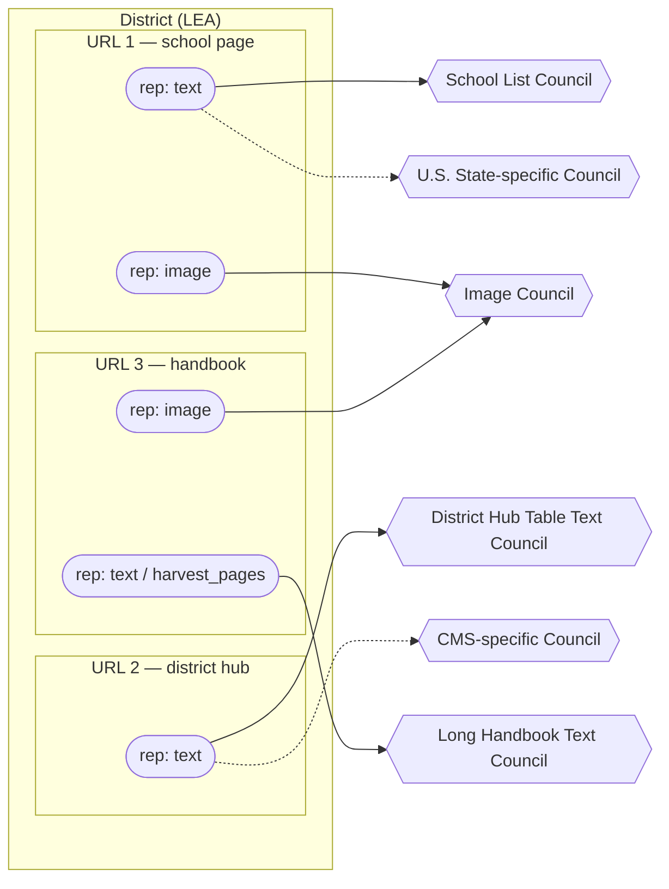

# Stage 6 — Handoff: routing representations to extraction councils (DESIGN, started 2026-06-27)

> **Status: DESIGN STARTING.** This is a living design note (same role `STAGE5_FILTER_DESIGN_2026-06.md`
> played for Stage 5) — a place to work through Stage 6 before any code. Sections marked **DECIDED**
> are settled (don't relitigate); **OPEN** sections are the working agenda. Authority for cross-stage
> architecture remains `PIPELINE_GOVERNANCE_AND_STATE_2026-06.md`; this note will feed back into it +
> `ACQUISITION_PIPELINE.md` + `REQUIREMENTS.yaml` once decisions settle.

**Companions / inputs:** the Stage-6 **user stories are inline in §4** (migrated 2026-06-27 from the retired
`apga_console_application_stage_view.md`); `docs/technical-notes/LLM_COUNCIL_RESEARCH_2026-06.md` (council research:
diversity > count, cross-family consensus, judge > voter, cost cascades); `docs/EXTRACTION_BENCHMARK_FINDINGS.md`
(model leaderboard + measured costs); `STAGE5_FILTER_DESIGN_2026-06.md` (the upstream `filtered.json`).

---

## 1. Purpose & boundary

**Stage 6 decides *which representations* go to *which extraction council(s)*, and performs the
release/dispatch.** It is **routing + release** — the gate is `gate@6`. It does **no extraction itself**
(that's Stage 7); it routes.

- **Input (from the DB — the working store):** the Stage-5 `record` / `representation` / `label` tables +
  the release decision (`decision`/`reason`, the best `send` rep per sent record + approved alternate
  target-flagged reps). `filtered.json` is the human-auditable **receipt** of that decision (a regenerable
  projection of the DB, governance §1), **not** the transport — Stage 6 reads the DB and the binaries on
  disk by path.
- **Output:** an immutable **`handoff_<hash>_<timestamp>.json`** (the dispatch record) + the actual paid
  OpenRouter calls that Stage 7 consumes. A `dispatched` `state_event` references the handoff hash.

**The unit Stage 7 receives is a COUNCIL, not a single model** — in production, representations are dispatched
to councils. *Single-model dispatch exists only as a benchmark/testing mode* (to score models on clean data
and inform council composition — §3A). Stage 6 must therefore hold **multiple swappable council configs**.

**Routing is per-representation, and the representation→council mapping is many-to-many** (Ian's sketch,
`docs/diagrams/STAGE6-routing-pencil-sketch.drawio.svg`, translated to Mermaid in §3B — a district holds
URLs, each URL holds representations, and representations fan out to content-typed councils). All of these
must be expressible:
- one rep → one council; one rep → multiple councils;
- multiple reps of the same URL → one council; *different* reps of the same URL → *different* councils
  (e.g. text → a text council, image → the image council);
- all reps of a URL, or all URLs of a district → one or more councils.

**Unit of work / review:** the **handoff package** — a set of representations (rolled up *by district/LEA*
for human review, story 61), each routed to its council, dispatched together. Multiple packages can exist
concurrently, each advancing only when approved (story 70) — the same "approve-to-advance" shape as Stage 1.

---

## 2. DECIDED / inherited (the fixed frame)

- **The DB is the input; `filtered.json` is the receipt** (governance §1) — Stage 6 reads the Stage-5
  `record`/`representation`/`label` tables + the release decision from the DB. The decision is event-driven
  and carries the winner **plus** alternate target-flagged reps (REQ-094 follow-up, approved 2026-06-27) so
  `gate@6` can offer representation override.
- **Driving goal: lowest total cost for the most bell schedules.** A higher-yield expensive council can beat
  a cheaper low-yield one — a correct first-pass answer needs no judge escalation, so yield buys cost back.
  Council composition is **continuously re-tested against a growing labeled pool** (hypotheses, not a frozen
  set); Stage 6's config machinery exists to make that testing cheap.
- **Default council template = 2 voters (2 families) → 1 judge on disagreement** (Ian, superseding the
  earlier "cheap-trio vs accuracy-pair" open question). A 3-voter first pass "doesn't add value, just cost
  at scale"; two cross-family voters agree-or-escalate, and a disagreement goes to a single judge that
  re-reads the page (research: judge > extra voter). This *is* the per-council mini-cascade; a separate
  cross-config cascade (cheap council → accuracy council) remains an open lever (§3B).
- **The handoff artifact is immutable** — freezes each district's chosen reps + assigned config +
  `(config,labels,data)` fingerprints at dispatch time; a new dispatch is a new file (governance §5).
  This is what makes "what did we send on date X" recoverable across the re-extract / request-more loops.
- **`gate@6` is manual/auto** (Settings toggle). Auto = auto-assign config + dispatch **within budget**;
  manual = human reviews/overrides config + representation, approves dispatch. Auto-advance through the
  paid stages (6/7) is **cost-gated by the budget governor (REQ-051)** — full-auto must not run up
  unbounded OpenRouter spend.
- **Cost lives at Stage 6**, not Stage 5 — only here do we know the council config (the model set). The
  `filtered.json` `cost_estimate` is a stub (`n_records`/`n_files`); the real dollar estimate is computed
  here from `config × token-estimate`.
- **The INVARIANT holds (REQ-054):** the council reads **TIMES** and returns per-school
  `{start_time, end_time, grade_level, school_name}` facts only; Python computes `gross = end − start`
  and the per-band mode (Stage 8). Stage 6 never asks a model to compute minutes.
- **Council = OpenRouter, out-of-process** (governance §7a); **consensus is cross-family, on the
  per-school (start,end) pair, ±15 min** (REQ-056) — same-family agreement is not consensus.
- **The loops Stage 6 participates in** (see the flow diagram's back-edges):
  - **7→6** — re-extract existing reps via a *different* council config (story 58); also "select an
    alternate representation" (story 59) → a new handoff, no new capture.
  - **8→6** — add an existing-rep URL to a new handoff (story 80).
  - Anything needing **new** capture/discovery (recapture, re-discover, band-gap fill) routes back to
    **Stage 1** as a reviewable follow-up batch — **not** created by Stage 6/7/8 directly.
- **Completion grain = district × BAND.** A district is "satisfied" when every claimed band has confident
  minutes; routing/cost reasoning is ultimately in service of *band* coverage, with schools/reps as the
  raw material.

---

## 3. OPEN — the working agenda (what we're here to decide)

### A. What *is* a council configuration? (the heart of Stage 6)
A first-class, registered object (stories 62–66: view/create/assign/override; default assignment). The
**template is decided** (§2: 2 voters / 2 families → 1 judge); what's open is **membership** (which models
fill each slot, settled by re-benchmarking on clean data) and **storage**. Schema:

| field | meaning | status |
|---|---|---|
| `id` / `name` | handle (e.g. `low-cost-text`, `image`) | — |
| `voters[]` | exactly 2 OpenRouter model ids, from **2 different families** | template fixed at 2; **membership open** (clean-data benchmark) |
| `judge` | 1 model (3rd family) that re-reads the page on a voter disagreement | part of every config (research: judge > extra voter) |
| `consensus_rule` | cross-family, per-school (start,end) pair, ±15 min (REQ-056) | fixed pipeline-wide |
| `prompts` | per-model prompt variants — same facts, shaped to each model's particularities | **new requirement** (Ian); see below |
| `escalation` | on no-consensus after the judge: escalate to a stronger config, or flag | ties to §B cascade |

**Seed councils (the two concrete starting configs — Ian; the *image* set covers PNG/scan reps):**

| config | voters (2 families) | judge |
|---|---|---|
| **low-cost text** | Gemini 2.5 Flash-Lite + Mistral Small 24B | Qwen3-235B-2507 |
| **image** | Gemini 2.5 Flash + Mistral Large 2512 | DeepSeek V3.2 |

These are *starting* configs on the candidate-6 roster, **to be re-validated** — the prior model picks were
made against a heavily-polluted input pool; now that Stages 1–5 deliver clean reps, Stage 7 re-benchmarks
available OpenRouter models per content structure before composition hardens (§3 preamble: the config
machinery exists to enable exactly this).

**Per-model prompt variation (new requirement).** The same facts may need different prompt shaping per
model. `prompts` is therefore per-model within a config, not one shared prompt — design the dispatch so a
config carries a prompt-template per voter/judge.

**Storage — DECIDED: config-as-data JSON** (approved 2026-06-29). A versioned `common/config/council_configs.json`
with per-entry provenance, mirroring the existing Stage-5 knob pattern (`config_loader`) — these are *tunable
config*, not data, so the config-as-data layer is the right home; git-diffable, and the Node half reads the
same file natively. The **assignment + cost + dispatch** are the DB/runtime parts (a config is *referenced
by id* from the immutable handoff; §3D).

**Diversity is a HARD CONSTRAINT, enforced by the config loader (council research §2/§3/§6).** A config is
*invalid* unless: (1) the **2 voters are different families**; (2) the **judge is a third family** (distinct
from both voters). This is not stylistic — the research is unambiguous: two wrong models agree on the *same*
wrong answer ~60% of the time (vs 33% chance), same-family far worse, and a judge that re-reads beats an
extra voter (−35.9% hallucination vs +32.7% for majority vote). Family buckets for our roster: **Google**
(Flash, Flash-Lite) · **Mistral** (Small 24B, Large 2512) · **DeepSeek** (V3.2) · **Qwen** (235B-2507). Both
seed councils satisfy this (low-cost: Google+Mistral→Qwen; image: Google+Mistral→DeepSeek). *The first test
in slice 1 is this validator.* (Why 2-and-a-judge, not a standing 3-voter panel: the research's "3>2" result
is for a *fixed parallel* council; ours is a **cascade** — 2 voters on the easy majority, the third-family
judge only on disagreement — which is the research's own preferred cost shape, §4.)

### B. Signals → routing (default assignment) — **the foundational question**

> **OPEN #1 — RESOLVED: routing grain is per-representation.** A hard `hub` rep and an easy single-school
> rep *in the same district* warrant different councils, and *different reps of the same URL* can go to
> different councils (text→text council, image→image council). So assignment is **per-representation**; the
> handoff is merely *organized by district* for human review (story 61). This closes the per-district /
> per-handoff / per-representation question in favor of per-rep, and it shapes the artifact + cost model (§3D/§3C).

What drives the council a representation gets (story 66, "default assignment criteria")? The routing key is
**the representation's content type + capture/context signals**, all already in the governance DB. Ian's
sketch enumerates the *candidate* routing dimensions (explicitly **speculative until we have data** — they
are hypotheses to test, not a fixed map):
- **Content format** — school bell-schedule page · district hub table · schedule buried in a long handbook ·
  image-only. (Maps to Stage-5 `topology` / `category_hypothesis` / `visual_text_gap` / `harvest_pages` /
  `n_schools`.) The sketch names content-typed councils for each (*School List*, *District Hub Table Text*,
  *Long Handbook Text*, *Image*) — illustrative, not committed.
- **Capture signals** — e.g. **CMS** (`cms_hint`), where a vendor's layout systematically affects text
  extraction → a *CMS-specific* council.
- **State** — where a state's mandated regulatory boilerplate skews extraction → a *state-specific* council.

**Illustrative routing (Ian's sketch, translated — councils speculative until data).** A district holds
URLs, each URL holds representations, and reps fan out per content type. Note the many-to-many: *different
reps of the same URL* go to *different* councils (text vs. image), reps from *different* URLs converge on
*one* council, and a single rep may go to *more than one* (dashed = a secondary CMS/state council). Source:
`docs/diagrams/STAGE6-routing-pencil-sketch.drawio.svg`.

**The cascade is the open lever (not the grain).** Within a council, the pair+judge *is* a mini-cascade.
The open question is whether to also cascade *across* configs — start a rep on the cheap council, escalate
to a stronger/specialized one only on no-consensus (FrugalGPT/UCCI) — vs. route straight to the right
council by content type. Decided empirically by measured escalation + yield on real captured inputs.

**Capture fidelity is a routing/accept signal, not just a content type (council research, the New Haven
refinement).** Cross-family agreement is strong evidence *only when the input is clean*. When a rep is
**known-garbled / low-fidelity** — multi-column scans OCR scrambles, `visual_text_gap`, OCR-sourced text —
even cross-family voters make the *same* mis-read (false consensus from a shared **bad input**, upstream of
the models, which family diversity cannot rescue). Two implications Stage 6 carries:
- **Routing:** a low-fidelity text rep should route to the **image/vision council** (read the rendered PNG),
  not a text council — the fix is a clean input, not more text voters.
- **Accept (Stage 7's rule, but Stage 6 must carry the signal):** a low-fidelity rep must **not auto-accept
  on 2-voter agreement** — force the judge or human-QC. So the handoff carries each rep's capture-fidelity
  signal alongside its routed council. (Calibrated escalation thresholds — UCCI — are a later refinement;
  the binary "fidelity-suspect → don't auto-accept" gate is the version we build first.)

### C. Cost estimation (story 67–68)
- **v1:** OpenRouter price/1M × token estimate (input ≈ rep size; output small/bounded). Per config × per rep.
- **Actuals:** OpenRouter returns a `usage` object on each response → capture post-hoc actuals to refine
  the estimator over time. **RESEARCH (story 68):** does the OpenRouter API expose *historical* per-request
  logs/usage beyond the per-response `usage`? (Worth a probe — needed for retroactive accuracy.)
- Feeds: the handoff cost summary, the `gate@6` go/no-go, and the budget governor (REQ-051).
- **OPEN:** token-estimation method (char/4 heuristic vs a real tokenizer per model).

### D. The handoff artifact schema (mostly designed — pin it)
`handoff_<hash>_<timestamp>.json` (immutable), organized by district for review but **assigned per
representation** (§3B): `districts[]` → per district its sent reps, **each rep carrying its routed council
config** (a rep may name more than one council — the many-to-many mapping) + frozen `(config,labels,data)`
fingerprints; the set of council configs used; total cost estimate; created_at. The freeze is what keeps
"what we sent on date X" recoverable across the re-extract / request-more loops, even after the DB's release
decision later regenerates.
- **OPEN:** how to represent the rep→council fan-out compactly when several reps share a config (a config
  table + per-rep references vs. inlined configs).

### E. `gate@6` manual/auto + re-handoff semantics
- **manual:** review the package, assigned configs, cost; override config + representation; approve dispatch.
- **auto:** auto-assign (cascade) + dispatch within budget; **auto-with-confidence-escalation** (escalate
  or flag on no-consensus — the same pattern confirmed for Stage 5 and Stage 8), never silent on low confidence.
- **re-handoff (story 58):** a district/URL already extracted, re-sent to a *different* config → a new
  immutable handoff file; the prior one is untouched (history preserved).

### F. The council "request more evidence" loop (plan for it now — Ian)
A council or judge in Stage 7 may decide it needs more than the one rep it was sent, and should be able to
**request** it. Three request kinds, each a back-edge Stage 6 has to route:
- **more text reps** — send additional text representations of the same URL beyond the highest-scoring one
  (already in the DB → a new handoff, no new capture).
- **the image** — escalate the Playwright-captured PNG to the **image council** (a *different* rep of the
  same URL → a different council; the 7→6 back-edge).
- **more data** — trigger a **new Stage 2 discovery query** for the district (the 7→1 back-edge: new work
  routes through a reviewable follow-up batch, never created by Stage 7 directly — §2 / governance §11d).

**This means Stage 7 can trigger prior-stage scripts**, and Stage 6 must equip the handoff with what a
follow-up needs to route correctly. **OPEN (research):** the OpenRouter **session/context** question — can
we keep an API session open across the request round-trip, or must we re-pass frozen context (the immutable
handoff is what makes this recoverable) into a fresh call with an appropriate follow-up prompt? Councils may
or may not persist in the OpenRouter session; the handoff freeze + per-model prompts (§3A) are the
mechanisms for reconstituting context if they don't.

---

## 4. Requirements to capture (seed from the Stage 6 user stories — not yet numbered)
- Initiate a handoff of not-yet-extracted district representations (57); re-handoff already-extracted reps
  to a different config (58); select an alternate target-flagged representation per URL (59–60).
- Handoff organized by district/LEA (61); see + override the assigned council config (62–63).
- View available council configs; create new ones from OpenRouter models; see default assignment criteria (64–66).
- Per-handoff cost estimate, refined with OpenRouter usage (67–68).
- Approve a handoff for dispatch (69); multiple handoff packages, approve-to-advance (70).

**Added from the routing commentary (Ian):**
- Council config follows the **2-voters-2-families → judge** template; hold **multiple swappable configs**,
  incl. a **single-model benchmark/testing mode** to re-validate composition on clean data.
- Route **per representation** to content-typed councils (the many-to-many mapping of §1/§3B), keyed on
  content format / capture signals (CMS) / state.
- **Per-model prompt variants** within a config (§3A).
- **Council/judge "request more evidence"** (§3F): more text reps, the image → image council, or a new
  Stage 2 query — i.e. **Stage 7 can trigger prior-stage scripts**, and Stage 6 equips the follow-up
  (incl. the OpenRouter session/context-persistence question).

---

## 5. References
- Stage 6 user stories — now inline in §4 (migrated 2026-06-27 from the retired apga doc).
- `PIPELINE_GOVERNANCE_AND_STATE_2026-06.md` §4/§5 (release/handoff), §7a (council out-of-process).
- `LLM_COUNCIL_RESEARCH_2026-06.md` — cross-family consensus, judge, cost cascade.
- `EXTRACTION_BENCHMARK_FINDINGS.md` — model leaderboard + measured costs (the config candidates).
- REQ-054 (read-times invariant), REQ-055 (gross metric), REQ-056 (cross-family consensus), REQ-051 (budget governor), REQ-094 (`filtered.json`).

---

## 6. Provenance
Ian's routing commentary + the pencil sketch (`docs/diagrams/STAGE6-routing-pencil-sketch.drawio.svg`) were
**reconciled into §1–§4 on 2026-06-29** — the driving goal (§2), the per-representation many-to-many routing
+ the Mermaid translation (§1/§3B), the 2-voters-2-families → judge template + the two seed councils +
per-model prompts (§3A), and the "request more evidence" loop + session-persistence question (§3F). The
original free-form commentary is preserved in git history (and `docs/scratch-paper/STAGE6-Ian-thoughts-on-routing.md`)
if the raw voice is ever needed. **Reconciliation principle applied:** code is truth, design notes narrate
it, and per `PIPELINE_GOVERNANCE_AND_STATE_2026-06.md` §1 the DB is the working store / JSON is a receipt —
so this note no longer calls `filtered.json` Stage 6's "input."