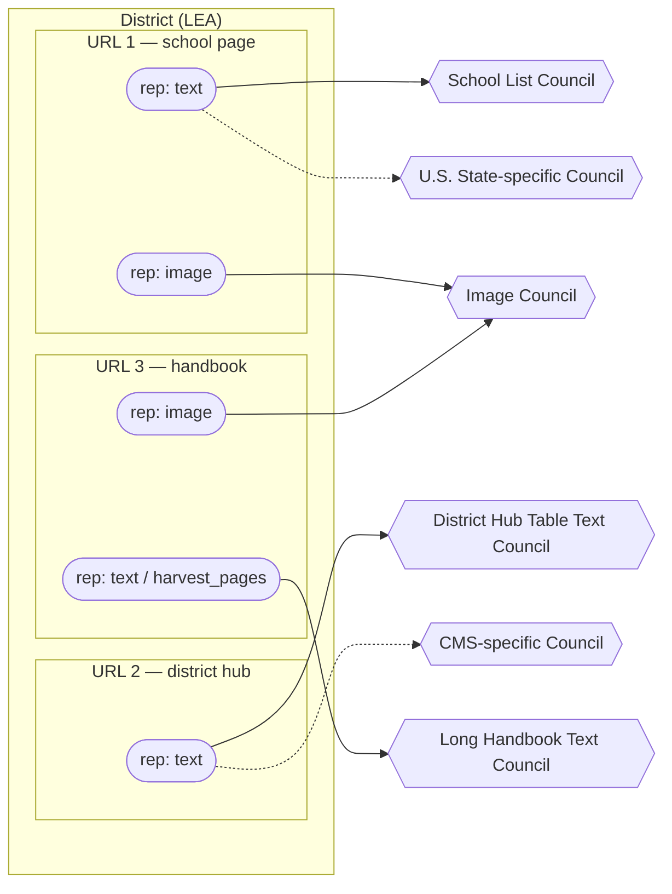

# Stage 6 — Dispatch: present state & decision log (REQ-101)

> **Authority:** Stage 6's purpose/boundary, the council config model, routing, cost estimation, the
> immutable dispatch artifact, and the gate@6 console — what the code does today. §0 maps the code (the
> ground truth); §1–§4 hold the design rationale, with items still genuinely open flagged inline (chiefly
> council **composition**, which awaits the measurement lab).
> **Audience:** anyone building on or debugging Stage 6; anyone tracing a dispatch's routing/pricing/identity.
> **Companions:** the Stage-6 **user stories are inline in §4**; `docs/technical-notes/models-and-council-composition/LLM_COUNCIL_RESEARCH_2026-06.md`
> (diversity > count, cross-family consensus, judge > voter, cost cascades); `EXTRACTION_BENCHMARK_FINDINGS.md`
> (model leaderboard + measured costs); `STAGE5_FILTER_DESIGN_2026-06.md` (upstream); `STAGE7_EXTRACT_DESIGN`
> (downstream); `PIPELINE_GOVERNANCE_AND_STATE_2026-06.md` §11/§12 (cross-stage architecture authority).
> **Update this when:** Stage 6's code behavior changes. Design turns and superseded approaches belong in
> §6 (Provenance / decision log), not here.

**Status: BUILT to the Stage 6→7 seam.** Stage 6 reads the Stage-5 release decision from the DB, routes
each representation to a council, prices it, freezes an immutable dispatch, records the dispatch, and
assembles the OpenRouter requests — **stopping *before* the paid call** (that's Stage 7). `gate@6` is live
in the console (manual approve; a preview→freeze identity check closes the staleness gap — §0).

---

## 0a. Receipt from prior stage / Handoff to next stage

**Receipt from prior stage:** the Stage-5 release decision, read directly from the governance DB
(`record`/`representation`/`label` + `release.decide`) — `filtered.json` is the human-auditable receipt of
that decision, never the transport.

**Handoff to next stage:** the immutable `handoff_<hash>_<timestamp>.json` (the assembled, priced,
routed dispatch package) + the precious `handoff` index row + a `dispatched` state_event are Stage 7's
input. Stage 7 makes the paid OpenRouter call against the frozen package; everything it needs (routed
council per representation, per-model prompts, the capture-fidelity flag, the harvest-slice page range) is
assembled here so Stage 7 never has to re-derive routing decisions.

---

## 0. As-built (code is ground truth)

The Stage 6 package is `infrastructure/acquisition/stage6_handoff/` (pure, `common`-only imports — independent
of the other stages, enforced by import-linter) + the app-layer bridge in `process_governance/`. Built
slice-by-slice; **~63 tests** (incl. govdb Postgres) + a live end-to-end dispatch.

| piece | code | what it does |
|---|---|---|
| council registry + validator | `stage6_handoff/councils.py` + `common/config/council_configs.json` | config-as-data councils; a HARD diversity rule (2 voters / 2 families → 3rd-family judge) **and** a prompt-resolution check, validated on load. Seeds: `low-cost-text`, `image`. `FAMILY_ALIAS` normalizes uncatalogued `mistralai/*` model ids to the `mistral` family (fable review issue #36 — an uncatalogued id used to fall back to the raw prefix, letting two Mistral voters pass the cross-family check); `validate()` now hard-refuses any voter/judge not in the family catalog at all |
| routing | `stage6_handoff/routing.py` | per-rep → council(s), **data-driven off each config's `input_kinds`**; the capture-fidelity gate (`visual_text_gap` → vision council, `fidelity_suspect=True`, never auto-accept on agreement — the New Haven lesson) |
| cost estimator | `stage6_handoff/cost.py` + `common/config/council_cost_model.json` | per-council $ = voters + escalation·judge; reads a config-as-data cost model with `provenance`. Ships a labeled **bootstrap** (flat per-call); the token×**live-OpenRouter-price** split is designed (§3C), not yet wired. The bridge now populates `n_schools` (from `intended_schools`) and `n_bytes` for binary reps (issue #55) — the inputs the future measured model needs; bootstrap dollars unchanged |
| package assembly | `stage6_handoff/package.py` | release decision → routed + priced in-memory dispatch package (pure). Carries `pages` (the harvest-slice page range) through to the frozen doc (issue #38 — it used to drop at this step, so Stage 7 would have read the whole handbook PDF instead of the materialized slice). An unknown per-rep council override now **raises**, naming the bad id, instead of silently falling back to auto-routing (issue #54) |
| release→routing bridge | `process_governance/stage6_dispatch.py` | reads the DB release decision (`release.load_district_records`/`decide`), enriches reps with size signals, assembles; the one module that imports **both** stage5 + stage6 (the §12 independence contract). The `district_status.json` backup export now happens only **after** the handoff file write succeeds (issue #39 — it used to export flushed-but-uncommitted events before the file write, so a failed write could leave phantom `dispatched` events in the git-swept backup) |
| immutable artifact | `stage6_handoff/handoff.py` | `handoff_<hash>_<ts>.json` under `data/acquisition/handoffs/`; a **price-independent** content-identity hash (which also folds in the `verified_only` mode, below), now **order-insensitive** — districts/records/reps are sorted before hashing, so the same selection made in a different order hashes identically (issue #52). `write()` refuses to overwrite. `package_identity()` exposes the hash publicly for the preview→freeze check below |
| dispatch record | `stage6_handoff/models.py` (precious `handoff` table) + `stage6_dispatch.record_dispatch` | the index row + a per-district `dispatched` gate@6 `state_event`, recorded **atomically on one session** (current_state is a view); the file is written **last** so a DB failure rolls back cleanly. An empty effective selection now **refuses** rather than freezing a 0-district handoff (issue #53) |
| request assembly (the seam) | `stage6_handoff/prompts.py` + `requests.py` | the ported extraction prompt (reads TIMES only, REQ-054) + a vision variant; `plan_requests` (the first-pass voter calls; judge deferred to Stage 7) + `build_request` (materialize) — **stops here; the paid POST is Stage 7**. `pages` now flows through to the plan (issue #38) |
| gate@6 console | `process_governance/server.py` (`/api/handoff/{candidates,councils,preview,dispatch,inspect}`, `/api/handoffs`) + `static/stage6.js` | pick send-eligible districts (each showing **n_send / n_verified / n_hold**) → preview the routed/priced package → **Approve & freeze (gate@6)**. Controls: left-pane filters (name/state/topology · has-send · has-held), the **verified-only** mode (§3E), per-rep **council override** (`/councils`), click-to-**inspect** a representation (`/inspect`), remove-a-district, + a recent-dispatches list. **Preview→freeze staleness closed (issue #37):** preview returns the package's identity hash; dispatch verifies it against a freshly-rebuilt package and returns HTTP 409 ("release changed since preview — re-preview") on mismatch, before anything freezes — what Ian approves is now verifiably what freezes. `serve_file`/`inspect` resolve `source=="harvest_slice"` reps via `resolve_harvest_slice()` (new-location-first, legacy fallback — the STAGE5 harvest-slice relocation) |

**The send set (the 5/6 seam — tier-gated, `stage5_filter/release.decide`).** A canonical record is **send** if it
carries a human **TARGET label**, or is unlabeled **tier-A** (`auto:tier-A` — the confident auto-dispatch);
unlabeled **tier-B/C** are **`hold`** (a *third* decision — a maybe-target awaiting a gate@5 label, surfaced as
`n_hold` / "held for label"), and tier-D / labeled-non-target are **reject**. Handbooks send the materialized
**`harvest_slice`** (the high-signal `harvest_pages`, ~1–4 pp — built at Stage-5 ingest), not the whole PDF.
**Verified-only mode** (a gate@6 toggle — §3E) narrows the send set to **labeled targets only**, holding the
speculative tier-A auto-sends, for building a manually-verified, training-grade corpus.

**Stage-5 v2.1 ripple check (2026-07-01).** The Stage-5 labeling rework (target-shape taxonomy; non-targets →
confounder facets; REQ-114) flows into Stage 6 **cleanly** — `release.decide` and the gate@6 candidates SQL
both read `TARGET_LABELS` **dynamically**, so migrated labels (`school_bell_table`, `district_hub_by_*`, …)
count as targets and `target_absent`/`unusable` reject; candidates / preview / verified-only all verified
against the migrated set (108 verified targets, preview assembles + prices normally). *(The
`server._TARGET_IN` frozen-at-import wrinkle noted here on 2026-07-01 was removed 2026-07-02 — the module
constant was deleted entirely in favor of a bound list param computed per request, issue #62.)* One
remaining wrinkle, not a defect: the human now records the real handbook **page range**
(`facets_json._pages_list`), but the `harvest_slice` still materializes off the *auto* `harvest_pages` — a
worthwhile future edge (prefer the human-labeled pages once they accrue), tracked as a follow-up. (tracked: #109)

**The seam:** everything needed to POST is assembled here; **Stage 7** makes the paid call, runs the
judge-on-disagreement loop, and the "request more evidence" back-edges (§3F). **Deferred (own tracks):**
the **council lab** (`cost_benchmark` — replaces the bootstrap with measured token rates + live OpenRouter
pricing, and re-benchmarks council **composition** on clean data; §3A/§3C — *designed, not run*); gate@6
**auto** mode + the budget-governor cost-gate (REQ-051) — the console does *manual* approve today; the
cross-config **cascade** lever (§3B); and (Stage 7) the request-more-evidence loop + OpenRouter session
persistence (§3F).

---

## 1. Purpose & boundary

**Stage 6 decides *which representations* go to *which extraction council(s)*, and performs the
release/dispatch.** It is **routing + release** — the gate is `gate@6`. It does **no extraction itself**
(that's Stage 7); it routes.

- **Input (from the DB — the working store):** the Stage-5 `record` / `representation` / `label` tables +
  the release decision (`decision`/`reason`, the best `send` rep per sent record + approved alternate
  target-flagged reps). `filtered.json` is the human-auditable **receipt** of that decision (a regenerable
  projection of the DB, governance §1), **not** the transport — Stage 6 reads the DB and the binaries on
  disk by path.
- **Output:** an immutable **`handoff_<hash>_<timestamp>.json`** (the dispatch record) + the actual paid
  OpenRouter calls that Stage 7 consumes. A `dispatched` `state_event` references the dispatch hash.

**The unit Stage 7 receives is a COUNCIL, not a single model** — in production, representations are dispatched
to councils. *Single-model dispatch exists only as a benchmark/testing mode* (to score models on clean data
and inform council composition — §3A). Stage 6 must therefore hold **multiple swappable council configs**.

**Routing is per-representation, and the representation→council mapping is many-to-many** (Ian's sketch,
`docs/diagrams/STAGE6-routing-pencil-sketch.drawio.svg`, translated to Mermaid in §3B — a district holds
URLs, each URL holds representations, and representations fan out to content-typed councils). All of these
must be expressible:
- one rep → one council; one rep → multiple councils;
- multiple reps of the same URL → one council; *different* reps of the same URL → *different* councils
  (e.g. text → a text council, image → the image council);
- all reps of a URL, or all URLs of a district → one or more councils.

**Unit of work / review:** the **dispatch package** — a set of representations (rolled up *by district/LEA*
for human review, story 61), each routed to its council, dispatched together. Multiple packages can exist
concurrently, each advancing only when approved (story 70) — the same "approve-to-advance" shape as Stage 1.

---

## 2. DECIDED / inherited (the fixed frame)

- **The DB is the input; `filtered.json` is the receipt** (governance §1) — Stage 6 reads the Stage-5
  `record`/`representation`/`label` tables + the release decision from the DB. The decision is event-driven
  and carries the winner **plus** alternate target-flagged reps (REQ-094 follow-up, approved 2026-06-27) so
  `gate@6` can offer representation override.
- **Driving goal: lowest total cost for the most bell schedules.** A higher-yield expensive council can beat
  a cheaper low-yield one — a correct first-pass answer needs no judge escalation, so yield buys cost back.
  Council composition is **continuously re-tested against a growing labeled pool** (hypotheses, not a frozen
  set); Stage 6's config machinery exists to make that testing cheap.
- **Default council template = 2 voters (2 families) → 1 judge on disagreement** (Ian, superseding the
  earlier "cheap-trio vs accuracy-pair" open question). A 3-voter first pass "doesn't add value, just cost
  at scale"; two cross-family voters agree-or-escalate, and a disagreement goes to a single judge that
  re-reads the page (research: judge > extra voter). This *is* the per-council mini-cascade; a separate
  cross-config cascade (cheap council → accuracy council) remains an open lever (§3B).
- **The dispatch artifact is immutable** — freezes each district's chosen reps + assigned config +
  `(config,labels,data)` fingerprints at dispatch time; a new dispatch is a new file (governance §5).
  This is what makes "what did we send on date X" recoverable across the re-extract / request-more loops.
- **`gate@6` is manual/auto** (Settings toggle). Auto = auto-assign config + dispatch **within budget**;
  manual = human reviews/overrides config + representation, approves dispatch. Auto-advance through the
  paid stages (6/7) is **cost-gated by the budget governor (REQ-051)** — full-auto must not run up
  unbounded OpenRouter spend.
- **Cost lives at Stage 6**, not Stage 5 — only here do we know the council config (the model set). The
  `filtered.json` `cost_estimate` is a stub (`n_records`/`n_files`); the real dollar estimate is computed
  here from `config × token-estimate`.
- **The INVARIANT holds (REQ-054):** the council reads **TIMES** and returns per-school
  `{start_time, end_time, grade_level, school_name}` facts only; Python computes `gross = end − start`
  and the per-band mode (Stage 8). Stage 6 never asks a model to compute minutes.
- **Council = OpenRouter, out-of-process** (governance §7a); **consensus is cross-family, on the
  per-school (start,end) pair, ±15 min** (REQ-056) — same-family agreement is not consensus.
- **The loops Stage 6 participates in** (see the flow diagram's back-edges):
  - **7→6** — re-extract existing reps via a *different* council config (story 58); also "select an
    alternate representation" (story 59) → a new dispatch, no new capture.
  - **8→6** — add an existing-rep URL to a new dispatch (story 80).
  - Anything needing **new** capture/discovery (recapture, re-discover, band-gap fill) routes back to
    **Stage 1** as a reviewable follow-up batch — **not** created by Stage 6/7/8 directly.
- **Completion grain = district × BAND.** A district is "satisfied" when every claimed band has confident
  minutes; routing/cost reasoning is ultimately in service of *band* coverage, with schools/reps as the
  raw material.

---

## 2a. Architecture: the runtime dispatch path vs the recurring council lab (Ian, 2026-06-30)

Stage 6 is **two layers**, not one — and conflating them was an early mistake. The cost machinery, the
council seeds, and routing rules are not one-off setup; they are **standing infrastructure re-exercised
over time** as the corpus grows, OpenRouter prices move, and new models/configs arrive.

| layer | pieces | cadence | role |
|---|---|---|---|
| **Runtime dispatch path** | `councils` registry · `routing` · `cost` estimator · `package` · `stage6_dispatch` bridge · dispatch writer · dispatch · gate@6 | **per dispatch** | the **consumer** — routes + prices + freezes + dispatches |
| **The council lab** | the model benchmark (`cost_benchmark`) · the measured **token model** · live **pricing** cache · a fingerprinted **run ledger** · later: accuracy/agreement scoring, routing-hypothesis tests | **periodic / on-demand** | the **producer** — measures, fits, and updates the config-as-data the runtime path reads |

**The producer ("the Council Lab") is now its own concern — see `COUNCIL_LAB_DESIGN_2026-06.md`.** It
emerged here but is genuinely cross-stage (Stage 4 reader-routing, Stage 6 councils/routing/cost, Stage 7
prompts/judge, the Stage-8-grown GT yardstick), so its design — the cost benchmark (was §3C C.1–C.6, now
that note §3), the composition re-benchmark (§3A "membership open", now that note §4), the prompt A/B, the
judge/vision fix, the run ledger, and the (agreed, later) dedicated console view — lives there. What stays
here is the **runtime consumer**: the council registry + validator (§3A), routing (§3B), the estimator on a
bootstrap cost model (§3C/C.0). **The contract between the layers is the config-as-data artifact + its
`provenance`** — built into the cost model (slice 3), so the runtime path is indifferent to
bootstrap-vs-measured and the Lab improves the numbers underneath it; nothing in the runtime path changes to
enable the Lab.

---

## 3. Design rationale + what remains open

> **Most of this section is now BUILT (see §0).** It's kept as the rationale behind the as-built code;
> the items still genuinely open are flagged inline. Quick status: **§3A** council config = BUILT
> (config-as-data + validator); *composition* OPEN (the lab). **§3B** routing = BUILT (data-driven off
> `input_kinds` + the fidelity gate); the *cross-config cascade* OPEN. **§3C** cost = BUILT on a bootstrap;
> the *measured token×live-price* model DESIGNED. **§3D** dispatch schema = BUILT. **§3E** gate@6 = *manual*
> BUILT (console); *auto* DEFERRED. **§3F** request-more-evidence = Stage 7 (deferred). **§3G** recency
> preference = OPEN (a dispatch decision; batch_00008 evidence).

### A. What *is* a council configuration? (the heart of Stage 6)
A first-class, registered object (stories 62–66: view/create/assign/override; default assignment). The
**template is decided** (§2: 2 voters / 2 families → 1 judge); what's open is **membership** (which models
fill each slot, settled by re-benchmarking on clean data) and **storage**. Schema:

| field | meaning | status |
|---|---|---|
| `id` / `name` | handle (e.g. `low-cost-text`, `image`) | — |
| `voters[]` | exactly 2 OpenRouter model ids, from **2 different families** | template fixed at 2; **membership open** (clean-data benchmark) |
| `judge` | 1 model (3rd family) that re-reads the page on a voter disagreement | part of every config (research: judge > extra voter) |
| `consensus_rule` | cross-family, per-school (start,end) pair, ±15 min (REQ-056) | fixed pipeline-wide |
| `prompts` | per-model prompt variants — same facts, shaped to each model's particularities | **new requirement** (Ian); see below |
| `escalation` | on no-consensus after the judge: escalate to a stronger config, or flag | ties to §B cascade |

**Seed councils (the two concrete starting configs — Ian; the *image* set covers PNG/scan reps):**

| config | voters (2 families) | judge |
|---|---|---|
| **low-cost text** | Gemini 2.5 Flash-Lite + Mistral Small 24B | Qwen3-235B-2507 |
| **image** | Gemini 2.5 Flash + Mistral Large 2512 | DeepSeek V3.2 |

These are *starting* configs on the candidate-6 roster, **to be re-validated** — the prior model picks were
made against a heavily-polluted input pool; now that Stages 1–5 deliver clean reps, Stage 7 re-benchmarks
available OpenRouter models per content structure before composition hardens (§3 preamble: the config
machinery exists to enable exactly this).

**Per-model prompt variation (new requirement).** The same facts may need different prompt shaping per
model. `prompts` is therefore per-model within a config, not one shared prompt — design the dispatch so a
config carries a prompt-template per voter/judge.

**Storage — DECIDED: config-as-data JSON** (approved 2026-06-29). A versioned `common/config/council_configs.json`
with per-entry provenance, mirroring the existing Stage-5 knob pattern (`config_loader`) — these are *tunable
config*, not data, so the config-as-data layer is the right home; git-diffable, and the Node half reads the
same file natively. The **assignment + cost + dispatch** are the DB/runtime parts (a config is *referenced
by id* from the immutable dispatch; §3D).

**Diversity is a HARD CONSTRAINT, enforced by the config loader (council research §2/§3/§6).** A config is
*invalid* unless: (1) the **2 voters are different families**; (2) the **judge is a third family** (distinct
from both voters). This is not stylistic — the research is unambiguous: two wrong models agree on the *same*
wrong answer ~60% of the time (vs 33% chance), same-family far worse, and a judge that re-reads beats an
extra voter (−35.9% hallucination vs +32.7% for majority vote). Family buckets for our roster: **Google**
(Flash, Flash-Lite) · **Mistral** (Small 24B, Large 2512) · **DeepSeek** (V3.2) · **Qwen** (235B-2507). Both
seed councils satisfy this (low-cost: Google+Mistral→Qwen; image: Google+Mistral→DeepSeek). *The first test
in slice 1 is this validator.* (Why 2-and-a-judge, not a standing 3-voter panel: the research's "3>2" result
is for a *fixed parallel* council; ours is a **cascade** — 2 voters on the easy majority, the third-family
judge only on disagreement — which is the research's own preferred cost shape, §4.)

### B. Signals → routing (default assignment) — **the foundational question**

> **OPEN #1 — RESOLVED: routing grain is per-representation.** A hard `hub` rep and an easy single-school
> rep *in the same district* warrant different councils, and *different reps of the same URL* can go to
> different councils (text→text council, image→image council). So assignment is **per-representation**; the
> dispatch is merely *organized by district* for human review (story 61). This closes the per-district /
> per-dispatch / per-representation question in favor of per-rep, and it shapes the artifact + cost model (§3D/§3C).

What drives the council a representation gets (story 66, "default assignment criteria")? The routing key is
**the representation's content type + capture/context signals**, all already in the governance DB. Ian's
sketch enumerates the *candidate* routing dimensions (explicitly **speculative until we have data** — they
are hypotheses to test, not a fixed map):
- **Content format** — school bell-schedule page · district hub table · schedule buried in a long handbook ·
  image-only. (Maps to Stage-5 `topology` / `category_hypothesis` / `visual_text_gap` / `harvest_pages` /
  `n_schools`.) The sketch names content-typed councils for each (*School List*, *District Hub Table Text*,
  *Long Handbook Text*, *Image*) — illustrative, not committed.
- **Capture signals** — e.g. **CMS** (`cms_hint`), where a vendor's layout systematically affects text
  extraction → a *CMS-specific* council.
- **State** — where a state's mandated regulatory boilerplate skews extraction → a *state-specific* council.

**Illustrative routing (Ian's sketch, translated — councils speculative until data).** A district holds
URLs, each URL holds representations, and reps fan out per content type. Note the many-to-many: *different
reps of the same URL* go to *different* councils (text vs. image), reps from *different* URLs converge on
*one* council, and a single rep may go to *more than one* (dashed = a secondary CMS/state council). Source:
`docs/diagrams/STAGE6-routing-pencil-sketch.drawio.svg`.



**The cascade is the open lever (not the grain).** Within a council, the pair+judge *is* a mini-cascade.
The open question is whether to also cascade *across* configs — start a rep on the cheap council, escalate
to a stronger/specialized one only on no-consensus (FrugalGPT/UCCI) — vs. route straight to the right
council by content type. Decided empirically by measured escalation + yield on real captured inputs. (tracked: #110)

**Capture fidelity is a routing/accept signal, not just a content type (council research, the New Haven
refinement).** Cross-family agreement is strong evidence *only when the input is clean*. When a rep is
**known-garbled / low-fidelity** — multi-column scans OCR scrambles, `visual_text_gap`, OCR-sourced text —
even cross-family voters make the *same* mis-read (false consensus from a shared **bad input**, upstream of
the models, which family diversity cannot rescue). Two implications Stage 6 carries:
- **Routing:** a low-fidelity text rep should route to the **image/vision council** (read the rendered PNG),
  not a text council — the fix is a clean input, not more text voters.
- **Accept (Stage 7's rule, but Stage 6 must carry the signal):** a low-fidelity rep must **not auto-accept
  on 2-voter agreement** — force the judge or human-QC. So the dispatch carries each rep's capture-fidelity
  signal alongside its routed council. (Calibrated escalation thresholds — UCCI — are a later refinement;
  the binary "fidelity-suspect → don't auto-accept" gate is the version we build first.)

### C. Cost estimation (story 67–68) — GROUNDED BY MEASUREMENT, not a heuristic (Ian, 2026-06-30)

**Decision: don't guess the estimator and don't reverse-engineer it from old logs — *measure it* against
representations we already have.** A `chars/4` heuristic is wrong per-model (every model tokenizes
differently; vision input tokens depend on image size, not chars) and old OpenRouter logs were produced on
a polluted, pre-Stage-1..5 input mix. Instead, run a small, stratified **cost-measurement benchmark** over
our existing captured/processed reps, record the real token+cost telemetry OpenRouter returns, and fit a
per-model **token model**. The estimator then reads *measured* token rates × *live* prices. **Feeds:** the
dispatch cost summary, the `gate@6` go/no-go, the budget governor (REQ-051).

**C.0 — The estimate decomposes into three inputs, by owner and volatility (Ian, 2026-06-30).** Keep them
separate — conflating them (as slice 3's first cut did) bakes a price snapshot into a measured artifact:

```
cost(rep, council) = Σ_voters  tokens(model, rep) × price(model)  +  escalation_rate × [judge term]
```
| input | owner | source | volatility | home |
|---|---|---|---|---|
| **token consumption** (in/out tokens per model × rep-type) | us | the **council lab**, measured on our reps | stable (changes with content / model set) | a stored **token model** (config-as-data, provenance) |
| **per-token price** ($/Mtok in & out) | OpenRouter/providers | **live OpenRouter `/api/v1/models`** | volatile (their schedule) | a **fetched cache** (`fetched_at`), refreshed on a cadence |
| **escalation rate** | us | the accuracy/agreement benchmark | slow | an assumption until measured |

**Pricing is FETCHED LIVE and cached — never measured, never hardcoded.** OpenRouter's models endpoint is
the authoritative per-token price; we cache it (a cheap metadata GET, *no model calls*) and refresh
periodically, so an estimate is `current tokens × current price`. Consequence: the (expensive) lab re-runs
only when **content or the model roster** changes — a **price** change just refreshes the (free) cache. And
the ledger can attribute a cost move to *us* (tokens) vs *OpenRouter* (price) separately.

> **STATUS: DESIGNED, NOT YET RUN.** This is the test design only (per Ian — design, don't execute yet).
> **Cost and accuracy are DECOUPLED (Ian, 2026-06-30):** cost needs no ground truth — it is tokens × price
> over *any* real representations — so this benchmark runs **cost-only on current clean reps now**. The
> clean-data **accuracy/composition** re-benchmark (§3A, "membership open") is a *separate, later* effort,
> blocked on aligning GT into the current pipeline (see C.6). The harness is built so the same runner can
> later emit an accuracy read-out, but we do **not** wire accuracy now. Single-model calls here = the
> **benchmark/testing mode** of §1 (in production we dispatch to councils, not lone models).

**C.1–C.6 — the cost-benchmark harness design MIGRATED to `COUNCIL_LAB_DESIGN_2026-06.md` §3** (the
Council Lab is the producer that measures the token model; §2a). In brief, so this section stays
self-contained: `stage6_handoff/cost_benchmark.py` (a script, gated on `OPENROUTER_API_KEY`) issues one
real-extraction-prompt call per (model × rep) over a stratified sample (~40–60 reps across
file_kind/content-type/size/school-count cells), captures native `usage` tokens + per-generation cost, and
fits a per-model **token model** (`council_token_model.json`, config-as-data) that the estimator reads ×
the **live** OpenRouter price cache. **DESIGNED, cost-only, not yet run.** The clean-data
accuracy/composition re-benchmark (§3A) is separate and was unblocked by `batch_00000` (the 27 curated-GT
districts injected `batch_type="benchmark"`, Stage-9-walled) — full detail + the growing-GT-yardstick
consequence in the Council Lab note §3/§4/§5.

### D. The dispatch artifact schema (mostly designed — pin it)
`handoff_<hash>_<timestamp>.json` (immutable), organized by district for review but **assigned per
representation** (§3B): `districts[]` → per district its sent reps, **each rep carrying its routed council
config** (a rep may name more than one council — the many-to-many mapping) + frozen `(config,labels,data)`
fingerprints; the set of council configs used; total cost estimate; created_at; the **`verified_only`** mode
flag (§3E, **part of the identity hash** — a training-grade dispatch is a distinct artifact from a default one
over the same reps). The freeze is what keeps "what we sent on date X" recoverable across the re-extract /
request-more loops, even after the DB's release decision later regenerates.
- **OPEN:** how to represent the rep→council fan-out compactly when several reps share a config (a config
  table + per-rep references vs. inlined configs).

### E. `gate@6` manual/auto + re-dispatch semantics
- **manual:** review the package, assigned configs, cost; override config + representation; approve dispatch.
- **auto:** auto-assign (cascade) + dispatch within budget; **auto-with-confidence-escalation** (escalate
  or flag on no-consensus — the same pattern confirmed for Stage 5 and Stage 8), never silent on low confidence.
- **verified-only (training-grade dispatch — BUILT, 2026-06-30):** a manual-mode toggle that dispatches
  **only human-labeled target** reps, downgrading the speculative unlabeled tier-A auto-sends to `hold`
  (traceable, not dropped). For building a **manually-verified corpus** (future accuracy GT / training data —
  ties to §3C C.6's GT-alignment). Filtered in the app-layer bridge (`stage6_dispatch.district_release_input`),
  **not** in `release.decide` — so `filtered.json` is unaffected (a dispatch-time choice, not a change to the
  release rule); the mode is **frozen into the dispatch identity** (`verified_only` in the hash — §3D). The
  candidate list carries **`n_verified`** (the labeled-target subset of `n_send`) so the console shows, per
  district, what a verified-only dispatch would send.
- **re-dispatch (story 58):** a district/URL already extracted, re-sent to a *different* config → a new
  immutable dispatch file; the prior one is untouched (history preserved).

### F. The council "request more evidence" loop (plan for it now — Ian)
A council or judge in Stage 7 may decide it needs more than the one rep it was sent, and should be able to
**request** it. Three request kinds, each a back-edge Stage 6 has to route:
- **more text reps** — send additional text representations of the same URL beyond the highest-scoring one
  (already in the DB → a new dispatch, no new capture).
- **the image** — escalate the Playwright-captured PNG to the **image council** (a *different* rep of the
  same URL → a different council; the 7→6 back-edge).
- **more data** — trigger a **new Stage 2 discovery query** for the district (the 7→1 back-edge: new work
  routes through a reviewable follow-up batch, never created by Stage 7 directly — §2 / governance §11d).

**This means Stage 7 can trigger prior-stage scripts**, and Stage 6 must equip the dispatch with what a
follow-up needs to route correctly. **OPEN (research):** the OpenRouter **session/context** question — can
we keep an API session open across the request round-trip, or must we re-pass frozen context (the immutable
dispatch is what makes this recoverable) into a fresh call with an appropriate follow-up prompt? Councils may
or may not persist in the OpenRouter session; the dispatch freeze + per-model prompts (§3A) are the
mechanisms for reconstituting context if they don't.

### G. Recency preference in bell-schedule documentation (OPEN — a DISPATCH decision; Ian, 2026-07-02) (tracked: #107)

**The problem, from live data (batch_00008):** Marshall WI's tier-gated auto-send set included a
**2021-2022 HS Handbook (COVID-era)** and a **2018-2019 MES Handbook** alongside the current
`Bell Schedule 25-26` PDF — the detectors score content shape, not school year, so stale documents
reach the paid seam looking identical to current ones. The Data Year Strategy (CLAUDE.md) is
explicit: bell schedules **2025-26 → 2024-25 → 2023-24** (search current first), **COVID years
(2019-20..2022-23) never**.

**Ian's lean: this is a DISPATCH decision** — the natural home is Stage 6, where competing
representations for the same district/school are visible side by side, not (only) the Stage-5
per-record gate (REQ-044 scoped recency there; the two are complementary, not duplicates):
- **Prefer-recent selection:** when multiple send-eligible records plausibly cover the same
  school/band, dispatch the most recent school year's document first; the stale sibling is held,
  not spent — it remains available if the recent one fails extraction (a cheaper 7→6 re-dispatch
  than paying for both up front).
- **COVID/stale down-rank or hold:** a record whose only year evidence is COVID-era or ≥3 school
  years old should not auto-send on tier alone — hold for a gate@5 label or require an explicit
  gate@6 override (mirrors the tier-B/C hold posture: the uncertain middle waits for judgment).
- **The signal problem is upstream:** dispatch needs a per-record **content school-year** signal
  to act on (URL/filename year patterns like `25-26`/`2018-2019`, in-text year mentions, capture
  date as a weak floor) — a Stage-5 deterministic signal + candidate Axis-3 facet
  (`content_school_year`), surfaced to the gate@6 preview. Detector/scoring use of it follows the
  measured-pass discipline (§3a of the Stage-5 note; kin to obs. 4's summer-school confounder).
- **Not decided:** hard-reject vs. hold for stale; whether year-preference lives in
  `release.decide` (Stage 5) or the routing/package layer (here); how it interacts with the
  handbook `harvest_slice` (an old handbook's slice may still be the only evidence for a band).
Cross-refs: REQ-044 (recency gate), REQ-007/school_year.py (COVID exclusion), the batch_00008
observation record (issues #60/#61's deferral note explains the measured-pass rule this follows).

---

## 4. Requirements to capture (seed from the Stage 6 user stories — not yet numbered)
- Initiate a dispatch of not-yet-extracted district representations (57); re-dispatch already-extracted reps
  to a different config (58); select an alternate target-flagged representation per URL (59–60).
- Dispatch organized by district/LEA (61); see + override the assigned council config (62–63).
- View available council configs; create new ones from OpenRouter models; see default assignment criteria (64–66).
- Per-dispatch cost estimate, refined with OpenRouter usage (67–68).
- Approve a dispatch for dispatch (69); multiple dispatch packages, approve-to-advance (70).

**Added from the routing commentary (Ian):**
- Council config follows the **2-voters-2-families → judge** template; hold **multiple swappable configs**,
  incl. a **single-model benchmark/testing mode** to re-validate composition on clean data.
- Route **per representation** to content-typed councils (the many-to-many mapping of §1/§3B), keyed on
  content format / capture signals (CMS) / state.
- **Per-model prompt variants** within a config (§3A).
- **Council/judge "request more evidence"** (§3F): more text reps, the image → image council, or a new
  Stage 2 query — i.e. **Stage 7 can trigger prior-stage scripts**, and Stage 6 equips the follow-up
  (incl. the OpenRouter session/context-persistence question).
- **Prioritization of District Hub schedules** If a district has a URL with either a labeled or A-scoring district hub schedule (either by school or by band) that covers all bands, then the best representation of that URL is the only URL that needs to be sent for the district on the first dispatch.

---

## 5. References
- Stage 6 user stories — now inline in §4 (migrated 2026-06-27 from the retired apga doc).
- `PIPELINE_GOVERNANCE_AND_STATE_2026-06.md` §4/§5 (release/dispatch), §7a (council out-of-process).
- `docs/technical-notes/models-and-council-composition/LLM_COUNCIL_RESEARCH_2026-06.md` — cross-family consensus, judge, cost cascade.
- `EXTRACTION_BENCHMARK_FINDINGS.md` — model leaderboard + measured costs (the config candidates).
- REQ-054 (read-times invariant), REQ-055 (gross metric), REQ-056 (cross-family consensus), REQ-051 (budget governor), REQ-094 (`filtered.json`).

---

## 6. Provenance
Ian's routing commentary + the pencil sketch (`docs/diagrams/STAGE6-routing-pencil-sketch.drawio.svg`) were
**reconciled into §1–§4 on 2026-06-29** — the driving goal (§2), the per-representation many-to-many routing
+ the Mermaid translation (§1/§3B), the 2-voters-2-families → judge template + the two seed councils +
per-model prompts (§3A), and the "request more evidence" loop + session-persistence question (§3F). The
original free-form commentary is preserved in git history (and `docs/scratch-paper/STAGE6-Ian-thoughts-on-routing.md`)
if the raw voice is ever needed. **Reconciliation principle applied:** code is truth, design notes narrate
it, and per `PIPELINE_GOVERNANCE_AND_STATE_2026-06.md` §1 the DB is the working store / JSON is a receipt —
so this note no longer calls `filtered.json` Stage 6's "input."
**2026-07-02 — six defects closed by adversarial review (fable review issues #36, #37, #38, #39, #52,
#53, #54, #55).** Found by a fresh-eyes review, none by normal use: (1) the council family-diversity
validator's fallback for an uncatalogued model id used the raw provider prefix rather than a normalized
family, so two uncatalogued Mistral models could pass the cross-family check — exactly the false-consensus
risk the check exists to prevent; (2) the gate@6 preview and the actual freeze were computed from the live
DB independently, so labels/splits/follow-ups edited between preview and approve could make the frozen
dispatch differ from what was reviewed, with no warning; (3) the handbook harvest-slice page range
(`pages`) was computed at Stage 5 but silently dropped at Stage-6 package assembly, so Stage 7 would have
read the whole PDF instead of the materialized slice; (4) the district_status.json backup could record
phantom `dispatched` events if the handoff file write failed after the events were exported but before
commit; (5) the dispatch identity hash was order-sensitive, so the same district/rep selection could hash
differently depending on request order, weakening the same-content dedup; (6) an empty effective
selection could still freeze a 0-district handoff, and an unknown per-rep council override silently fell
back to auto-routing instead of surfacing the stale reference. All six fixed; see §0's table for the
present-state description of each fix.
